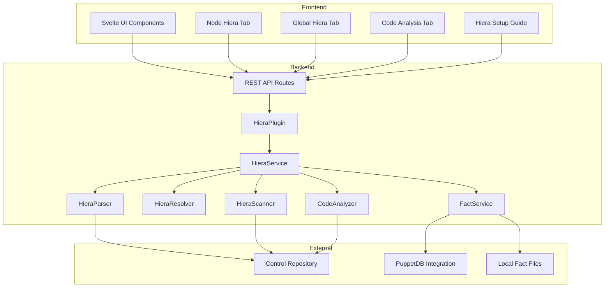
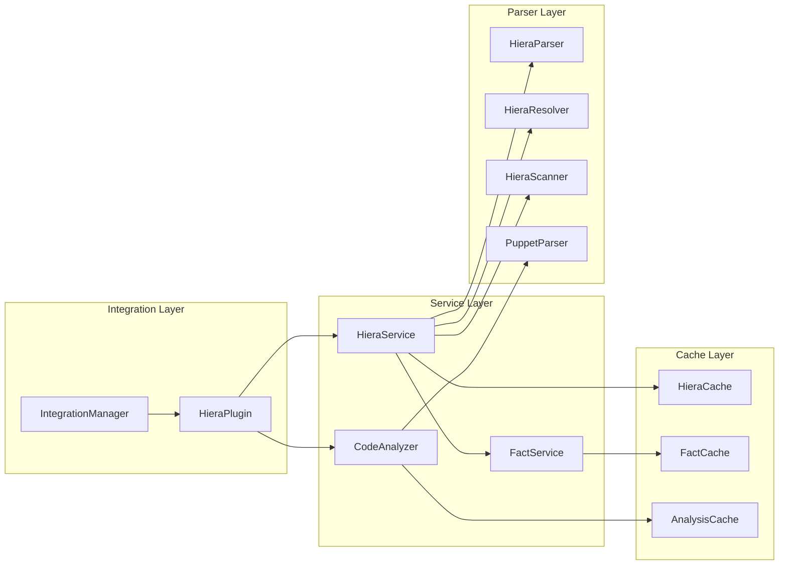

# Design Document: Hiera and Local Puppet Codebase Integration

## Overview

This design document describes the architecture and implementation approach for integrating Hiera data lookup and Puppet codebase analysis into Pabawi v0.4.0. The integration follows the existing plugin architecture pattern used by PuppetDB and Puppetserver integrations, providing a consistent user experience while adding powerful new capabilities for Puppet administrators.

The integration enables:

- Configuration of a local Puppet control repository
- Parsing and resolution of Hiera data with full lookup method support
- Node-specific Hiera key visualization with usage highlighting
- Global Hiera key search across all nodes
- Static code analysis of Puppet manifests
- Module update detection from Puppetfile

## Architecture

### High-Level Architecture



### Component Architecture



## Components and Interfaces

### Backend Components

#### 1. HieraPlugin (backend/src/integrations/hiera/HieraPlugin.ts)

Extends `BasePlugin` to integrate with the existing plugin architecture.

```typescript
interface HieraPluginConfig {
  enabled: boolean;
  controlRepoPath: string;
  hieraConfigPath?: string;  // defaults to hiera.yaml
  environments?: string[];
  factSources: {
    puppetdb: boolean;
    localPath?: string;
  };
  catalogCompilation: {
    enabled: boolean;
    cacheTTL?: number;
  };
  cache: {
    ttl: number;
    maxSize: number;
  };
}

class HieraPlugin extends BasePlugin implements InformationSourcePlugin {
  type = 'information' as const;
  
  async initialize(config: IntegrationConfig): Promise<void>;
  async healthCheck(): Promise<HealthStatus>;
  async getInventory(): Promise<Node[]>;
  async getNodeFacts(nodeId: string): Promise<Facts>;
  async getNodeData(nodeId: string, dataType: string): Promise<unknown>;
  
  // Hiera-specific methods
  getHieraService(): HieraService;
  getCodeAnalyzer(): CodeAnalyzer;
}
```

#### 2. HieraService (backend/src/integrations/hiera/HieraService.ts)

Core service orchestrating Hiera operations.

```typescript
interface HieraService {
  // Key discovery
  getAllKeys(): Promise<HieraKeyIndex>;
  searchKeys(query: string): Promise<HieraKey[]>;
  
  // Key resolution
  resolveKey(nodeId: string, key: string): Promise<HieraResolution>;
  resolveAllKeys(nodeId: string): Promise<Map<string, HieraResolution>>;
  
  // Node-specific data
  getNodeHieraData(nodeId: string): Promise<NodeHieraData>;
  getKeyUsageByNode(nodeId: string): Promise<KeyUsageMap>;
  
  // Global queries
  getKeyValuesAcrossNodes(key: string): Promise<KeyNodeValues[]>;
  
  // Cache management
  invalidateCache(): void;
  reloadControlRepo(): Promise<void>;
}

interface HieraKey {
  name: string;
  locations: HieraKeyLocation[];
  lookupOptions?: LookupOptions;
}

interface HieraKeyLocation {
  file: string;
  hierarchyLevel: string;
  lineNumber: number;
  value: unknown;
}

interface HieraResolution {
  key: string;
  resolvedValue: unknown;
  lookupMethod: 'first' | 'unique' | 'hash' | 'deep';
  sourceFile: string;
  hierarchyLevel: string;
  allValues: HieraKeyLocation[];
  interpolatedVariables?: Record<string, unknown>;
}

interface NodeHieraData {
  nodeId: string;
  facts: Facts;
  keys: Map<string, HieraResolution>;
  usedKeys: Set<string>;
  unusedKeys: Set<string>;
}

interface KeyNodeValues {
  nodeId: string;
  value: unknown;
  sourceFile: string;
  hierarchyLevel: string;
}
```

#### 3. HieraParser (backend/src/integrations/hiera/HieraParser.ts)

Parses hiera.yaml configuration files.

```typescript
interface HieraConfig {
  version: 5;
  defaults?: HieraDefaults;
  hierarchy: HierarchyLevel[];
  lookupOptions?: Record<string, LookupOptions>;
}

interface HierarchyLevel {
  name: string;
  path?: string;
  paths?: string[];
  glob?: string;
  globs?: string[];
  datadir?: string;
  data_hash?: string;
  lookup_key?: string;
  mapped_paths?: [string, string, string];
  options?: Record<string, unknown>;
}

interface LookupOptions {
  merge?: 'first' | 'unique' | 'hash' | 'deep';
  convert_to?: 'Array' | 'Hash';
  knockout_prefix?: string;
}

interface HieraParser {
  parse(configPath: string): Promise<HieraConfig>;
  validateConfig(config: HieraConfig): ValidationResult;
  expandHierarchyPaths(config: HieraConfig, facts: Facts): string[];
}
```

#### 4. HieraResolver (backend/src/integrations/hiera/HieraResolver.ts)

Resolves Hiera keys using the hierarchy and facts.

```typescript
interface HieraResolver {
  resolve(
    key: string,
    facts: Facts,
    config: HieraConfig,
    options?: ResolveOptions
  ): Promise<HieraResolution>;
  
  resolveWithCatalog(
    key: string,
    nodeId: string,
    environment: string
  ): Promise<HieraResolution>;
  
  interpolateValue(
    value: unknown,
    facts: Facts,
    variables?: Record<string, unknown>
  ): unknown;
}

interface ResolveOptions {
  lookupMethod?: 'first' | 'unique' | 'hash' | 'deep';
  defaultValue?: unknown;
  mergeOptions?: MergeOptions;
}

interface MergeOptions {
  strategy: 'first' | 'unique' | 'hash' | 'deep';
  knockoutPrefix?: string;
  sortMergedArrays?: boolean;
  mergeHashArrays?: boolean;
}
```

#### 5. HieraScanner (backend/src/integrations/hiera/HieraScanner.ts)

Scans hieradata files to build key index.

```typescript
interface HieraScanner {
  scan(hieradataPath: string): Promise<HieraKeyIndex>;
  watchForChanges(callback: () => void): void;
  stopWatching(): void;
}

interface HieraKeyIndex {
  keys: Map<string, HieraKey>;
  files: Map<string, HieraFileInfo>;
  lastScan: string;
  totalKeys: number;
  totalFiles: number;
}

interface HieraFileInfo {
  path: string;
  hierarchyLevel: string;
  keys: string[];
  lastModified: string;
}
```

#### 6. FactService (backend/src/integrations/hiera/FactService.ts)

Thin wrapper that leverages the existing PuppetDB integration for fact retrieval, with fallback to local files.

**Design Decision**: Rather than duplicating fact retrieval logic, this service delegates to the existing `PuppetDBService.getNodeFacts()` when PuppetDB integration is available. This ensures:

- Single source of truth for PuppetDB communication
- Consistent caching behavior
- No code duplication

```typescript
interface FactService {
  /**
   * Get facts for a node, using PuppetDB if available, falling back to local files
   * @param nodeId - Node identifier (certname)
   * @returns Facts and metadata about the source
   */
  getFacts(nodeId: string): Promise<FactResult>;
  
  /**
   * Get the fact source that would be used for a node
   */
  getFactSource(nodeId: string): Promise<'puppetdb' | 'local' | 'none'>;
  
  /**
   * List all nodes with available facts (from any source)
   */
  listAvailableNodes(): Promise<string[]>;
}

interface FactResult {
  facts: Facts;
  source: 'puppetdb' | 'local';
  warnings?: string[];
}

interface LocalFactFile {
  name: string;
  values: Record<string, unknown>;
}

// Implementation approach:
class FactServiceImpl implements FactService {
  constructor(
    private integrationManager: IntegrationManager,
    private localFactsPath?: string
  ) {}

  async getFacts(nodeId: string): Promise<FactResult> {
    // Try PuppetDB first via existing integration
    const puppetdb = this.integrationManager.getInformationSource('puppetdb');
    if (puppetdb?.isInitialized()) {
      try {
        const facts = await puppetdb.getNodeFacts(nodeId);
        return { facts, source: 'puppetdb' };
      } catch (error) {
        // Fall through to local facts
      }
    }

    // Fall back to local facts
    if (this.localFactsPath) {
      const facts = await this.loadLocalFacts(nodeId);
      if (facts) {
        return {
          facts,
          source: 'local',
          warnings: ['Using local fact files - facts may be outdated']
        };
      }
    }

    // No facts available
    return {
      facts: { nodeId, gatheredAt: new Date().toISOString(), facts: {} },
      source: 'local',
      warnings: [`No facts available for node '${nodeId}'`]
    };
  }
}
```

#### 7. CodeAnalyzer (backend/src/integrations/hiera/CodeAnalyzer.ts)

Performs static analysis of Puppet code.

```typescript
interface CodeAnalyzer {
  analyze(): Promise<CodeAnalysisResult>;
  getUnusedCode(): Promise<UnusedCodeReport>;
  getLintIssues(): Promise<LintIssue[]>;
  getModuleUpdates(): Promise<ModuleUpdate[]>;
  getUsageStatistics(): Promise<UsageStatistics>;
}

interface CodeAnalysisResult {
  unusedCode: UnusedCodeReport;
  lintIssues: LintIssue[];
  moduleUpdates: ModuleUpdate[];
  statistics: UsageStatistics;
  analyzedAt: string;
}

interface UnusedCodeReport {
  unusedClasses: UnusedItem[];
  unusedDefinedTypes: UnusedItem[];
  unusedHieraKeys: UnusedItem[];
}

interface UnusedItem {
  name: string;
  file: string;
  line: number;
  type: 'class' | 'defined_type' | 'hiera_key';
}

interface LintIssue {
  file: string;
  line: number;
  column: number;
  severity: 'error' | 'warning' | 'info';
  message: string;
  rule: string;
  fixable: boolean;
}

interface ModuleUpdate {
  name: string;
  currentVersion: string;
  latestVersion: string;
  source: 'forge' | 'git';
  hasSecurityAdvisory: boolean;
  changelog?: string;
}

interface UsageStatistics {
  totalManifests: number;
  totalClasses: number;
  totalDefinedTypes: number;
  totalFunctions: number;
  linesOfCode: number;
  mostUsedClasses: ClassUsage[];
  mostUsedResources: ResourceUsage[];
}

interface ClassUsage {
  name: string;
  usageCount: number;
  nodes: string[];
}

interface ResourceUsage {
  type: string;
  count: number;
}
```

### API Routes

#### Hiera Routes (backend/src/routes/hiera.ts)

```typescript
// Configuration
GET  /api/integrations/hiera/status
POST /api/integrations/hiera/reload

// Key discovery
GET  /api/integrations/hiera/keys
GET  /api/integrations/hiera/keys/search?q={query}
GET  /api/integrations/hiera/keys/{key}

// Node-specific
GET  /api/integrations/hiera/nodes/{nodeId}/data
GET  /api/integrations/hiera/nodes/{nodeId}/keys
GET  /api/integrations/hiera/nodes/{nodeId}/keys/{key}

// Global key lookup
GET  /api/integrations/hiera/keys/{key}/nodes

// Code analysis
GET  /api/integrations/hiera/analysis
GET  /api/integrations/hiera/analysis/unused
GET  /api/integrations/hiera/analysis/lint
GET  /api/integrations/hiera/analysis/modules
GET  /api/integrations/hiera/analysis/statistics
```

### Frontend Components

#### 1. NodeHieraTab (frontend/src/components/NodeHieraTab.svelte)

Displays Hiera data for a specific node with search and filtering.

```typescript
interface NodeHieraTabProps {
  nodeId: string;
}

// Features:
// - Searchable list of all Hiera keys
// - Filter by used/unused keys
// - Expandable key details showing all hierarchy levels
// - Highlighted resolved value
// - Expert mode: show file paths, lookup methods, interpolation details
```

#### 2. GlobalHieraTab (frontend/src/components/GlobalHieraTab.svelte)

Global Hiera key search across all nodes.

```typescript
interface GlobalHieraTabProps {}

// Features:
// - Search input for key name
// - Results grouped by resolved value
// - Node list with source file info
// - Click to navigate to node detail
```

#### 3. CodeAnalysisTab (frontend/src/components/CodeAnalysisTab.svelte)

Displays code analysis results.

```typescript
interface CodeAnalysisTabProps {}

// Features:
// - Dashboard with statistics
// - Unused code section with file links
// - Lint issues with severity filtering
// - Module updates with version comparison
// - Most used classes ranking
```

#### 4. HieraSetupGuide (frontend/src/components/HieraSetupGuide.svelte)

Setup instructions for the Hiera integration.

```typescript
// Features:
// - Step-by-step configuration guide
// - Control repo path configuration
// - Fact source selection (PuppetDB vs local)
// - Catalog compilation mode toggle
// - Connection test button
```

## Data Models

### Configuration Schema

```typescript
// backend/src/config/schema.ts additions

interface HieraConfig {
  enabled: boolean;
  controlRepoPath: string;
  hieraConfigPath: string;  // relative to controlRepoPath
  environments: string[];
  factSources: {
    preferPuppetDB: boolean;
    localFactsPath?: string;
  };
  catalogCompilation: {
    enabled: boolean;
    timeout: number;
    cacheTTL: number;
  };
  cache: {
    enabled: boolean;
    ttl: number;
    maxEntries: number;
  };
  codeAnalysis: {
    enabled: boolean;
    lintEnabled: boolean;
    moduleUpdateCheck: boolean;
    analysisInterval: number;
  };
}
```

### Database Schema (if needed for caching)

```sql
-- Optional: For persistent caching of analysis results
CREATE TABLE hiera_analysis_cache (
  id TEXT PRIMARY KEY,
  analysis_type TEXT NOT NULL,
  data JSON NOT NULL,
  created_at TIMESTAMP DEFAULT CURRENT_TIMESTAMP,
  expires_at TIMESTAMP NOT NULL
);

CREATE INDEX idx_hiera_cache_type ON hiera_analysis_cache(analysis_type);
CREATE INDEX idx_hiera_cache_expires ON hiera_analysis_cache(expires_at);
```

## Correctness Properties

*A property is a characteristic or behavior that should hold true across all valid executions of a system-essentially, a formal statement about what the system should do. Properties serve as the bridge between human-readable specifications and machine-verifiable correctness guarantees.*

### Property 1: Configuration Round-Trip

*For any* valid configuration object containing control repo path, fact source settings, and catalog compilation mode, storing the configuration and then retrieving it SHALL produce an equivalent configuration object.

**Validates: Requirements 1.1, 3.2, 12.1**

### Property 2: Control Repository Validation

*For any* filesystem path, the Configuration_Service SHALL return valid=true if and only if the path exists, is accessible, and contains the expected Puppet structure (hiera.yaml file).

**Validates: Requirements 1.2, 1.3**

### Property 3: Hiera Configuration Parsing Round-Trip

*For any* valid Hiera 5 configuration object, serializing it to YAML and then parsing it back SHALL produce an equivalent configuration with all hierarchy levels, paths, and data providers preserved.

**Validates: Requirements 2.1, 2.2**

### Property 4: Hiera Parser Error Reporting

*For any* YAML string containing syntax errors, the Hiera_Parser SHALL return an error result that includes the line number where the error occurs.

**Validates: Requirements 2.5**

### Property 5: Hierarchy Path Interpolation

*For any* hierarchy path template containing fact variables (e.g., `%{facts.os.family}`) and any valid fact set, interpolating the path SHALL replace all variables with their corresponding fact values.

**Validates: Requirements 2.6**

### Property 6: Fact Source Priority

*For any* node where both PuppetDB and local fact files contain facts, the Fact_Service SHALL return the PuppetDB facts when PuppetDB integration is available and configured as preferred.

**Validates: Requirements 3.1, 3.5**

### Property 7: Local Fact File Parsing

*For any* valid JSON file in Puppetserver fact format (with "name" and "values" fields), the Fact_Service SHALL parse it and return a Facts object with all values accessible.

**Validates: Requirements 3.3, 3.4**

### Property 8: Key Scanning Completeness

*For any* hieradata directory containing YAML files, the Hiera_Scanner SHALL discover all unique keys across all files, tracking for each key: the file path, hierarchy level, line number, and value.

**Validates: Requirements 4.1, 4.2, 4.3, 4.4**

### Property 9: Key Search Functionality

*For any* key index and search query string, searching SHALL return all keys whose names contain the query string as a substring (case-insensitive).

**Validates: Requirements 4.5, 7.4**

### Property 10: Hiera Resolution Correctness

*For any* Hiera key, fact set, and hierarchy configuration, the Hiera_Resolver SHALL:

- Apply the correct lookup method (first, unique, hash, deep) based on lookup_options
- Return the value from the first matching hierarchy level (for 'first' lookup)
- Merge values according to the specified merge strategy (for merge lookups)
- Track which hierarchy level provided the final/winning value

**Validates: Requirements 5.1, 5.2, 5.3, 5.4**

### Property 11: Value Interpolation

*For any* Hiera value containing variable references (e.g., `%{facts.hostname}`) and any fact set, resolving the value SHALL replace all variable references with their corresponding values from facts.

**Validates: Requirements 5.5**

### Property 12: Missing Key Handling

*For any* Hiera key that does not exist in any hierarchy level for a given fact set, the Hiera_Resolver SHALL return a result indicating the key was not found (not throw an error).

**Validates: Requirements 5.6, 3.6**

### Property 13: Key Usage Filtering

*For any* node with a set of included classes and a set of Hiera keys, filtering by "used" SHALL return only keys that are referenced by the included classes, and filtering by "unused" SHALL return the complement.

**Validates: Requirements 6.6**

### Property 14: Global Key Resolution Across Nodes

*For any* Hiera key and set of nodes, querying the key across all nodes SHALL return for each node: the resolved value (or indication of not found), the source file, and the hierarchy level.

**Validates: Requirements 7.2, 7.3, 7.6**

### Property 15: Node Grouping by Value

*For any* set of key-node-value tuples, grouping by resolved value SHALL produce groups where all nodes in each group have the same resolved value for the key.

**Validates: Requirements 7.5**

### Property 16: Unused Code Detection

*For any* control repository with classes, defined types, and Hiera keys, and a set of node catalogs, the Code_Analyzer SHALL identify as unused:

- Classes not included in any catalog
- Defined types not instantiated in any catalog
- Hiera keys not referenced in any manifest

**Validates: Requirements 8.1, 8.2, 8.3**

### Property 17: Unused Code Metadata

*For any* unused code item detected, the result SHALL include the file path, line number, and item type (class, defined_type, or hiera_key).

**Validates: Requirements 8.4**

### Property 18: Exclusion Pattern Support

*For any* set of exclusion patterns and unused code results, items matching any exclusion pattern SHALL NOT appear in the final unused code report.

**Validates: Requirements 8.5**

### Property 19: Lint Issue Detection

*For any* Puppet manifest containing syntax errors or style violations, the Code_Analyzer SHALL detect and report issues with: severity level, file path, line number, column number, and descriptive message.

**Validates: Requirements 9.1, 9.2, 9.3**

### Property 20: Issue Filtering

*For any* set of lint issues and filter criteria (severity, type), filtering SHALL return only issues matching all specified criteria.

**Validates: Requirements 9.4**

### Property 21: Puppetfile Parsing

*For any* valid Puppetfile, the Code_Analyzer SHALL extract all module declarations with their names, versions, and sources (forge or git).

**Validates: Requirements 10.1**

### Property 22: Module Update Detection

*For any* module with a specified version and a known latest version on Puppet Forge, if the latest version is newer than the current version, the Code_Analyzer SHALL indicate an update is available.

**Validates: Requirements 10.2, 10.3**

### Property 23: Code Statistics Accuracy

*For any* control repository, the Code_Analyzer SHALL accurately count: total manifests, total classes, total defined types, total functions, and lines of code.

**Validates: Requirements 11.1, 11.2, 11.3**

### Property 24: Catalog Compilation Mode Behavior

*For any* Hiera key resolution request:

- When catalog compilation is disabled, only facts SHALL be used for variable interpolation
- When catalog compilation is enabled and succeeds, code-defined variables SHALL also be available
- When catalog compilation is enabled but fails, the resolver SHALL fall back to fact-only resolution

**Validates: Requirements 12.2, 12.3, 12.4**

### Property 25: Integration Enable/Disable Persistence

*For any* Hiera integration configuration, disabling the integration SHALL preserve all configuration values, and re-enabling SHALL restore full functionality with the same configuration.

**Validates: Requirements 13.5**

### Property 26: API Response Correctness

*For any* API request to Hiera endpoints:

- GET /keys SHALL return all discovered keys
- GET /nodes/{id}/keys/{key} SHALL return the same resolution as HieraResolver.resolve()
- GET /analysis SHALL return the same results as CodeAnalyzer.analyze()

**Validates: Requirements 14.1, 14.2, 14.3, 14.4, 14.5**

### Property 27: API Error Handling

*For any* API request when the Hiera integration is not configured, the API SHALL return an error response with HTTP status 503 and a message indicating setup is required.

**Validates: Requirements 14.6**

### Property 28: Cache Correctness

*For any* sequence of Hiera operations, cached results SHALL be equivalent to freshly computed results until the underlying data changes.

**Validates: Requirements 15.1, 15.5**

### Property 29: Cache Invalidation on File Change

*For any* hieradata file modification, the cache for affected keys SHALL be invalidated, and subsequent lookups SHALL return the updated values.

**Validates: Requirements 15.2**

### Property 30: Pagination Correctness

*For any* API endpoint returning paginated results, iterating through all pages SHALL return all items exactly once, with no duplicates or omissions.

**Validates: Requirements 15.6**

## Error Handling

### Error Categories

1. **Configuration Errors**
   - Invalid control repo path
   - Missing hiera.yaml
   - Invalid hiera.yaml syntax
   - Inaccessible directories

2. **Resolution Errors**
   - Missing facts for node
   - Circular variable references
   - Invalid interpolation syntax
   - Catalog compilation failures

3. **Analysis Errors**
   - Puppet syntax errors in manifests
   - Puppetfile parse errors
   - Forge API unavailable
   - Large repository timeouts

### Error Response Format

```typescript
interface HieraError {
  code: string;
  message: string;
  details?: {
    file?: string;
    line?: number;
    suggestion?: string;
  };
}

// Error codes
const HIERA_ERROR_CODES = {
  NOT_CONFIGURED: 'HIERA_NOT_CONFIGURED',
  INVALID_PATH: 'HIERA_INVALID_PATH',
  PARSE_ERROR: 'HIERA_PARSE_ERROR',
  RESOLUTION_ERROR: 'HIERA_RESOLUTION_ERROR',
  FACTS_UNAVAILABLE: 'HIERA_FACTS_UNAVAILABLE',
  CATALOG_COMPILATION_FAILED: 'HIERA_CATALOG_COMPILATION_FAILED',
  ANALYSIS_ERROR: 'HIERA_ANALYSIS_ERROR',
  FORGE_UNAVAILABLE: 'HIERA_FORGE_UNAVAILABLE',
} as const;
```

### Graceful Degradation

The system SHALL gracefully degrade when components are unavailable, always displaying clear warnings to the user:

- **PuppetDB unavailable**: Fall back to local facts. Display warning: "PuppetDB unavailable - using local fact files. Some facts may be outdated."
- **Catalog compilation fails**: Fall back to fact-only resolution. Display warning: "Catalog compilation failed for {node} - using fact-only resolution. Some Hiera variables may not resolve correctly."
- **Forge API unavailable**: Skip module update checks. Display warning: "Puppet Forge API unavailable - module update information may be incomplete."
- **Individual file parse errors**: Continue with remaining files. Display warning: "Failed to parse {file}: {error}. This file will be skipped."
- **Local facts missing for node**: Return empty fact set. Display warning: "No facts available for node {nodeId}. Hiera resolution may be incomplete."

All warnings SHALL be:

1. Logged to the backend console with appropriate log level (warn)
2. Returned in API responses in a `warnings` array
3. Displayed in the UI with a warning indicator (yellow/orange styling)
4. Accessible in Expert Mode with additional diagnostic details

## Testing Strategy

### Unit Tests

Unit tests will cover:

- HieraParser: YAML parsing, config validation, path expansion
- HieraResolver: Lookup methods, merge strategies, interpolation
- HieraScanner: File discovery, key extraction, index building
- CodeAnalyzer: Manifest parsing, unused detection, statistics
- FactService: Source selection, file parsing, caching

### Property-Based Tests

Property-based tests will validate the correctness properties defined above using fast-check library:

- Configuration round-trip (Property 1)
- Parsing round-trip (Property 3)
- Resolution correctness (Property 10)
- Value interpolation (Property 11)
- Cache correctness (Property 28)

Each property test will run minimum 100 iterations with generated inputs.

### Integration Tests

Integration tests will cover:

- Full resolution flow from API to file system
- PuppetDB fact retrieval integration
- File watching and cache invalidation
- Multi-environment scenarios

### Test Configuration

```typescript
// vitest.config.ts additions
export default defineConfig({
  test: {
    include: ['src/integrations/hiera/**/*.test.ts'],
    coverage: {
      include: ['src/integrations/hiera/**/*.ts'],
      exclude: ['**/*.test.ts', '**/types.ts'],
      thresholds: {
        lines: 80,
        functions: 80,
        branches: 75,
      },
    },
  },
});
```

### Test Data Generators

```typescript
// Property test generators using fast-check
import * as fc from 'fast-check';

// Generate valid Hiera keys
const hieraKeyArb = fc.stringOf(
  fc.constantFrom(...'abcdefghijklmnopqrstuvwxyz_:'.split('')),
  { minLength: 1, maxLength: 50 }
);

// Generate valid fact sets
const factsArb = fc.dictionary(
  fc.string({ minLength: 1, maxLength: 20 }),
  fc.oneof(fc.string(), fc.integer(), fc.boolean())
);

// Generate hierarchy levels
const hierarchyLevelArb = fc.record({
  name: fc.string({ minLength: 1, maxLength: 30 }),
  path: fc.string({ minLength: 1, maxLength: 100 }),
});

// Generate Hiera configs
const hieraConfigArb = fc.record({
  version: fc.constant(5),
  hierarchy: fc.array(hierarchyLevelArb, { minLength: 1, maxLength: 10 }),
});
```
