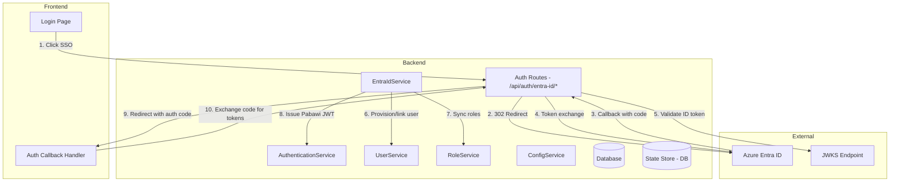
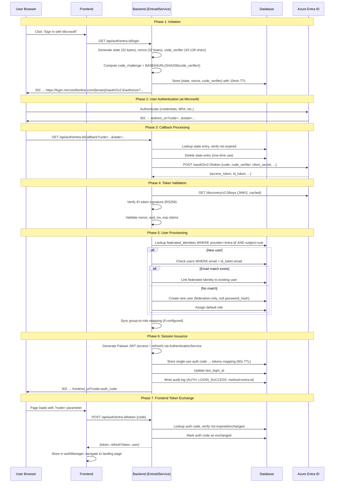

# Design Document: Azure Entra ID Authentication

## Overview

This design adds Azure Entra ID (OpenID Connect) as a federated authentication provider to Pabawi, running alongside the existing local username/password flow. The implementation follows the OAuth 2.0 Authorization Code Flow with PKCE, validates ID tokens via JWKS, and issues standard Pabawi JWT tokens so that downstream middleware and RBAC remain unaware of the authentication origin.

Key design goals:
- **Zero disruption** to existing auth flows — local login continues unchanged
- **Identical JWT tokens** regardless of authentication method — auth middleware sees no difference
- **Automatic user provisioning** on first SSO login with optional account linking
- **Group-to-role synchronization** from Entra ID claims to Pabawi RBAC
- **Security-first** — PKCE, state/nonce validation, JWKS signature verification, short-lived ephemeral state

## Architecture

### High-Level Integration



### Architectural Decisions

| Decision | Rationale |
|----------|-----------|
| New `EntraIdService` class (not a BasePlugin) | This is an auth provider, not an infrastructure integration. Plugins are for inventory/execution sources. |
| Server-side state store in DB table | Supports clustered deployments; avoids in-memory state loss on restart. 10-minute TTL with cleanup. |
| Single-use authorization code for frontend token delivery | Prevents token exposure in URL fragments/history. Frontend exchanges ephemeral code for actual JWT pair. |
| JWKS caching with configurable TTL | Avoids hitting Microsoft on every login while allowing key rotation detection. |
| Group-to-role sync at login time only | Avoids continuous polling of Entra ID; roles reflect state at last login. |

## Components and Interfaces

### New Files

| File | Purpose |
|------|---------|
| `backend/src/services/EntraIdService.ts` | Core SSO logic: authorization URL generation, token exchange, ID token validation, JWKS management, user provisioning orchestration |
| `backend/src/routes/entraIdAuth.ts` | Express route factory: `/api/auth/entra-id/login`, `/callback`, `/token`, and `/api/auth/providers` |
| `backend/src/database/migrations/016_entra_id_auth.sql` | New tables: `federated_identities`, `oauth_state_store` |
| `frontend/src/lib/entraIdAuth.svelte.ts` | Frontend SSO state: provider discovery, callback handling |
| `frontend/src/components/EntraIdLoginButton.svelte` | Microsoft-branded SSO button component |

### Modified Files

| File | Change |
|------|--------|
| `backend/src/config/ConfigService.ts` | Add Entra ID configuration parsing block |
| `backend/src/config/schema.ts` | Add `EntraIdConfigSchema` to Zod schemas |
| `backend/src/routes/auth.ts` | Add `/providers` endpoint; modify logout to include `entraIdLogoutUrl` |
| `backend/src/services/UserService.ts` | Add `createFederatedUser()` and `linkFederatedIdentity()` methods |
| `backend/src/container/DIContainer.ts` | Register `EntraIdService` in `ServiceRegistry` (optional, only when enabled) |
| `frontend/src/pages/Login.svelte` | Conditionally render SSO button based on provider discovery |

### EntraIdService Interface

```typescript
export interface EntraIdConfig {
  enabled: boolean;
  tenantId: string;
  clientId: string;
  clientSecret: string;
  redirectUri: string;
  scopes: string[];
  groupMapping: Record<string, string> | null;
  postLogoutRedirectUri: string;
  jwksCacheTtlMs: number;
}

export interface OAuthStateEntry {
  state: string;
  nonce: string;
  codeVerifier: string;
  createdAt: string;  // ISO 8601
  expiresAt: string;  // ISO 8601, createdAt + 10 minutes
}

export interface AuthCodeEntry {
  code: string;
  accessToken: string;
  refreshToken: string;
  userId: string;
  idToken: string;        // stored for logout id_token_hint
  authMethod: string;     // 'entra-id'
  createdAt: string;
  expiresAt: string;      // createdAt + 60 seconds
}

export class EntraIdService {
  constructor(
    db: DatabaseAdapter,
    config: EntraIdConfig,
    authService: AuthenticationService,
    userService: UserService,
    roleService: RoleService,
    auditLogger: AuditLoggingService,
    logger: LoggerService,
  );

  /** Generate authorization URL and store state/nonce/PKCE verifier */
  generateAuthorizationUrl(): Promise<{ url: string; state: string }>;

  /** Handle callback: validate state, exchange code, validate ID token, provision user, issue tokens */
  handleCallback(code: string, state: string): Promise<AuthCodeEntry>;

  /** Exchange frontend auth code for tokens */
  exchangeAuthCode(code: string): Promise<{ accessToken: string; refreshToken: string; user: UserDTO }>;

  /** Build Entra ID logout URL for single sign-out */
  buildLogoutUrl(idToken: string): string;

  /** Get provider info for discovery endpoint */
  getProviderInfo(): { enabled: true; name: string };

  /** Cleanup expired state entries (called periodically) */
  cleanupExpiredState(): Promise<number>;
}
```

### Route Factory

```typescript
// backend/src/routes/entraIdAuth.ts
export function createEntraIdAuthRouter(
  databaseService: DatabaseService,
  container: DIContainer,
): Router;
```

Endpoints:
- `GET /api/auth/entra-id/login` → 302 redirect to Entra ID authorization endpoint
- `GET /api/auth/entra-id/callback` → handles OAuth callback, redirects to frontend with auth code
- `POST /api/auth/entra-id/token` → exchanges single-use auth code for Pabawi JWT pair
- `GET /api/auth/providers` → returns available auth methods (public, no auth required)

## Data Models

### Database Schema (Migration 016)

```sql
-- Migration 016: Entra ID federated authentication support

-- Federated identity links: maps external IdP subjects to Pabawi users
CREATE TABLE IF NOT EXISTS federated_identities (
  id TEXT PRIMARY KEY,
  user_id TEXT NOT NULL,
  provider TEXT NOT NULL,           -- 'entra-id'
  subject TEXT NOT NULL,            -- Entra ID 'sub' claim (unique per tenant+user)
  issuer TEXT NOT NULL,             -- Token issuer URL
  email TEXT,                       -- Email from IdP (informational, not authoritative)
  id_token TEXT,                    -- Last ID token (for logout id_token_hint)
  created_at TEXT NOT NULL,
  updated_at TEXT NOT NULL,
  FOREIGN KEY (user_id) REFERENCES users(id) ON DELETE CASCADE,
  UNIQUE(provider, subject)
);

CREATE INDEX IF NOT EXISTS idx_federated_identities_user ON federated_identities(user_id);
CREATE INDEX IF NOT EXISTS idx_federated_identities_lookup ON federated_identities(provider, subject);

-- OAuth state store: PKCE + state + nonce for in-flight authorization requests
CREATE TABLE IF NOT EXISTS oauth_state_store (
  state TEXT PRIMARY KEY,
  nonce TEXT NOT NULL,
  code_verifier TEXT NOT NULL,
  created_at TEXT NOT NULL,
  expires_at TEXT NOT NULL
);

CREATE INDEX IF NOT EXISTS idx_oauth_state_expires ON oauth_state_store(expires_at);

-- Single-use authorization codes for frontend token delivery
CREATE TABLE IF NOT EXISTS oauth_auth_codes (
  code TEXT PRIMARY KEY,
  access_token TEXT NOT NULL,
  refresh_token TEXT NOT NULL,
  user_id TEXT NOT NULL,
  id_token TEXT,
  auth_method TEXT NOT NULL DEFAULT 'entra-id',
  created_at TEXT NOT NULL,
  expires_at TEXT NOT NULL,
  exchanged INTEGER NOT NULL DEFAULT 0
);

CREATE INDEX IF NOT EXISTS idx_oauth_auth_codes_expires ON oauth_auth_codes(expires_at);
```

### TypeScript Interfaces

```typescript
interface FederatedIdentity {
  id: string;
  userId: string;
  provider: string;
  subject: string;
  issuer: string;
  email: string | null;
  idToken: string | null;
  createdAt: string;
  updatedAt: string;
}
```

### Configuration Schema (Zod)

```typescript
export const EntraIdConfigSchema = z.object({
  enabled: z.boolean().default(false),
  tenantId: z.string().min(1),
  clientId: z.string().min(1),
  clientSecret: z.string().min(1),
  redirectUri: z.string().url(),
  scopes: z.array(z.string()).default(['openid', 'profile', 'email']),
  groupMapping: z.record(z.string(), z.string()).nullable().default(null),
  postLogoutRedirectUri: z.string().url().optional(),
  jwksCacheTtlMs: z.number().int().positive().default(86400000), // 24 hours
});
```

The `ConfigService` parsing block follows the same pattern as other integrations:
- `ENTRA_ID_ENABLED !== "true"` → skip entirely, no other vars required
- `ENTRA_ID_ENABLED === "true"` → parse and validate all required vars; throw on missing/invalid

## OAuth 2.0 Flow Sequence



## Error Handling

| Scenario | HTTP Status | Error Code | Response |
|----------|-------------|------------|----------|
| Entra ID disabled, SSO endpoint hit | 404 | — | Standard 404 |
| Missing/invalid state on callback | 400 | `INVALID_STATE` | State parameter missing or mismatched |
| State expired (>10 min) | 400 | `SESSION_EXPIRED` | Authentication session expired |
| Token exchange failure (non-2xx from AAD) | 401 | `TOKEN_EXCHANGE_FAILED` | Could not exchange authorization code |
| Token exchange network timeout (>10s) | 401 | `TOKEN_EXCHANGE_FAILED` | Token endpoint unreachable |
| ID token signature invalid | 401 | `INVALID_ID_TOKEN` | Token signature verification failed |
| ID token nonce mismatch | 401 | `INVALID_ID_TOKEN` | Token nonce validation failed |
| ID token aud/iss mismatch | 401 | `INVALID_ID_TOKEN` | Token audience/issuer mismatch |
| ID token expired (>5min skew) | 401 | `INVALID_ID_TOKEN` | Token has expired |
| AAD returns error parameter | 401 | `AUTH_PROVIDER_ERROR` | Includes AAD error + description |
| Missing email/preferred_username claims | 401 | `MISSING_CLAIMS` | Required identity claims absent |
| User provisioning DB failure | 500 | `PROVISIONING_FAILED` | Account creation failed |
| Auth code expired or already exchanged | 400 | `INVALID_AUTH_CODE` | Authorization code invalid |
| JWKS endpoint unreachable, no cache | 503 | `JWKS_UNAVAILABLE` | Cannot verify token signatures |
| Config missing at request time | 500 | `SERVER_CONFIGURATION_ERROR` | Server configuration problem |

All error responses follow the existing `{ error: { code, message } }` pattern from `utils/errorHandling.ts`.

Sensitive values (client_secret, authorization codes, tokens) are never logged. The `LoggerService` calls use only metadata like `{ component: 'EntraIdService', operation: 'handleCallback' }`.


## Correctness Properties

*A property is a characteristic or behavior that should hold true across all valid executions of a system — essentially, a formal statement about what the system should do. Properties serve as the bridge between human-readable specifications and machine-verifiable correctness guarantees.*

### Property 1: Non-"true" ENTRA_ID_ENABLED skips config validation

*For any* string value of `ENTRA_ID_ENABLED` that is not exactly `"true"` (including undefined, empty, "false", "yes", "1", random strings), the ConfigService SHALL parse without error and without requiring any other `ENTRA_ID_*` variables.

**Validates: Requirements 1.1**

### Property 2: Missing required variables produce comprehensive error

*For any* non-empty subset of the required variables (`ENTRA_ID_TENANT_ID`, `ENTRA_ID_CLIENT_ID`, `ENTRA_ID_CLIENT_SECRET`, `ENTRA_ID_REDIRECT_URI`) that are undefined or empty when `ENTRA_ID_ENABLED` is `"true"`, the ConfigService SHALL throw an error whose message contains the name of every missing variable in that subset.

**Validates: Requirements 1.2, 1.3**

### Property 3: Scope parsing discards empty entries

*For any* comma-separated string set as `ENTRA_ID_SCOPES`, the parsed scope array SHALL contain no empty strings, and when `ENTRA_ID_SCOPES` is unset, the result SHALL default to `["openid", "profile", "email"]`.

**Validates: Requirements 1.4**

### Property 4: Group mapping JSON round-trip

*For any* valid `Record<string, string>` object serialized as JSON and set as `ENTRA_ID_GROUP_MAPPING`, the parsed configuration SHALL produce an equivalent object. For any string that is not valid JSON or does not parse to a `Record<string, string>`, parsing SHALL throw a validation error.

**Validates: Requirements 1.5, 1.6**

### Property 5: Authorization URL contains all required parameters

*For any* valid Entra ID configuration (tenant_id, client_id, redirect_uri, scopes), calling `generateAuthorizationUrl()` SHALL produce a URL containing query parameters `response_type=code`, `client_id` matching the configured value, `redirect_uri` matching the configured value, all configured scopes in the `scope` parameter, a `state` parameter of at least 32 bytes of entropy, a `nonce` parameter of at least 32 bytes of entropy, `code_challenge_method=S256`, and a `code_challenge` parameter.

**Validates: Requirements 2.2**

### Property 6: PKCE code_verifier/code_challenge correctness

*For any* call to `generateAuthorizationUrl()`, the stored `code_verifier` SHALL be between 43 and 128 characters (inclusive) per RFC 7636, and the `code_challenge` parameter in the URL SHALL equal `BASE64URL(SHA256(code_verifier))`.

**Validates: Requirements 2.3, 9.3**

### Property 7: State mismatch rejects callback

*For any* callback request where the `state` query parameter does not exactly match the stored state value (including missing, empty, or expired state), the service SHALL reject the request with HTTP 400 and error code `INVALID_STATE` without contacting the token endpoint.

**Validates: Requirements 3.2, 3.6, 9.1**

### Property 8: ID token signature validation

*For any* JWT signed with a key present in the JWKS key set, signature validation SHALL pass. *For any* JWT signed with a key NOT present in the JWKS key set, signature validation SHALL fail and the callback SHALL return HTTP 401 with error code `INVALID_ID_TOKEN`.

**Validates: Requirements 3.3**

### Property 9: Nonce mismatch rejects token

*For any* ID token where the `nonce` claim does not match the stored nonce value, the service SHALL reject the token and return HTTP 401 with error code `INVALID_ID_TOKEN`.

**Validates: Requirements 3.4, 9.2**

### Property 10: Audience and issuer validation

*For any* ID token where the `aud` claim does not match the configured `client_id` OR the `iss` claim does not match `https://login.microsoftonline.com/{tenant_id}/v2.0`, the service SHALL reject the token with error code `INVALID_ID_TOKEN`.

**Validates: Requirements 3.5**

### Property 11: State entries deleted after callback processing

*For any* callback execution (whether successful or failed), the `oauth_state_store` entry matching the request's state parameter SHALL be deleted, ensuring it cannot be reused.

**Validates: Requirements 3.10**

### Property 12: New federated user provisioning invariant

*For any* valid ID token claims (sub, email, preferred_username/derived username, given_name, family_name) where no federated identity exists with that sub: the service SHALL create a user with `is_active=1`, null `password_hash`, a federated_identities record with `provider='entra-id'` and `subject=sub`, and SHALL assign the default viewer role.

**Validates: Requirements 4.1, 4.2, 4.5**

### Property 13: Existing federated user profile immutability

*For any* returning user (federated identity already linked), calling the provisioning flow with different claim values (name, email) SHALL NOT modify the existing user record's `first_name`, `last_name`, or `email` fields.

**Validates: Requirements 4.3**

### Property 14: Username derivation from invalid preferred_username

*For any* `preferred_username` that does not match the pattern `^[a-zA-Z0-9_]{3,50}$`, the service SHALL derive the username from the email local-part by replacing all characters not in `[a-zA-Z0-9_]` with underscores and truncating to 50 characters.

**Validates: Requirements 4.7**

### Property 15: Group-to-role synchronization correctness

*For any* group mapping configuration and any `groups` claim array (with UUIDs in any case), the user SHALL end up with exactly the Pabawi roles whose group IDs are present in both the mapping keys (case-insensitive comparison) and the groups claim, plus any roles that were not part of the mapping (manually assigned). Roles previously assigned by the mapping whose group IDs are no longer in the claim SHALL be revoked.

**Validates: Requirements 5.1, 5.2, 5.3**

### Property 16: Authorization code single-use and TTL

*For any* successfully generated auth code, the code SHALL have `expires_at` ≤ 60 seconds from creation. After a successful exchange, any subsequent exchange attempt with the same code SHALL be rejected. After the code expires, exchange SHALL also be rejected.

**Validates: Requirements 6.2, 6.3, 6.4**

### Property 17: Providers endpoint always includes local authentication

*For any* application configuration state (Entra ID enabled or disabled, any combination of integrations), the `GET /api/auth/providers` response SHALL always contain `{ "local": true }`.

**Validates: Requirements 11.2**

## Testing Strategy

### Property-Based Testing

Property-based tests will use **fast-check** (already a project dependency) with a minimum of 100 iterations per property.

Properties particularly well-suited for PBT in this feature:
- **Config parsing properties (1–4)**: Generate random env var combinations
- **PKCE correctness (6)**: Verify math relationship across many generations
- **Token validation properties (7–10)**: Generate tokens with random claim permutations
- **Username derivation (14)**: Generate random strings, verify transformation rules
- **Group-to-role sync (15)**: Generate random mappings and group claims, verify set arithmetic
- **Auth code single-use (16)**: Generate codes and attempt double-exchange

Each property test will be tagged:
```typescript
// Feature: azure-entra-id-auth, Property 6: PKCE code_verifier/code_challenge correctness
```

### Unit Tests (Example-Based)

- Provider discovery endpoint (11.1–11.5)
- OAuth error parameter handling (3.9)
- Email-match account linking (4.4)
- Logout URL construction (8.2, 8.3)
- Frontend component rendering based on provider state (7.5, 7.6)
- Federation-only account local login rejection (7.4)

### Integration Tests

- Full OAuth flow with mocked Entra ID endpoints (token exchange, JWKS fetch)
- JWKS cache fallback on endpoint failure (9.8)
- Token exchange timeout behavior (3.1)
- Database failure during provisioning — atomicity (4.8)
- Audit logging verification (6.6)

### Frontend Tests

- Login page provider discovery and conditional rendering (10.1–10.7)
- Auth callback handler — code extraction and token exchange (10.5, 10.6)
- SSO logout redirect (8.4)

### Test Organization

```
backend/test/
├── unit/
│   └── EntraIdService.test.ts       # Unit tests for service logic
├── properties/
│   └── EntraIdAuth.property.test.ts  # Property-based tests (fast-check)
├── integration/
│   └── EntraIdAuthFlow.test.ts       # Full flow with mocked external endpoints
└── middleware/
    └── entraIdRoutes.test.ts         # Route-level tests with supertest

frontend/src/
├── components/
│   └── EntraIdLoginButton.test.ts    # Component test
└── lib/
    └── entraIdAuth.svelte.test.ts    # Callback handler test
```
