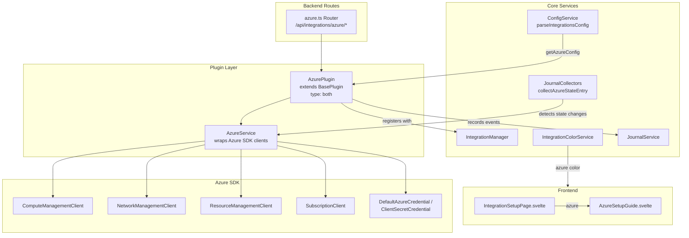
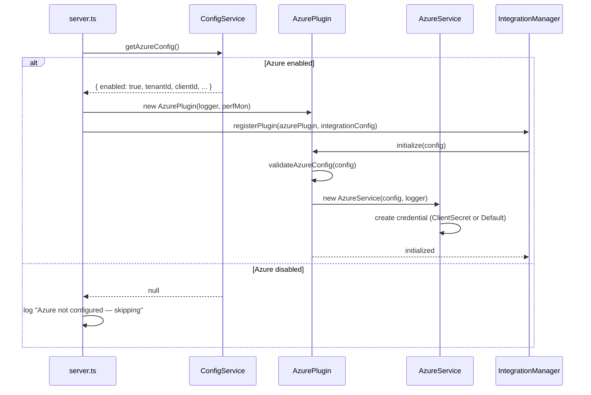
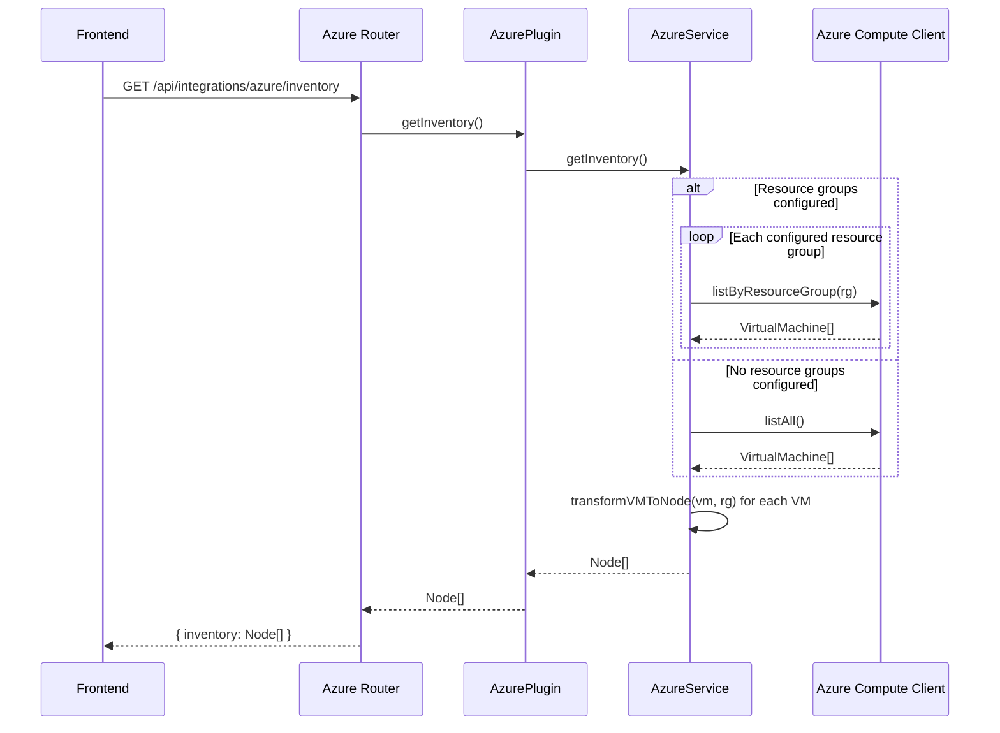
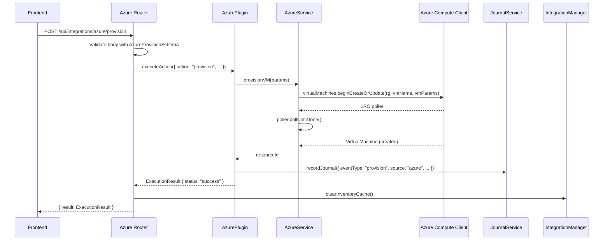
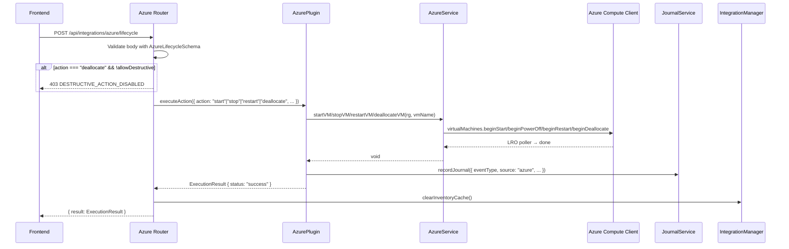

# Design Document: Azure Integration

## Overview

This design adds Azure Virtual Machine management to Pabawi, mirroring the existing AWS EC2 integration architecture. The Azure integration provides VM inventory discovery, facts retrieval, provisioning, lifecycle management (start/stop/restart/deallocate), resource discovery, journal tracking, and a frontend setup guide — all wired through the established plugin system.

The integration uses the Azure SDK for JavaScript (`@azure/arm-compute`, `@azure/identity`, `@azure/arm-network`, `@azure/arm-resources`) and follows the same BasePlugin → IntegrationManager registration pattern used by AWS, Proxmox, and other integrations.

## Architecture



### Registration Flow (mirrors AWS)



## Components and Interfaces

### 1. AzurePlugin (`backend/src/integrations/azure/AzurePlugin.ts`)

Extends `BasePlugin` with `type = "both"`, implementing both `InformationSourcePlugin` and `ExecutionToolPlugin`. Mirrors `AWSPlugin` exactly.

```typescript
class AzurePlugin extends BasePlugin implements InformationSourcePlugin, ExecutionToolPlugin {
  readonly type = "both";
  private service?: AzureService;
  private journalService?: JournalService;

  constructor(logger?: LoggerService, performanceMonitor?: PerformanceMonitorService, journalService?: JournalService);

  // BasePlugin overrides
  protected performInitialization(): Promise<void>;
  protected performHealthCheck(): Promise<Omit<HealthStatus, "lastCheck">>;

  // InformationSourcePlugin
  getInventory(): Promise<Node[]>;
  getGroups(): Promise<NodeGroup[]>;
  getNodeFacts(nodeId: string): Promise<Facts>;
  getNodeData(nodeId: string, dataType: string): Promise<unknown>;

  // ExecutionToolPlugin
  executeAction(action: Action): Promise<ExecutionResult>;
  listCapabilities(): Capability[];
  listProvisioningCapabilities(): ProvisioningCapability[];

  // Resource discovery (delegated to AzureService)
  getLocations(): Promise<AzureLocation[]>;
  getVMSizes(location: string): Promise<VMSizeInfo[]>;
  getImages(publisher?: string, offer?: string, sku?: string): Promise<VMImageInfo[]>;
  getResourceGroups(): Promise<ResourceGroupInfo[]>;

  // Journal injection
  setJournalService(journalService: JournalService): void;

  // Internal
  private validateAzureConfig(config: AzureConfig): void;
  private handleProvision(action: Action): Promise<ExecutionResult>;
  private handleLifecycle(action: Action): Promise<ExecutionResult>;
  private recordJournal(entry: CreateJournalEntry): Promise<void>;
  private mapActionToEventType(action: string): JournalEventType;
}
```

### 2. AzureService (`backend/src/integrations/azure/AzureService.ts`)

Wraps Azure SDK clients. Mirrors `AWSService` structure.

```typescript
class AzureService {
  private computeClient: ComputeManagementClient;
  private networkClient: NetworkManagementClient;
  private resourceClient: ResourceManagementClient;
  private subscriptionClient: SubscriptionClient;
  private credential: TokenCredential;
  private subscriptionId: string;
  private resourceGroups?: string[];
  private logger: LoggerService;

  constructor(config: AzureConfig, logger: LoggerService);

  // Credential validation
  validateCredentials(): Promise<{ subscriptionName: string; subscriptionId: string; tenantId: string }>;

  // Inventory
  getInventory(): Promise<Node[]>;
  getGroups(): Promise<NodeGroup[]>;
  getNodeFacts(nodeId: string): Promise<Facts>;

  // Resource discovery
  getLocations(): Promise<AzureLocation[]>;
  getVMSizes(location: string): Promise<VMSizeInfo[]>;
  getImages(publisher?: string, offer?: string, sku?: string): Promise<VMImageInfo[]>;
  getResourceGroups(): Promise<ResourceGroupInfo[]>;

  // Provisioning
  provisionVM(params: Record<string, unknown>): Promise<string>;

  // Lifecycle
  startVM(resourceGroup: string, vmName: string): Promise<void>;
  stopVM(resourceGroup: string, vmName: string): Promise<void>;
  restartVM(resourceGroup: string, vmName: string): Promise<void>;
  deallocateVM(resourceGroup: string, vmName: string): Promise<void>;

  // Internal helpers
  private throwIfAuthError(error: unknown): void;
  private listVMsInResourceGroup(resourceGroup: string): Promise<VirtualMachine[]>;
  private listAllVMs(): Promise<VirtualMachine[]>;
  private transformVMToNode(vm: VirtualMachine, resourceGroup: string): Node;
  private transformToFacts(nodeId: string, vm: VirtualMachine, instanceView: VirtualMachineInstanceView): Facts;
  private parseNodeId(nodeId: string): { subscriptionId: string; resourceGroup: string; vmName: string };
  private groupByLocation(nodes: Node[]): NodeGroup[];
  private groupByResourceGroup(nodes: Node[]): NodeGroup[];
  private groupByTags(nodes: Node[]): NodeGroup[];
}
```

### 3. Azure Types (`backend/src/integrations/azure/types.ts`)

```typescript
// Configuration
interface AzureConfig {
  tenantId?: string;
  clientId?: string;
  clientSecret?: string;
  subscriptionId: string;
  resourceGroups?: string[];
}

// Resource discovery types
interface AzureLocation {
  name: string;
  displayName: string;
  regionalDisplayName?: string;
}

interface VMSizeInfo {
  name: string;
  vCPUs: number;
  memoryMB: number;
  osDiskSizeGB: number;
  maxDataDiskCount: number;
}

interface VMImageInfo {
  publisher: string;
  offer: string;
  sku: string;
  version: string;
}

interface ResourceGroupInfo {
  name: string;
  location: string;
  tags: Record<string, string>;
}

// Error class
class AzureAuthenticationError extends Error {
  constructor(message: string) {
    super(message);
    this.name = "AzureAuthenticationError";
  }
}
```

### 4. Azure Routes (`backend/src/routes/integrations/azure.ts`)

```typescript
function createAzureRouter(
  azurePlugin: AzurePlugin,
  integrationManager?: IntegrationManager,
  options?: { allowDestructiveActions?: boolean }
): Router;
```

Endpoints (all under `/api/integrations/azure`):

| Method | Path | Description | Zod Schema |
|--------|------|-------------|------------|
| GET | `/inventory` | List Azure VMs | — |
| POST | `/provision` | Create a new VM | `AzureProvisionSchema` |
| POST | `/lifecycle` | Start/stop/restart/deallocate | `AzureLifecycleSchema` |
| POST | `/test` | Test connection | — |
| GET | `/locations` | List Azure locations | — |
| GET | `/vm-sizes` | List VM sizes for a location | `LocationQuerySchema` |
| GET | `/images` | List marketplace images | `ImageQuerySchema` |
| GET | `/resource-groups` | List resource groups | — |

### 5. ConfigService Integration

**`parseIntegrationsConfig()`** — add Azure block after the AWS block:

```typescript
// Parse Azure configuration
if (process.env.AZURE_ENABLED === "true") {
  const subscriptionId = process.env.AZURE_SUBSCRIPTION_ID;
  if (!subscriptionId) {
    throw new Error("AZURE_SUBSCRIPTION_ID is required when AZURE_ENABLED is true");
  }

  let resourceGroups: string[] | undefined;
  if (process.env.AZURE_RESOURCE_GROUPS) {
    resourceGroups = process.env.AZURE_RESOURCE_GROUPS.split(",").map(r => r.trim()).filter(Boolean);
  }

  integrations.azure = {
    enabled: true,
    tenantId: process.env.AZURE_TENANT_ID,
    clientId: process.env.AZURE_CLIENT_ID,
    clientSecret: process.env.AZURE_CLIENT_SECRET,
    subscriptionId,
    resourceGroups,
  };
}
```

**`getAzureConfig()`** accessor — same pattern as `getAWSConfig()`:

```typescript
public getAzureConfig():
  | (typeof this.config.integrations.azure & { enabled: true })
  | null {
  const azure = this.config.integrations.azure;
  if (azure?.enabled) {
    return azure as typeof azure & { enabled: true };
  }
  return null;
}
```

### 6. Schema Additions (`backend/src/config/schema.ts`)

```typescript
export const AzureConfigSchema = z.object({
  enabled: z.boolean().default(false),
  tenantId: z.string().optional(),
  clientId: z.string().optional(),
  clientSecret: z.string().optional(),
  subscriptionId: z.string().optional(),
  resourceGroups: z.array(z.string()).optional(),
});

export type AzureIntegrationConfig = z.infer<typeof AzureConfigSchema>;

// Add to IntegrationsConfigSchema:
export const IntegrationsConfigSchema = z.object({
  // ... existing fields ...
  azure: AzureConfigSchema.optional(),
});
```

### 7. IntegrationColorService Addition

```typescript
// In IntegrationColors interface, add:
azure: IntegrationColorConfig;

// In the colors object:
azure: {
  primary: '#0078D4',  // Azure blue
  light: '#E8F4FD',
  dark: '#005A9E',
},

// IntegrationType automatically includes "azure" via keyof IntegrationColors
```

### 8. Journal Collector (`collectAzureStateEntry`)

Added to `JournalCollectors.ts`, following the `collectAWSStateEntry` pattern:

```typescript
interface AzureServiceLike {
  getNodeFacts(nodeId: string): Promise<{
    facts: {
      categories?: {
        system: {
          powerState: string;
          vmName?: string;
          resourceGroup?: string;
          location?: string;
        };
      };
    };
  }>;
}

function mapAzurePowerStateToEventType(state: string): JournalEventType {
  const mapping: Record<string, JournalEventType> = {
    "VM running": "start",
    "VM stopped": "stop",
    "VM deallocated": "stop",
    "VM deallocating": "stop",
    "VM starting": "start",
    "VM deleting": "destroy",
  };
  return mapping[state] ?? "unknown";
}

async function collectAzureStateEntry(
  azureService: AzureServiceLike,
  vmName: string,
  resourceGroup: string,
  db: DatabaseAdapter,
  nodeId: string,
): Promise<JournalEntry[]>;
```

The `JournalSourceSchema` already needs `"azure"` added as a valid source identifier.

### 9. Server Registration (`backend/src/server.ts`)

Following the AWS pattern:

```typescript
import { createAzureRouter } from "./routes/integrations/azure";
import { AzurePlugin } from "./integrations/azure/AzurePlugin";

// In startServer():
let azurePlugin: AzurePlugin | undefined;
const azureConfig = config.integrations.azure;
const azureConfigured = azureConfig?.enabled === true;

if (azureConfigured && azureConfig) {
  azurePlugin = new AzurePlugin(logger, performanceMonitor);
  const integrationConfig: IntegrationConfig = {
    enabled: true,
    name: "azure",
    type: "both",
    config: azureConfig as unknown as Record<string, unknown>,
    priority: 7,
  };
  integrationManager.registerPlugin(azurePlugin, integrationConfig);
}

// Mount routes:
if (azurePlugin) {
  app.use("/api/integrations/azure", createAzureRouter(azurePlugin, integrationManager, {
    allowDestructiveActions: configService.isDestructiveProvisioningAllowed(),
  }));
}
```

### 10. Frontend — AzureSetupGuide (`frontend/src/components/AzureSetupGuide.svelte`)

Mirrors `AWSSetupGuide.svelte`:

- Form fields: Tenant ID, Client ID, Client Secret (password), Subscription ID, Resource Groups (optional, comma-separated), Default Location
- `generateEnvSnippet()` → produces `AZURE_ENABLED=true` + all `AZURE_*` vars
- `maskSensitiveValues()` → masks `AZURE_CLIENT_SECRET`
- Copy-to-clipboard button with toast notification
- Instructions to paste into `backend/.env` and restart
- Prerequisites section (Azure subscription, Service Principal, RBAC permissions)
- CLI validation commands (`az login`, `az vm list`)
- Troubleshooting section

Registered in `IntegrationSetupPage.svelte` as `{:else if integration === 'azure'}` block and exported from `frontend/src/components/index.ts`.

## Data Models

### Node ID Format

```
azure:{subscriptionId}:{resourceGroup}:{vmName}
```

Example: `azure:12345678-abcd-efgh-ijkl-123456789012:my-rg:web-server-01`

### Node Object (from `transformVMToNode`)

```typescript
{
  id: "azure:{subscriptionId}:{resourceGroup}:{vmName}",
  name: "{vmName}",
  source: "azure",
  status: "running" | "stopped" | "deallocated" | ...,
  config: {
    vmId: string,
    powerState: string,
    vmSize: string,
    resourceGroup: string,
    location: string,
    tags: Record<string, string>,
    provisioningState: string,
    osType: "Windows" | "Linux",
  }
}
```

### Facts Object (from `transformToFacts`)

```typescript
{
  nodeId: string,
  source: "azure",
  facts: {
    os: { family: "windows" | "linux", name: string, release: string },
    networking: { hostname: string, interfaces: [...] },
    categories: {
      system: {
        vmName, vmId, powerState, vmSize, location,
        provisioningState, osType, offer, sku, version, availabilityZone
      },
      network: {
        publicIp, privateIp, networkInterfaces: [...],
        virtualNetwork, subnet, networkSecurityGroup
      },
      hardware: {
        vmSize, osDiskSizeGB, dataDiskCount, dataDiskDetails: [...]
      },
      custom: {
        tags: Record<string, string>,
        resourceGroup, subscriptionId
      }
    }
  }
}
```

### NodeGroup ID Format

```
azure:{groupType}:{groupValue}
```

Examples:

- `azure:location:eastus`
- `azure:resourceGroup:my-rg`
- `azure:tag:Environment:production`

### Zod Schemas for Route Validation

```typescript
const AzureProvisionSchema = z.object({
  resourceGroup: z.string().min(1),
  vmName: z.string().min(1),
  location: z.string().min(1),
  vmSize: z.string().optional().default("Standard_B1s"),
  imageReference: z.object({
    publisher: z.string(),
    offer: z.string(),
    sku: z.string(),
    version: z.string().optional().default("latest"),
  }),
  adminUsername: z.string().min(1),
  adminPassword: z.string().optional(),
  sshPublicKey: z.string().optional(),
  networkInterfaceId: z.string().optional(),
  subnetId: z.string().optional(),
  tags: z.record(z.string()).optional(),
});

const AzureLifecycleSchema = z.object({
  vmName: z.string().min(1),
  resourceGroup: z.string().min(1),
  action: z.enum(["start", "stop", "restart", "deallocate"]),
  subscriptionId: z.string().optional(),
});

const LocationQuerySchema = z.object({
  location: z.string().min(1, "Location is required"),
});

const ImageQuerySchema = z.object({
  publisher: z.string().optional(),
  offer: z.string().optional(),
  sku: z.string().optional(),
});
```

## Sequence Diagrams

### Inventory Discovery Flow



### VM Provisioning Flow



### VM Lifecycle Flow



## Correctness Properties

*A property is a characteristic or behavior that should hold true across all valid executions of a system — essentially, a formal statement about what the system should do. Properties serve as the bridge between human-readable specifications and machine-verifiable correctness guarantees.*

### Property 1: Config parsing round-trip

*For any* valid combination of AZURE_* environment variables (AZURE_ENABLED=true, optional tenantId, clientId, clientSecret, subscriptionId, resourceGroups), parsing them through `parseIntegrationsConfig()` SHALL produce an Azure config object where each field matches the corresponding environment variable value, and resourceGroups is correctly split from a comma-separated string into an array.

**Validates: Requirements 2.1, 2.3**

### Property 2: VM-to-Node transformation preserves identity and state

*For any* valid Azure VirtualMachine object with a name, resource group, subscription, power state, VM size, location, and tags, `transformVMToNode()` SHALL produce a Node with id matching the format `azure:{subscriptionId}:{resourceGroup}:{vmName}`, name equal to the VM name, source equal to `"azure"`, status reflecting the power state, and config containing vmId, powerState, vmSize, resourceGroup, location, and tags.

**Validates: Requirements 4.3, 4.4**

### Property 3: Grouping produces correct membership and id format

*For any* set of Azure VM nodes with varying locations, resource groups, and tags, the grouping functions SHALL produce NodeGroup objects where: (a) each group's id matches the format `azure:{groupType}:{groupValue}`, (b) every node appears in exactly the groups corresponding to its location, resource group, and matching tag keys, and (c) no group contains a node that doesn't belong to it.

**Validates: Requirements 5.1, 5.2, 5.3, 5.4**

### Property 4: Facts transformation includes all required categories

*For any* valid Azure VirtualMachine and VirtualMachineInstanceView, `transformToFacts()` SHALL produce a Facts object containing: system category (vmName, vmId, powerState, vmSize, location, provisioningState, osType), network category (publicIp, privateIp, networkInterfaces), hardware category (vmSize, osDiskSizeGB, dataDiskCount), and custom category (tags, resourceGroup, subscriptionId). The os section SHALL have family set to `"windows"` or `"linux"` based on osType.

**Validates: Requirements 6.2, 6.3, 6.4**

### Property 5: Zod schemas reject invalid request bodies

*For any* object that is missing required fields or has fields of incorrect types relative to `AzureProvisionSchema` or `AzureLifecycleSchema`, Zod validation SHALL throw a `ZodError`. Conversely, *for any* object that satisfies all required fields with correct types, validation SHALL succeed.

**Validates: Requirements 7.5, 8.5, 12.3, 12.6**

### Property 6: Action and power state mapping correctness

*For any* valid lifecycle action string in `{"start", "stop", "restart", "deallocate"}`, `mapActionToEventType()` SHALL return the correct JournalEventType (`"start"`, `"stop"`, `"reboot"`, `"stop"` respectively). *For any* known Azure power state string, `mapAzurePowerStateToEventType()` SHALL return the correct JournalEventType per the defined mapping ("VM running" → "start", "VM stopped" → "stop", "VM deallocated" → "stop", "VM deleting" → "destroy").

**Validates: Requirements 9.2, 9.5**

### Property 7: State change detection produces entries only on transitions

*For any* pair of (previousState, currentState) Azure power state strings, `collectAzureStateEntry()` SHALL produce exactly one journal entry when previousState ≠ currentState, and zero entries when previousState = currentState. The produced entry's eventType SHALL match `mapAzurePowerStateToEventType(currentState)`.

**Validates: Requirements 9.4**

### Property 8: Auth error wrapping

*For any* Azure SDK error whose code or message indicates an authentication or authorization failure (e.g., "AuthenticationFailed", "AuthorizationFailed", "InvalidAuthenticationToken"), `throwIfAuthError()` SHALL throw an `AzureAuthenticationError` with the original error message. *For any* non-auth error, it SHALL not throw an `AzureAuthenticationError`.

**Validates: Requirements 13.2**

### Property 9: generateEnvSnippet produces valid .env block

*For any* form state with non-empty subscriptionId, `generateEnvSnippet()` SHALL produce a string containing `AZURE_ENABLED=true` and a line `AZURE_SUBSCRIPTION_ID={value}` for each populated field. Empty optional fields SHALL not appear in the output. The output SHALL be a valid .env format (one KEY=VALUE per line, comments starting with #).

**Validates: Requirements 15.3**

### Property 10: maskSensitiveValues preserves non-sensitive values

*For any* .env snippet string, `maskSensitiveValues()` SHALL replace the value portion of `AZURE_CLIENT_SECRET=...` lines with asterisks, while leaving all other lines (including `AZURE_TENANT_ID`, `AZURE_SUBSCRIPTION_ID`, comments) unchanged. The number of lines in the output SHALL equal the number of lines in the input.

**Validates: Requirements 15.4**

## Error Handling

### Error Classes

| Error Class | When Thrown | HTTP Status |
|---|---|---|
| `AzureAuthenticationError` | Azure SDK returns auth/authz error | 401 |
| `ZodError` (from Zod) | Request body/query validation fails | 422 (via `sendValidationError`) |
| `Error` ("VM not found") | Requested VM doesn't exist | 500 |
| `Error` ("AZURE_SUBSCRIPTION_ID required") | Config validation during init | Startup failure (logged, server continues) |

### Error Handling Strategy

1. **Authentication errors**: The `throwIfAuthError()` helper in `AzureService` inspects Azure SDK error codes (`AuthenticationFailed`, `AuthorizationFailed`, `InvalidAuthenticationToken`, `ExpiredAuthenticationToken`) and wraps them in `AzureAuthenticationError`. Routes catch this and return 401.

2. **Validation errors**: All route handlers validate request bodies/queries with Zod schemas. `ZodError` is caught and passed to `sendValidationError()` for consistent 422 responses.

3. **Resource not found**: When a VM lookup fails, `AzureService` throws a descriptive error including the VM identifier. Routes catch this as a generic error and return 500.

4. **Initialization failures**: If `AzurePlugin.performInitialization()` throws (e.g., missing subscriptionId), the `IntegrationManager` logs the error and continues starting other plugins. The server remains operational without Azure.

5. **Partial failures**: When querying multiple resource groups, if one fails, the error is logged and remaining groups continue to be queried. The inventory returns partial results rather than failing entirely.

6. **Journal failures**: If `JournalService` is unavailable when recording an event, the failure is logged but the operation result is still returned to the caller.

7. **Destructive action guard**: Deallocate requests are rejected with 403 when `ALLOW_DESTRUCTIVE_PROVISIONING=false`, matching the AWS terminate guard pattern.

### Structured Logging

All errors are logged via `LoggerService` with structured metadata:

```typescript
{
  component: "AzurePlugin" | "AzureService" | "AzureRouter",
  operation: "getInventory" | "provision" | "lifecycle" | ...,
  metadata: { resourceGroup?, vmName?, subscriptionId?, action? }
}
```

## Testing Strategy

### Property-Based Tests (fast-check, minimum 100 iterations each)

| Property | Test File | What It Validates |
|---|---|---|
| P1: Config parsing | `test/properties/azure-config.property.test.ts` | Random env var combos parse correctly |
| P2: VM-to-Node transform | `test/properties/azure-transform.property.test.ts` | Node id format, fields, status |
| P3: Grouping membership | `test/properties/azure-groups.property.test.ts` | Group ids, node membership |
| P4: Facts completeness | `test/properties/azure-facts.property.test.ts` | All fact categories present |
| P5: Zod validation | `test/properties/azure-validation.property.test.ts` | Invalid bodies rejected |
| P6: Action/state mapping | `test/properties/azure-mapping.property.test.ts` | Correct event types |
| P7: State change detection | `test/properties/azure-journal.property.test.ts` | Entries on transitions only |
| P8: Auth error wrapping | `test/properties/azure-errors.property.test.ts` | Auth errors wrapped correctly |
| P9: generateEnvSnippet | `test/properties/azure-setup-guide.property.test.ts` | Valid .env output |
| P10: maskSensitiveValues | `test/properties/azure-setup-guide.property.test.ts` | Secrets masked, others preserved |

Each property test is tagged: `// Feature: azure-integration, Property N: {description}`

### Unit Tests (Vitest)

| Area | Test File | Key Scenarios |
|---|---|---|
| AzurePlugin init | `src/integrations/azure/__tests__/AzurePlugin.test.ts` | Enabled/disabled, missing subscriptionId, credential fallback |
| AzurePlugin health | `src/integrations/azure/__tests__/AzurePlugin.test.ts` | Healthy, unhealthy (auth), unhealthy (network) |
| AzureService inventory | `src/integrations/azure/__tests__/AzureService.test.ts` | With/without resource groups, partial failures |
| AzureService lifecycle | `src/integrations/azure/__tests__/AzureService.test.ts` | Start, stop, restart, deallocate |
| AzureService provision | `src/integrations/azure/__tests__/AzureService.test.ts` | Success, auth error, param error |
| Azure routes | `test/integration/azure-routes.test.ts` | All endpoints, auth errors, validation errors, 403 guard |
| ConfigService | `test/unit/ConfigService.test.ts` | Azure config parsing, getAzureConfig() |
| IntegrationColorService | `test/unit/IntegrationColorService.test.ts` | Azure color entry exists, distinct from AWS/Proxmox |
| Journal collector | `test/unit/azure-journal-collector.test.ts` | State change detection, no-change case |
| AzureSetupGuide | `frontend/src/components/AzureSetupGuide.test.ts` | Form fields, snippet generation, masking, clipboard |

### Integration Tests

| Area | Test File | What It Validates |
|---|---|---|
| Server registration | `test/integration/azure-registration.test.ts` | Plugin registered when enabled, skipped when disabled |
| Route mounting | `test/integration/azure-routes.test.ts` | Routes accessible at /api/integrations/azure/* |
| End-to-end inventory | `test/integration/azure-inventory.test.ts` | Full flow from HTTP request to mocked Azure SDK response |

### Mocking Strategy

- Azure SDK clients (`ComputeManagementClient`, `NetworkManagementClient`, `ResourceManagementClient`, `SubscriptionClient`) are mocked in all unit and property tests
- `JournalService` is mocked to verify journal recording without database dependency
- `IntegrationManager.clearInventoryCache()` is mocked to verify cache invalidation
- No real Azure API calls in any test — all Azure SDK interactions are mocked
