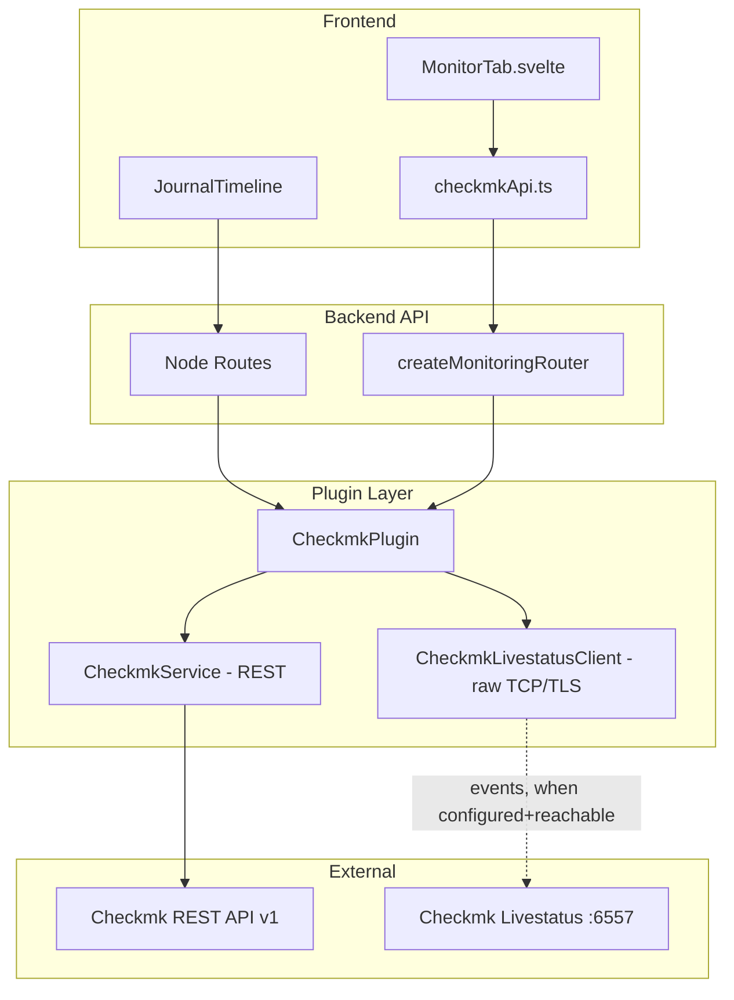
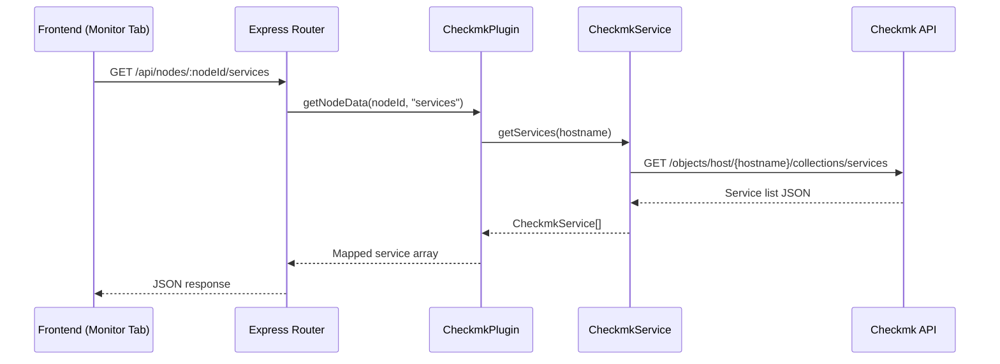
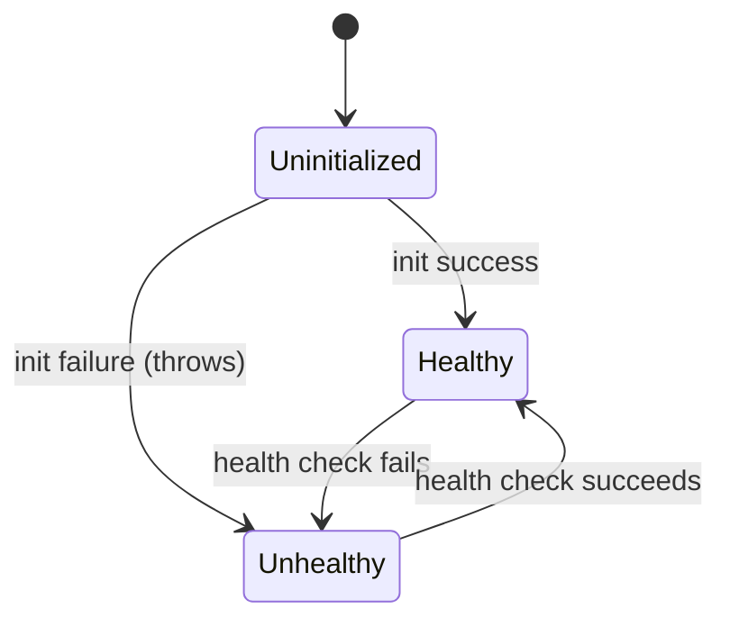

# Design Document: Checkmk Integration

## Overview

This design adds a Checkmk monitoring integration to Pabawi as an `InformationSourcePlugin`. The plugin fetches live data from the Checkmk REST API v1 — host inventory and service monitoring status — and service **state-change events** from the Checkmk **Livestatus** `log` table when configured/reachable, falling back to a REST-derived latest-transition-per-service otherwise. Data is exposed through the existing plugin architecture, node linking system, journal timeline, and two new API endpoints consumed by a frontend Monitor tab.

The integration follows the established plugin patterns: declarative registry entry, `BasePlugin` extension, `ConfigService` env-var parsing, route factory with DI container, and graceful degradation when the upstream API is unavailable.

> **Key decisions:** The events source (Livestatus primary, REST fallback) is recorded in [ADR 0001](../../../docs/adr/0001-checkmk-events-source.md). Initialization is **non-fatal** on connectivity failure (throws only on config errors) so the plugin auto-recovers per Requirement 12.6. Terminology (e.g. State_Change_Event ≠ Event Console event) is in the project [CONTEXT.md](../../../CONTEXT.md).

## Architecture



### Data Flow



### Integration with Existing Systems

- **IntegrationManager**: Registers CheckmkPlugin as an `InformationSourcePlugin` with priority 8. Participates in inventory aggregation and health check scheduling.
- **NodeLinkingService**: Checkmk hosts are linked to existing nodes by hostname (case-insensitive match via the standard linking algorithm). Checkmk is intentionally **not** added to `NodeLinkingService.SOURCE_PRIORITY`, so it resolves to priority 0 and never becomes the primary source — identity/transport/uri always come from richer sources (ssh, puppetserver, etc.) when a node is linked.
- **JournalService**: CheckmkPlugin implements `LiveSource` interface. Registered under key `"checkmk"` in the live sources map. Events are fetched on-demand during timeline aggregation.
- **ConfigService**: New `checkmk` key in the integrations config object, parsed from `CHECKMK_*` environment variables.
- **Plugin Registry**: New entry in `backend/src/plugins/registry.ts` with `resolveConfig` returning null when not configured.

## Components and Interfaces

### CheckmkPlugin (`backend/src/integrations/checkmk/CheckmkPlugin.ts`)

Extends `BasePlugin`, implements `InformationSourcePlugin`.

```typescript
export class CheckmkPlugin extends BasePlugin implements InformationSourcePlugin {
  type = "information" as const;
  private service: CheckmkService;

  constructor(logger?: LoggerService, performanceMonitor?: PerformanceMonitorService);

  // BasePlugin abstract methods
  protected performInitialization(): Promise<void>;
  protected performHealthCheck(): Promise<Omit<HealthStatus, "lastCheck">>;

  // InformationSourcePlugin methods
  getInventory(): Promise<Node[]>;
  getGroups(): Promise<NodeGroup[]>;
  getNodeFacts(nodeId: string): Promise<Facts>;
  getNodeData(nodeId: string, dataType: string): Promise<unknown>;
}
```

**Responsibilities:**

- Lifecycle management. `performInitialization()` validates config (throws only on config errors), then attempts `CheckmkService.testConnection()`; on connectivity failure it logs a warning, marks unhealthy, and **completes initialization** (does not throw) so the periodic health check can recover it without a restart (Requirements 2.3, 12.6)
- Delegates REST communication to `CheckmkService` and Livestatus communication to `CheckmkLivestatusClient`
- Maps Checkmk responses to Pabawi types (`Node`, `NodeGroup`, journal entries)
- Implements `getNodeData` with `dataType` routing: `"services"` → service status; `"events"` → events from Livestatus when configured+reachable, else REST-derived latest-transition-per-service, normalised to journal-formatted `CheckmkEvent` entries
- Returns empty arrays on any upstream failure (graceful degradation); Livestatus failure silently falls back to REST and never affects plugin health

### CheckmkService (`backend/src/integrations/checkmk/CheckmkService.ts`)

HTTP client layer for the Checkmk REST API.

```typescript
export class CheckmkService {
  constructor(config: CheckmkConfig, logger: LoggerService);

  // Connectivity
  testConnection(): Promise<{ success: boolean; version?: string; error?: string }>;

  // Host inventory
  getHosts(): Promise<CheckmkHost[]>;

  // Service monitoring (also yields last_state/last_state_change for REST event fallback)
  getServices(hostname: string): Promise<CheckmkServiceStatus[]>;
}
```

**Responsibilities:**

- Constructs the base URL: `{serverUrl}/{site}/check_mk/api/1.0`
- Attaches `Authorization: Bearer {username} {password}` header to every request
- Configures HTTPS agent based on `sslVerify` setting
- Enforces 15-second request timeout (per Requirement 12.2)
- `getServices` requests explicit `columns=` (description, state, state_type, plugin_output, last_check, **last_state, last_state_change**) — without them Checkmk returns no field data
- Logs errors with structured metadata; never exposes password in logs
- Returns raw Checkmk response types (no Pabawi mapping here)

### CheckmkLivestatusClient (`backend/src/integrations/checkmk/CheckmkLivestatusClient.ts`)

Hand-rolled raw Livestatus (LQL) client — **no third-party dependency**.

```typescript
export class CheckmkLivestatusClient {
  constructor(config: CheckmkLivestatusConfig, logger: LoggerService);

  isEnabled(): boolean;                 // true iff host is configured
  ping(): Promise<boolean>;             // GET status (1 row) — used by periodic probe
  getEvents(hostname: string, options?: { days?: number; limit?: number }): Promise<CheckmkEvent[]>;
}
```

**Responsibilities:**

- Opens a `net.Socket` (or `tls.connect` when `tls` is true; `rejectUnauthorized` from the shared `sslVerify`) to `host:port`
- Writes an LQL query to the `log` table: `GET log` with `Columns: time host_name service_description state state_type plugin_output`, `Filter: class = 1`, `Filter: host_name = {hostname}`, `Filter: time >= {now-7d}`, `Limit: 500`, `OutputFormat: json`, then `ResponseHeader: fixed16` (or KeepAlive off, one request per connection)
- Applies `timeoutMs` (default 5000); on connect/timeout/parse error throws so the plugin can fall back to REST
- Never logs secrets; logs `host:port` for debugging

### Types (`backend/src/integrations/checkmk/types.ts`)

```typescript
export interface CheckmkConfig {
  enabled: boolean;
  serverUrl: string;       // e.g. "https://monitoring.example.com"
  site: string;            // e.g. "mysite"
  username: string;        // automation user
  password: string;        // automation secret
  sslVerify: boolean;      // default true; also governs Livestatus TLS verification
  livestatus?: CheckmkLivestatusConfig;  // optional; events history source
}

export interface CheckmkLivestatusConfig {
  host: string;            // CHECKMK_LIVESTATUS_HOST — presence enables the source
  port: number;            // default 6557
  tls: boolean;            // default false (classic plaintext 6557)
  timeoutMs: number;       // default 5000
}

export interface CheckmkHost {
  hostname: string;
  attributes: {
    ipaddress?: string;
    folder?: string;
    labels?: Record<string, string>;
    [key: string]: unknown;
  };
}

export interface CheckmkServiceStatus {
  description: string;
  state: 0 | 1 | 2 | 3;           // OK, WARN, CRIT, UNKNOWN
  stateType: 0 | 1;               // 0=soft, 1=hard
  pluginOutput: string;            // truncated to 4000 chars
  lastCheck: number;               // unix timestamp seconds
  lastState: 0 | 1 | 2 | 3;        // previous state — for REST event fallback
  lastStateChange: number;         // unix timestamp seconds — for REST event fallback
}

// Normalised across both sources (Livestatus log rows and REST last_state derivation)
export interface CheckmkEvent {
  timestamp: string;               // ISO 8601
  serviceDescription: string;
  previousState: 0 | 1 | 2 | 3;
  currentState: 0 | 1 | 2 | 3;
  output: string;                  // truncated to 4096 chars
}

export const SERVICE_STATE_NAMES: Record<number, string> = {
  0: "OK",
  1: "WARN",
  2: "CRIT",
  3: "UNKNOWN",
};
```

### ConfigService Addition

New `checkmk` key in `IntegrationsConfigSchema`:

```typescript
// In schema.ts
export const CheckmkConfigSchema = z.object({
  enabled: z.boolean().default(false),
  serverUrl: z.string().url().max(2048),
  site: z.string().min(1),
  username: z.string().min(1),
  password: z.string().min(1),
  sslVerify: z.boolean().default(true),
  healthCheckIntervalMs: z.number().int().default(300000), // throttle for health probes (5 min)
  livestatus: z
    .object({
      host: z.string().min(1),
      port: z.number().int().default(6557),
      tls: z.boolean().default(false),
      timeoutMs: z.number().int().default(5000),
    })
    .optional(),
});
```

Environment variable parsing in `ConfigService.parseIntegrationsConfig()`:

| Env Variable | Required | Default | Description |
|---|---|---|---|
| `CHECKMK_ENABLED` | No | `false` | Must be exactly `"true"` to enable |
| `CHECKMK_SERVER_URL` | When enabled | — | Base URL (http:// or https://) |
| `CHECKMK_SITE` | When enabled | — | Checkmk site name |
| `CHECKMK_USERNAME` | When enabled | — | Automation user |
| `CHECKMK_PASSWORD` | When enabled | — | Automation secret |
| `CHECKMK_SSL_VERIFY` | No | `true` | Set to `"false"` to disable TLS verification (REST and Livestatus) |
| `CHECKMK_LIVESTATUS_HOST` | No | — | Livestatus host; **presence enables** the events history source |
| `CHECKMK_LIVESTATUS_PORT` | No | `6557` | Livestatus TCP port |
| `CHECKMK_LIVESTATUS_TLS` | No | `false` | `"true"` wraps the socket in TLS (encrypted Livestatus) |
| `CHECKMK_LIVESTATUS_TIMEOUT_MS` | No | `5000` | Per-request Livestatus timeout before REST fallback |
| `CHECKMK_HEALTHCHECK_INTERVAL_MS` | No | `300000` | Min interval between actual health probes (throttle); caps external API impact |

### Plugin Registry Entry

```typescript
// In registry.ts
{
  name: "checkmk",
  type: "information",
  priority: 8,
  resolveConfig(configService: ConfigService): Record<string, unknown> | null {
    const checkmkConfig = configService.getIntegrationsConfig().checkmk;
    if (!checkmkConfig?.serverUrl) {
      return null;
    }
    return checkmkConfig;
  },
  create(deps: PluginDeps): IntegrationPlugin {
    return new CheckmkPlugin(deps.logger, deps.performanceMonitor);
  },
}
```

### Route Factory (`backend/src/routes/integrations/monitoring.ts`)

```typescript
export function createMonitoringRouter(container: DIContainer): Router;
```

**Endpoints:**

| Method | Path | Auth | RBAC | Description |
|---|---|---|---|---|
| GET | `/api/nodes/:nodeId/services` | JWT | `checkmk:read` | Live service status |
| GET | `/api/nodes/:nodeId/monitoring-events` | JWT | `checkmk:read` | State-change events |

RBAC is applied at the **router mount** in `server.ts` (`app.use("/api/nodes", authMiddleware, rateLimitMiddleware, rbacMiddleware('checkmk','read'), createMonitoringRouter(...))`), matching the existing `/api/nodes` routers — not per-route inside the router. The `checkmk:read` permission must be seeded by migration `014` and backfilled to Viewer/Operator/Administrator/Provisioner, or all requests 403. The router is mounted unconditionally; it returns 503 `CHECKMK_NOT_CONFIGURED` when the plugin is absent.

Both endpoints:

- Return 503 with `CHECKMK_NOT_CONFIGURED` if plugin not enabled
- Return 404 with `NODE_NOT_FOUND` if hostname unknown to Checkmk
- Return 502 with upstream error details on Checkmk API failure/timeout (30s)
- Use `asyncHandler` wrapper and structured error responses

### Frontend: `checkmkApi.ts`

```typescript
export interface ServiceStatus {
  description: string;
  state: "OK" | "WARN" | "CRIT" | "UNKNOWN";
  stateType: "soft" | "hard";
  pluginOutput: string;
  lastCheck: string;  // ISO timestamp
}

export interface MonitoringEvent {
  timestamp: string;
  serviceDescription: string;
  previousState: string;
  currentState: string;
  output: string;
}

export async function getNodeServices(nodeId: string): Promise<ServiceStatus[]>;
export async function getNodeMonitoringEvents(nodeId: string, limit?: number): Promise<MonitoringEvent[]>;
```

### Frontend: MonitorTab Component

`frontend/src/components/MonitorTab.svelte`

- **Gating:** nav button shown only when `(nodeWithMeta.sources ?? []).includes('checkmk')` — encodes Req 9.1 (enabled + linked) in one check
- **Live fetch:** content under `{#if activeTab === 'monitor'} <MonitorTab {nodeId} folder={...} labels={...} /> {/if}` so it remounts on each switch; fetches in its own `onMount`. **Not** added to `loadedTabs`/`dataCache` — never cached (Req 9.2)
- **Host header:** optional `folder?: string` and `labels?: Record<string,string>` props, passed by NodeDetailPage from `(node as LinkedNode).sourceData?.checkmk?.config` (already returned by `GET /api/inventory/:nodeId`). Renders a small folder + labels header; omitted when absent. The `/services` response stays a pure service array — no contract change
- Groups services by state: CRIT → WARN → UNKNOWN → OK, heading + count per group
- State badge uses **semantic colors** (CRIT=red, WARN=amber, UNKNOWN=grey, OK=green) — *not* the checkmk integration purple
- Description, truncated output (200 chars, expandable), relative timestamp via shared `formatRelativeTime`
- **Four post-loading states mapped from HTTP status**: `200`+services → grouped list; `200`+`[]` → "No monitored services for this node" (not an error); `502` → upstream-error message + Retry; `503`/unhealthy → "Monitoring unavailable", list hidden, no Retry. Lets operators distinguish no-checks vs Checkmk-down vs not-configured (Req 9.5–9.8, 12.3)

### Shared helper: `formatRelativeTime`

`formatRelativeTime` is currently duplicated in `NodeStatus.svelte` and `EventsViewer.svelte`. Extract it to a shared `frontend/src/lib/` helper and have MonitorTab (and ideally the two existing call sites) import it, rather than adding a third copy.

### Frontend: Integration Colors

Add `checkmk` entry to `IntegrationColors` interface and default palette:

```typescript
checkmk: {
  primary: '#8B5CF6',  // Purple — distinct from existing integrations
  light: '#F5F3FF',
  dark: '#7C3AED',
}
```

This purple is used **only for source attribution** — the journal timeline source dot/icon (an activity/heartbeat icon). Service-state badges in the Monitor tab use semantic monitoring colors (red/amber/grey/green), never this purple.

**Authoritative source is the backend.** The frontend fetches `GET /api/integrations/colors`, served by `backend/src/services/IntegrationColorService.getDefaultColors()`, and only falls back to its local default. So the `checkmk` entry must be added in **three** places: (1) `IntegrationColorService.getDefaultColors()` (backend, source of truth), (2) the frontend `IntegrationColors` interface (or TypeScript fails), and (3) the frontend default palette (fallback). All three use `#8B5CF6`.

### MCP Tools (`backend/src/mcp/`)

Two read-only tools, registered in `McpToolHandlers.registerAllTools` and gated via `TOOL_PERMISSIONS` in `McpServer.ts`:

```typescript
// McpServer.ts TOOL_PERMISSIONS additions
monitoring_services_get: { resource: 'checkmk', action: 'read' },
monitoring_events_get:   { resource: 'checkmk', action: 'read' },
```

- `monitoring_services_get(nodeId)` → calls `CheckmkPlugin.getNodeData(nodeId, "services")`, summarised by a new `summariseService` in `McpOutputSummariser` (description, state name, plugin output, last check)
- `monitoring_events_get(nodeId, limit?)` → calls `getNodeData(nodeId, "events")`, reusing `summariseJournalEntry` (overlaps `journal_query` by design — a checkmk-scoped events query)
- Both return an MCP error result (not throw) when the plugin is disabled or the node is unknown
- The mcp-service user is auto-granted all `*:read` permissions (`McpServiceUser`), so migration `014` (`checkmk:read`) is the only grant needed
- Update the "8 tools" → "10 tools" count and `docs/mcp.md`

### Setup Guide (`frontend/src/components/CheckmkSetupGuide.svelte`)

Follows the existing `*SetupGuide` pattern (e.g. `HieraSetupGuide`): reactive `config` `$state`, a `generateEnvSnippet()` builder, and copy-to-clipboard. Exported from the `components` barrel and rendered by `IntegrationSetupPage` under `{:else if integration === 'checkmk'}`.

- Core fields: `CHECKMK_ENABLED`, `CHECKMK_SERVER_URL`, `CHECKMK_SITE`, `CHECKMK_USERNAME`, `CHECKMK_PASSWORD`, `CHECKMK_SSL_VERIFY`
- `showAdvanced` toggle reveals the Livestatus group (`CHECKMK_LIVESTATUS_HOST/PORT/TLS/TIMEOUT_MS`) with a note that it enables full event history and that plaintext 6557 is unencrypted

### Journal Integration

The `CheckmkPlugin.getNodeData(nodeId, "events")` returns journal-compatible objects:

```typescript
{
  id: randomUUID(),
  nodeId: hostname,
  nodeUri: `checkmk:${hostname}`,
  eventType: "state_change",
  source: "checkmk",
  action: "state_change",
  summary: `${serviceDescription}: ${previousStateName} → ${currentStateName}`,
  details: { /* full Checkmk event data */ },
  timestamp: event.timestamp,  // ISO 8601
  isLive: true,
}
```

The `JournalService` constructor receives the CheckmkPlugin in its `liveSources` map under key `"checkmk"`. Failed fetches are silently skipped per existing `fetchLiveEntries` error handling.

## Data Models

### Checkmk API Response Shapes (External)

**GET `/domain-types/host_config/collections/all`** — Host inventory:

```json
{
  "value": [
    {
      "id": "myhost",
      "title": "myhost",
      "extensions": {
        "attributes": { "ipaddress": "10.0.0.1", "labels": {} },
        "folder": "/servers"
      }
    }
  ]
}
```

**GET `/objects/host/{hostname}/collections/services?columns=description&columns=state&columns=state_type&columns=plugin_output&columns=last_check&columns=last_state&columns=last_state_change`** — Service status (columns are mandatory):

```json
{
  "value": [
    {
      "extensions": {
        "description": "CPU load",
        "state": 0,
        "state_type": 1,
        "plugin_output": "OK - 15min load: 0.42",
        "last_check": 1700000000,
        "last_state": 1,
        "last_state_change": 1699999000
      }
    }
  ]
}
```

**Events — primary: Livestatus `log` table (LQL over TCP, not REST).** `/domain-types/historical_event/...` does **not** exist in the REST API. Query:

```
GET log
Columns: time host_name service_description state state_type plugin_output
Filter: class = 1
Filter: host_name = myhost
Filter: time >= 1699395200
Limit: 500
OutputFormat: json
```

Response is a JSON array-of-arrays (one row per state change), mapped to `CheckmkEvent`.

**Events — fallback: REST service-status derivation.** When Livestatus is unconfigured/unreachable, each service from the `getServices` response yields one `CheckmkEvent`: `previousState = last_state`, `currentState = state`, `timestamp = last_state_change`, `output = plugin_output`.

### Internal Pabawi Mapping

| Checkmk Field | Pabawi Node Field | Notes |
|---|---|---|
| `id` (hostname) | `id`, `name` | Used as linking identifier |
| `extensions.attributes.ipaddress` | `uri` | Falls back to hostname |
| — | `transport` | Always `"ssh"` |
| — | `source` | Always `"checkmk"` |
| `extensions.attributes.ipaddress`, `extensions.folder`, `extensions.attributes.labels` | `config` | Curated: `{ ipaddress, folder, labels }` (labels nested). Data-only at the inventory/linking layer; `folder`/`labels` surfaced in the Monitor tab header via `sourceData["checkmk"].config` |

## Correctness Properties

*A property is a characteristic or behavior that should hold true across all valid executions of a system — essentially, a formal statement about what the system should do. Properties serve as the bridge between human-readable specifications and machine-verifiable correctness guarantees.*

### Property 1: Plugin registration correctness

*For any* combination of environment variable values, the Checkmk plugin SHALL be registered with the IntegrationManager if and only if CHECKMK_ENABLED is exactly the string `"true"` AND CHECKMK_SERVER_URL, CHECKMK_SITE, CHECKMK_USERNAME, and CHECKMK_PASSWORD are all non-empty strings. In all other cases, the plugin SHALL NOT be registered.

**Validates: Requirements 1.2, 1.3, 1.4**

### Property 2: Server URL validation

*For any* string value of CHECKMK_SERVER_URL, the ConfigService SHALL accept it if and only if it begins with `"http://"` or `"https://"`, contains a valid hostname, and does not exceed 2048 characters. All other strings SHALL be rejected.

**Validates: Requirements 1.5**

### Property 3: SSL verify parsing

*For any* string value of CHECKMK_SSL_VERIFY, the resulting `sslVerify` configuration SHALL be `false` if and only if the value is exactly the string `"false"`. For any other non-empty value, undefined, or empty string, the result SHALL be `true`.

**Validates: Requirements 1.7**

### Property 4: Authorization header correctness

*For any* request made by CheckmkService to the Checkmk API, the request SHALL include an `Authorization` header with the value `Bearer {username} {password}` where username and password are the configured credentials.

**Validates: Requirements 3.1**

### Property 5: Password non-exposure

*For any* operation performed by the Checkmk plugin that produces log output, error messages, or API responses, the configured CHECKMK_PASSWORD value SHALL NOT appear in any of those outputs.

**Validates: Requirements 3.3**

### Property 6: Host-to-Node mapping

*For any* valid Checkmk host object returned by the API, the mapping SHALL produce a Pabawi Node where: `id` equals the hostname, `name` equals the hostname, `transport` equals `"ssh"`, `uri` equals the IP address if present or the hostname otherwise, `source` equals `"checkmk"`, and `config` contains all Checkmk host attributes (IP address, folder path, labels) as key-value pairs.

**Validates: Requirements 5.2, 5.3, 6.1**

### Property 7: Service mapping and filtering

*For any* array of service objects returned by the Checkmk API, the plugin SHALL return only services that have both a `description` and `state` field present, and each returned service SHALL have: `description` as a string, `state` as an integer 0–3, `stateType` as 0 or 1, `pluginOutput` truncated to 4000 characters with ellipsis if longer, and `lastCheck` as a unix timestamp.

**Validates: Requirements 7.2, 7.6**

### Property 8: Event mapping and ordering

*For any* array of state-change events returned by the events source (Livestatus `log`, or the REST `last_state`→`state` derivation), the plugin SHALL return events with: timestamp in ISO 8601 format, service description, previous state (0–3), current state (0–3), and output truncated to 4096 characters. The returned array SHALL be sorted by timestamp in descending order.

**Validates: Requirements 8.3, 8.5**

### Property 9: Service grouping order

*For any* array of services with mixed states, the Monitor tab grouping function SHALL produce groups in the order: CRIT (state 2) first, then WARN (state 1), then UNKNOWN (state 3), then OK (state 0), with each group containing the correct count of services.

**Validates: Requirements 9.3**

### Property 10: Journal entry mapping

*For any* Checkmk state-change event, the journal entry mapping SHALL produce an object with: `source` equal to `"checkmk"`, `eventType` equal to `"state_change"`, `summary` containing the service description and a state transition in the format `"{service}: {previousStateName} → {currentStateName}"`, `timestamp` in ISO 8601 format, `isLive` equal to `true`, and `details` containing the full event data.

**Validates: Requirements 10.2**

### Property 11: Graceful degradation

*For any* data fetch operation (inventory, services, or events) where the upstream source (REST or Livestatus) is unreachable or returns an error, the plugin SHALL return an empty array without throwing an exception, and SHALL log the error with structured metadata including component, integration name, and operation. For events specifically, a Livestatus failure SHALL first fall back to the REST derivation before yielding an empty array.

**Validates: Requirements 12.1, 8.6**

## Error Handling

### Strategy

The Checkmk integration follows Pabawi's established graceful degradation pattern: upstream failures never propagate as exceptions to callers. All error paths return empty results and log structured errors.

### Error Categories

| Error Type | HTTP Status from Checkmk | Plugin Behavior | API Response to Frontend |
|---|---|---|---|
| Connection refused / DNS failure | N/A (network) | Log error, return `[]` | 502 with upstream error |
| Request timeout (>15s) | N/A (timeout) | Abort request, return `[]` | 502 with timeout message |
| Authentication failure | 401, 403 | Log (no password), return `[]`, report unhealthy | 502 with auth error |
| Host not found | 404 | Return `[]` | 404 `NODE_NOT_FOUND` |
| Server error | 5xx | Log error, return `[]` | 502 with upstream error |
| Invalid response body | N/A (parse) | Log error, return `[]` | 502 with parse error |
| Plugin not configured | N/A | — | 503 `CHECKMK_NOT_CONFIGURED` |

### Timeout Configuration

- **CheckmkService (REST) request timeout**: 15 seconds (per Requirement 12.2)
- **CheckmkLivestatusClient timeout**: 5 seconds default (`CHECKMK_LIVESTATUS_TIMEOUT_MS`) — on expiry, fall back to REST event derivation
- **IntegrationManager per-source timeout**: 15 seconds (existing `SOURCE_TIMEOUT_MS`)
- **API endpoint timeout**: 30 seconds (per Requirement 11.7). Worst-case event path = Livestatus timeout (5s) + REST fallback (15s) = 20s < 30s, so the budget holds
- **Health check / init timeout**: 10 seconds (per Requirement 2.2, 2.4)

### Logging Contract

All errors logged via `LoggerService` with structured metadata:

```typescript
this.logger.error("Failed to fetch services from Checkmk", {
  component: "CheckmkPlugin",
  integration: "checkmk",
  operation: "getServices",
  metadata: { hostname, statusCode, errorMessage },
});
```

Password is never included in metadata. The `serverUrl` may be logged for debugging.

### Health State Transitions



The plugin does not require a restart to recover. The IntegrationManager's periodic health check scheduler will detect recovery automatically.

**Throttled probes (limit external-API impact).** The global scheduler calls `healthCheckAll(false)` — cache-bypassed — every cycle (5 min default) and drops to a 60s retry whenever *any* plugin is unhealthy. To keep this from hammering the Checkmk API, `CheckmkPlugin.performHealthCheck` is **self-throttling**: it caches the last `testConnection` result + timestamp and returns it unchanged if re-invoked within `healthCheckIntervalMs` (`CHECKMK_HEALTHCHECK_INTERVAL_MS`, default 5 min). Net effect: at most one `/version` (and at most one Livestatus probe) per interval, regardless of scheduler cadence or the 60s retry storm. Trade-off: recovery is detected within one throttle interval rather than one scheduler cycle (acceptable per Req 2.8).

## Testing Strategy

### Unit Tests (`backend/test/unit/`)

**CheckmkService tests:**

- Auth header construction with various username/password values
- URL construction from config (serverUrl + site)
- HTTPS agent configuration (sslVerify true/false, http:// scheme)
- Response parsing for hosts and services (incl. `last_state`/`last_state_change` columns)
- Mandatory `columns=` query parameters present on the services request

**CheckmkLivestatusClient tests:**

- LQL `log` query construction (class=1, host_name, time≥now-7d, limit 500)
- Row→`CheckmkEvent` mapping; TLS vs plaintext socket selection; `rejectUnauthorized` from `sslVerify`
- Timeout aborts and surfaces an error (so the plugin can fall back)

**CheckmkPlugin init & fallback tests:**

- Init with REST unreachable → `initialized === true`, plugin unhealthy, **no throw**; a later successful `performHealthCheck()` flips healthy without re-init (Req 2.3/12.6)
- Init with invalid config → throws
- events: Livestatus reachable → Livestatus events; Livestatus unreachable/timeout → REST-derived events; Livestatus failure never flips overall health
- REST derivation omits services where `last_state === state` (no synthetic OK→OK)
- Timeout behavior (mocked)
- Error handling for various HTTP status codes

**CheckmkPlugin tests:**

- Host-to-Node mapping (various attribute combinations)
- Service filtering (missing fields omitted)
- Event sorting (timestamp descending)
- Journal entry formatting
- getNodeData routing (services vs events vs unknown dataType)
- Graceful degradation (empty arrays on service errors)

**ConfigService tests:**

- Env var parsing for all CHECKMK_* variables
- Validation of server URL format
- SSL verify defaulting and parsing
- Missing required vars when enabled

**Route tests (supertest):**

- 503 when plugin not configured
- 404 for unknown node
- 502 on upstream failure
- 401 without JWT
- 403 without monitoring:read permission
- Successful responses with correct shape

### Property-Based Tests (`backend/test/properties/`)

Using `fast-check` with minimum 100 iterations per property.

Each property test references its design document property:

```typescript
// Feature: checkmk-integration, Property 6: Host-to-Node mapping
it("maps any valid Checkmk host to a correct Pabawi Node", () => {
  fc.assert(
    fc.property(checkmkHostArbitrary, (host) => {
      const node = mapCheckmkHostToNode(host);
      expect(node.id).toBe(host.hostname);
      expect(node.name).toBe(host.hostname);
      expect(node.transport).toBe("ssh");
      expect(node.source).toBe("checkmk");
      // ... additional assertions
    }),
    { numRuns: 100 }
  );
});
```

**Properties to implement:**

1. Plugin registration correctness (config combinations)
2. Server URL validation (random strings)
3. SSL verify parsing (random strings)
4. Auth header correctness (random credentials)
5. Password non-exposure (random passwords in error scenarios)
6. Host-to-Node mapping (random host objects)
7. Service mapping and filtering (random service arrays)
8. Event mapping and ordering (random event arrays)
9. Service grouping order (random service state arrays)
10. Journal entry mapping (random events)
11. Graceful degradation (random operations with mocked failures)

### Frontend Tests (`frontend/src/components/`)

**MonitorTab.test.ts:**

- Renders loading state
- Renders services grouped by state in correct order, with semantic state-badge colors
- `502` → renders upstream-error state with Retry button; Retry triggers re-fetch
- `200`+`[]` → renders "No monitored services" empty state (no Retry, not an error)
- `503`/unhealthy → renders "Monitoring unavailable" state with the list hidden (no Retry)
- Service output truncation at 200 chars with expand

### Integration Tests

- Full plugin lifecycle: init → health check → inventory → services → events
- JournalService aggregation with Checkmk live source
- NodeLinkingService merge with Checkmk hosts
- Plugin registry resolveConfig behavior

### Test Infrastructure

- Mock Checkmk API responses using `nock` or manual fetch mocks
- `fast-check` arbitraries for `CheckmkHost`, `CheckmkServiceStatus`, `CheckmkEvent`
- Shared test fixtures for common Checkmk response shapes
