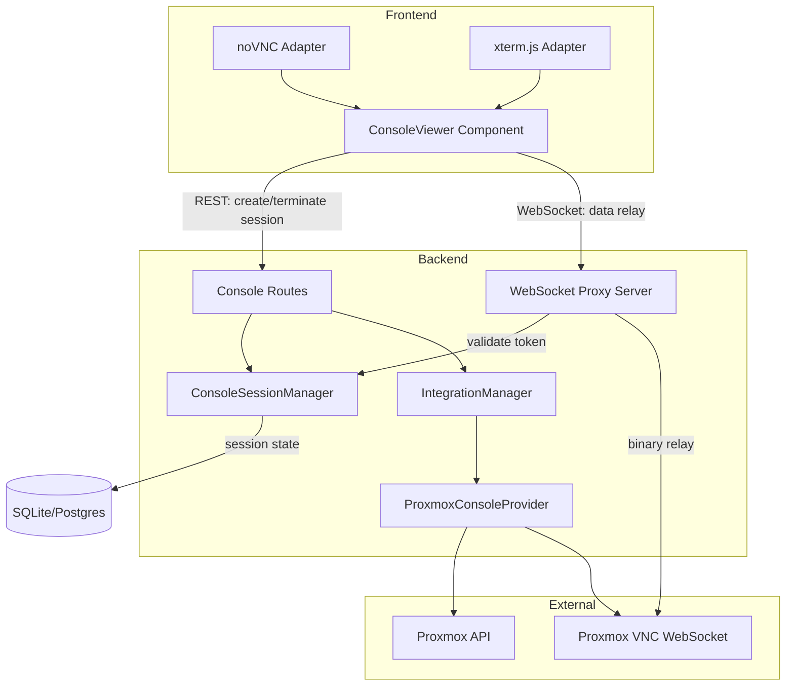
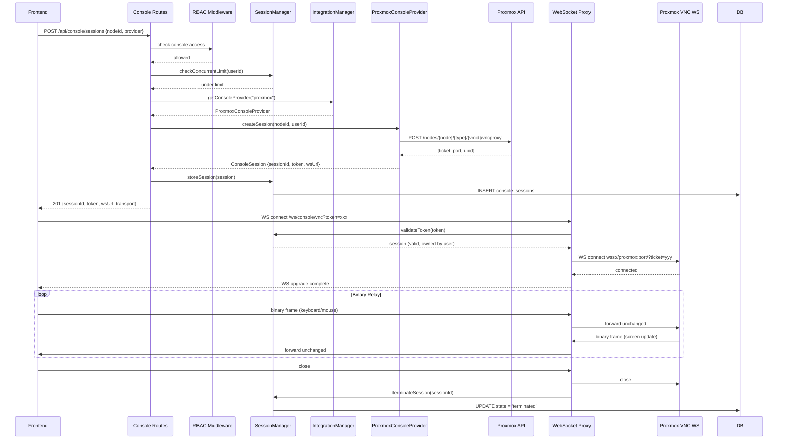

# Design Document: Console Integration

## Overview

The console integration feature introduces a `ConsolePlugin` interface into Pabawi's plugin architecture, enabling any infrastructure integration to expose remote console/terminal access (VNC, serial, SSH, SSM) to managed nodes. The system uses WebSocket proxying to relay binary VNC frames or terminal I/O between the browser and the upstream provider, with session lifecycle management, RBAC gating, and audit logging.

The initial implementation targets Proxmox VNC consoles. The architecture is designed to accommodate future providers (AWS SSM, Azure Serial Console) without structural changes.

### Key Design Decisions

1. **WebSocket proxy over direct connection** — The backend mediates all console traffic. This enables session-level RBAC, audit logging, token-based access, and upstream credential isolation. The browser never connects directly to Proxmox/AWS/Azure.

2. **Separate WebSocket server on shared HTTP server** — The `ws` library attaches to the existing Express HTTP server with path-based routing (`/ws/console/vnc`, `/ws/console/terminal`), avoiding a second port.

3. **Session token for WebSocket auth** — JWT tokens authenticate the REST session creation, but a short-lived opaque session token authorizes the WebSocket upgrade. This decouples the WebSocket handshake (which can only pass tokens via query params) from JWT, limiting exposure.

4. **ConsolePlugin as a third plugin interface** — Alongside `ExecutionToolPlugin` and `InformationSourcePlugin`, `ConsolePlugin` is registered in a dedicated map on `IntegrationManager`. This keeps concerns separated: console access is orthogonal to execution and information retrieval.

5. **Provider-level VNC ticket acquisition** — The Proxmox provider acquires a time-limited VNC proxy ticket from the Proxmox API, then connects upstream using that ticket. The ticket never reaches the browser.

## Architecture



### Console Open Flow — Sequence Diagram



## Components and Interfaces

### ConsolePlugin Interface

```typescript
import type { IntegrationPlugin } from "./types";

/** Supported transport protocols */
type ConsoleTransport = "websocket-vnc" | "websocket-terminal";

/** Describes a console capability for a node */
interface ConsoleCapability {
  transport: ConsoleTransport;
  displayName: string; // max 100 chars
  connectionSchema: Record<string, unknown>;
}

/** Session state machine */
type ConsoleSessionState = "creating" | "active" | "terminated" | "failed";

/** Session status returned by getSessionStatus */
interface ConsoleSessionStatus {
  state: ConsoleSessionState;
  startedAt: string; // ISO 8601
  error?: string; // present when state === "failed"
}

/** Full session object returned by createSession */
interface ConsoleSession {
  sessionId: string;
  token: string; // session token for WS auth
  wsUrl: string; // relative WebSocket URL
  transport: ConsoleTransport;
  state: ConsoleSessionState;
  startedAt: string;
  nodeId: string;
  userId: string;
  provider: string;
}

/** Console plugin interface — third plugin type alongside execution/information */
interface ConsolePlugin extends IntegrationPlugin {
  getConsoleCapabilities(nodeId: string): Promise<ConsoleCapability[]>;
  createSession(nodeId: string, userId: string): Promise<ConsoleSession>;
  terminateSession(sessionId: string): Promise<boolean>;
  getSessionStatus(sessionId: string): Promise<ConsoleSessionStatus>;
  getSupportedTransports(): ConsoleTransport[];
}
```

### IntegrationManager Extension

```typescript
// Added to IntegrationManager alongside executionTools and informationSources
private consoleProviders = new Map<string, ConsolePlugin>();

// Registration detects ConsolePlugin via type guard
private isConsolePlugin(plugin: IntegrationPlugin): plugin is ConsolePlugin {
  return "getConsoleCapabilities" in plugin
    && "createSession" in plugin
    && "terminateSession" in plugin;
}

// During registerPlugin:
if (this.isConsolePlugin(plugin)) {
  this.consoleProviders.set(plugin.name, plugin);
}

// New public methods:
getConsoleProvider(name: string): ConsolePlugin | null;
getAllConsoleProviders(): ConsolePlugin[];
async getConsoleAvailability(nodeId: string): Promise<ConsoleAvailabilityEntry[]>;
```

### ConsoleSessionManager Service

Manages session state, token generation/validation, timeout enforcement, and concurrent session limiting.

```typescript
class ConsoleSessionManager {
  constructor(
    private db: DatabaseAdapter,
    private config: ConsoleConfig,
    private logger: LoggerService,
    private auditLogger: AuditLoggingService,
  ) {}

  /** Generate a cryptographically random session token (32+ bytes) */
  generateToken(): string;

  /** Store a new session and its token */
  async createSession(session: ConsoleSession): Promise<void>;

  /** Validate token: exists, not expired (60s), owned by userId */
  async validateToken(token: string, userId: string): Promise<ConsoleSession | null>;

  /** Mark token as used (consumed on WS upgrade) */
  async consumeToken(token: string): Promise<void>;

  /** Record heartbeat for a session */
  async heartbeat(sessionId: string): Promise<void>;

  /** Terminate a session and record audit */
  async terminateSession(sessionId: string, reason: string): Promise<void>;

  /** Get count of active sessions for a user */
  async getActiveSessionCount(userId: string): Promise<number>;

  /** Terminate all sessions for a provider (used on restart) */
  async terminateAllForProvider(provider: string): Promise<void>;

  /** Cleanup expired sessions (called on interval) */
  async cleanupExpiredSessions(): Promise<void>;

  /** Get session by ID */
  async getSession(sessionId: string): Promise<ConsoleSession | null>;
}
```

### WebSocket Proxy Server

```typescript
import { WebSocketServer, WebSocket } from "ws";
import type { Server as HTTPServer } from "http";

class ConsoleWebSocketProxy {
  private wss: WebSocketServer;

  constructor(
    httpServer: HTTPServer,
    private sessionManager: ConsoleSessionManager,
    private config: ConsoleConfig,
    private logger: LoggerService,
  ) {
    // Two paths: /ws/console/vnc and /ws/console/terminal
    this.wss = new WebSocketServer({ noServer: true });

    httpServer.on("upgrade", (req, socket, head) => {
      // Origin validation
      // Path routing
      // Token extraction from query params
      this.handleUpgrade(req, socket, head);
    });
  }

  /** Handle VNC binary relay */
  private async handleVncConnection(
    clientWs: WebSocket,
    session: ConsoleSession,
    upstreamUrl: string,
  ): Promise<void>;

  /** Handle terminal text/binary relay */
  private async handleTerminalConnection(
    clientWs: WebSocket,
    session: ConsoleSession,
    upstreamUrl: string,
  ): Promise<void>;
}
```

### Console Route Factory

```typescript
// backend/src/routes/console.ts
export function createConsoleRouter(
  container: DIContainer,
  integrationManager: IntegrationManager,
  sessionManager: ConsoleSessionManager,
  db: DatabaseAdapter,
): Router;
```

**Endpoints:**

| Method | Path | Auth | Permission | Description |
|--------|------|------|------------|-------------|
| GET | `/api/console/availability/:nodeId` | JWT | `console:access` | Get available console options for a node |
| POST | `/api/console/sessions` | JWT | `console:access` | Create a console session |
| DELETE | `/api/console/sessions/:sessionId` | JWT | `console:access` or `console:admin` | Terminate a session |
| GET | `/api/console/sessions/:sessionId` | JWT | `console:access` | Get session status |
| POST | `/api/console/sessions/:sessionId/heartbeat` | JWT | `console:access` | Send heartbeat |

### ProxmoxConsoleProvider

Extends the existing `ProxmoxIntegration` class or lives as a companion that delegates to `ProxmoxService` for API calls.

```typescript
class ProxmoxConsoleProvider implements ConsolePlugin {
  constructor(
    private proxmoxService: ProxmoxService,
    private logger: LoggerService,
  ) {}

  async getConsoleCapabilities(nodeId: string): Promise<ConsoleCapability[]> {
    // Check if guest exists and is running
    // Return [{transport: "websocket-vnc", displayName: "VNC Console", ...}]
  }

  async createSession(nodeId: string, userId: string): Promise<ConsoleSession> {
    // 1. Determine guest type (qemu/lxc) from nodeId
    // 2. Verify guest is running
    // 3. POST /nodes/{node}/{type}/{vmid}/vncproxy → {ticket, port}
    // 4. Build upstream WS URL: wss://proxmox:port/...?vncticket=xxx
    // 5. Return ConsoleSession with token, wsUrl
  }

  getSupportedTransports(): ConsoleTransport[] {
    return ["websocket-vnc"];
  }
}
```

### Frontend: ConsoleViewer Component

A single Svelte 5 component at `frontend/src/components/ConsoleViewer.svelte` that:

1. Accepts `nodeId` and `capabilities` props
2. Renders transport-appropriate sub-component:
   - noVNC canvas for `websocket-vnc`
   - xterm.js terminal for `websocket-terminal`
3. Manages connection lifecycle (connect, heartbeat, disconnect)
4. Displays status indicator (`connecting` | `connected` | `disconnected`)
5. Handles error close codes (4401, 4502, 4408, 4504) with user-facing messages
6. Provides full-screen toggle
7. Uses `navigator.sendBeacon` for cleanup on page unload

State is managed via Svelte runes (`$state`, `$effect`) inside the component. No separate `.svelte.ts` store file needed — console state is scoped to the viewer's lifecycle.

## Data Models

### Database Schema: `console_sessions`

Migration file: `018_console_sessions.sql`

```sql
CREATE TABLE console_sessions (
  id TEXT PRIMARY KEY,
  user_id TEXT NOT NULL,
  node_id TEXT NOT NULL,
  provider TEXT NOT NULL,
  transport TEXT NOT NULL,
  state TEXT NOT NULL DEFAULT 'creating',
  token TEXT,
  token_created_at TEXT,
  token_consumed INTEGER NOT NULL DEFAULT 0,
  upstream_url TEXT,
  started_at TEXT NOT NULL,
  last_heartbeat_at TEXT,
  terminated_at TEXT,
  error_message TEXT,
  created_at TEXT NOT NULL DEFAULT (datetime('now')),
  CONSTRAINT chk_state CHECK (state IN ('creating', 'active', 'terminated', 'failed')),
  CONSTRAINT chk_transport CHECK (transport IN ('websocket-vnc', 'websocket-terminal'))
);

CREATE INDEX idx_console_sessions_user_id ON console_sessions(user_id);
CREATE INDEX idx_console_sessions_state ON console_sessions(state);
CREATE INDEX idx_console_sessions_token ON console_sessions(token);
```

### Console Configuration (Zod Schema Addition)

```typescript
// Added to backend/src/config/schema.ts
export const ConsoleConfigSchema = z.object({
  sessionTimeoutMs: z.number().int().positive().default(300000),
  maxSessionDuration: z.number().int().positive().default(28800000),
  maxConcurrentSessions: z.number().int().min(1).default(3),
  heartbeatIntervalMs: z.number().int().positive().default(30000),
});

export type ConsoleConfig = z.infer<typeof ConsoleConfigSchema>;
```

Added to `AppConfigSchema`:
```typescript
console: ConsoleConfigSchema.default({
  sessionTimeoutMs: 300000,
  maxSessionDuration: 28800000,
  maxConcurrentSessions: 3,
  heartbeatIntervalMs: 30000,
}),
```

### RBAC Permissions (Migration)

Migration file: `019_console_permissions.sql`

```sql
INSERT INTO permissions (id, resource, action, description)
VALUES
  (lower(hex(randomblob(16))), 'console', 'access', 'Access console sessions for nodes'),
  (lower(hex(randomblob(16))), 'console', 'admin', 'Manage other users console sessions');

-- Grant console:access to operator and admin roles
INSERT INTO role_permissions (role_id, permission_id)
SELECT r.id, p.id
FROM roles r, permissions p
WHERE r.name IN ('operator', 'admin')
  AND p.resource = 'console' AND p.action = 'access';

-- Grant console:admin to admin role only
INSERT INTO role_permissions (role_id, permission_id)
SELECT r.id, p.id
FROM roles r, permissions p
WHERE r.name = 'admin'
  AND p.resource = 'console' AND p.action = 'admin';
```

## Correctness Properties

*A property is a characteristic or behavior that should hold true across all valid executions of a system — essentially, a formal statement about what the system should do. Properties serve as the bridge between human-readable specifications and machine-verifiable correctness guarantees.*

### Property 1: Console provider registration invariant

*For any* plugin that implements the `ConsolePlugin` interface, after registration with `IntegrationManager`, it SHALL appear in the console providers map and be retrievable by name.

**Validates: Requirements 1.4**

### Property 2: Session token validation correctness

*For any* session token, the WebSocket validation function SHALL accept the token if and only if: it exists in the database, was created less than 60 seconds ago, has not been consumed, and the connecting user matches the session owner. All other tokens SHALL be rejected with close code 4401.

**Validates: Requirements 4.2, 4.3, 5.2, 5.3, 8.1, 8.2**

### Property 3: Binary frame relay integrity

*For any* binary data frame sent through the VNC WebSocket proxy in either direction, the frame SHALL arrive at the other end byte-for-byte identical to what was sent.

**Validates: Requirements 4.4**

### Property 4: Terminal resize dimension validation

*For any* resize control message, the system SHALL propagate the resize if columns are in [1, 500] and rows are in [1, 200]. For any values outside these ranges, the message SHALL be discarded without terminating the session.

**Validates: Requirements 5.5, 5.8**

### Property 5: RBAC enforcement for session creation

*For any* user requesting console session creation, the system SHALL allow the request if and only if the user holds the `console:access` permission. Users without this permission SHALL receive a 403 response.

**Validates: Requirements 6.2, 6.3**

### Property 6: RBAC enforcement for cross-user termination

*For any* user attempting to terminate a console session they do not own, the system SHALL allow the operation if and only if the user holds the `console:admin` permission. Users owning their own session need only `console:access`.

**Validates: Requirements 6.4, 6.5, 6.6, 8.3**

### Property 7: Concurrent session limit enforcement

*For any* user who has reached the configured `maxConcurrentSessions` limit (default 3), new session creation requests SHALL be rejected with HTTP 429 status.

**Validates: Requirements 8.6**

### Property 8: Session record completeness

*For any* created console session, the stored record SHALL contain non-null values for: session ID, user ID, node ID, provider name, creation timestamp, and last heartbeat timestamp.

**Validates: Requirements 2.7**

### Property 9: Audit log completeness for session events

*For any* session creation or termination event, an audit log entry SHALL be recorded containing the user ID, node ID, provider name, action type, and ISO 8601 timestamp.

**Validates: Requirements 8.4**

### Property 10: Availability response structure and ordering

*For any* console availability query returning multiple providers, each entry SHALL contain provider name, transport type, and display label, and entries SHALL be sorted by provider name in ascending alphabetical order.

**Validates: Requirements 3.3, 3.4**

### Property 11: Unsupported node returns empty availability

*For any* node ID not supported by any registered console provider, the availability query SHALL return an empty array.

**Validates: Requirements 3.2**

### Property 12: Guest type routing correctness

*For any* Proxmox guest, the console provider SHALL use the `/qemu/{vmid}/vncproxy` endpoint for QEMU guests and `/lxc/{vmid}/vncproxy` endpoint for LXC guests.

**Validates: Requirements 9.4**

### Property 13: Non-running guest rejection

*For any* Proxmox guest not in the "running" state, console session creation SHALL fail with an error message indicating the guest must be running.

**Validates: Requirements 9.6**

### Property 14: Configuration parsing with defaults

*For any* console environment variable that contains a non-numeric, non-integer, or less-than-1 value, the system SHALL use the documented default and log a warning. Additionally, if `heartbeatIntervalMs >= sessionTimeoutMs`, both SHALL revert to their defaults.

**Validates: Requirements 11.1, 11.2, 11.3, 11.4, 11.5, 11.6**

### Property 15: Unhealthy provider exclusion

*For any* console provider that is unavailable or fails its health check, the system SHALL exclude it from availability responses while still returning results from healthy providers.

**Validates: Requirements 10.1**

### Property 16: Malformed control message resilience

*For any* binary control frame received on a terminal WebSocket with an unrecognized message type byte or a payload shorter than expected for the declared type, the system SHALL discard the frame and continue relaying without terminating the session.

**Validates: Requirements 5.8**

## Error Handling

### WebSocket Close Codes

| Code | Meaning | When Used |
|------|---------|-----------|
| 4401 | Authentication failed | Invalid or expired session token |
| 4408 | Session duration exceeded | Max session duration reached |
| 4502 | Upstream failure | Provider connection dropped |
| 4504 | Connection timeout | Upstream failed to connect within 10s |

### REST API Error Responses

| Status | Condition | Body |
|--------|-----------|------|
| 403 | Missing `console:access` or `console:admin` | `{error: {code: "FORBIDDEN", message: "..."}}` |
| 404 | Session or node not found | `{error: {code: "NOT_FOUND", message: "..."}}` |
| 429 | Concurrent session limit reached | `{error: {code: "TOO_MANY_SESSIONS", message: "..."}}` |
| 502 | Provider unavailable or upstream error | `{error: {code: "PROVIDER_ERROR", message: "..."}}` |
| 504 | Session creation timeout (>30s) | `{error: {code: "TIMEOUT", message: "..."}}` |

### Graceful Degradation Strategy

- Provider health check failures → exclude from availability, don't affect other routes
- WebSocket proxy upstream drop → close client with 4502, terminate session, log
- Backend restart → mark all sessions terminated before accepting new ones
- Token expiry race condition → client gets 4401, can re-create session via REST

## Testing Strategy

### Property-Based Testing (fast-check)

Property-based testing applies to this feature. The core logic around token validation, session state management, configuration parsing, and RBAC enforcement involves pure functions or clearly defined input/output behavior with large input spaces.

**Library:** `fast-check` (already in project)
**Minimum iterations:** 100 per property test
**Tag format:** `Feature: console-integration, Property {N}: {title}`

Properties to implement as PBT:
- Property 2 (token validation) — generate random tokens, timestamps, user IDs
- Property 4 (resize validation) — generate random dimension pairs
- Property 5 (RBAC creation) — generate random user/permission combinations
- Property 6 (RBAC cross-user termination) — generate random user/owner/permission combinations
- Property 7 (concurrent limit) — generate random session counts
- Property 8 (session record completeness) — generate random session inputs
- Property 10 (availability ordering) — generate random provider name arrays
- Property 14 (config parsing) — generate random env var values

### Unit Tests (Vitest)

- `ConsoleSessionManager`: session lifecycle, token generation, cleanup
- `ProxmoxConsoleProvider`: VNC ticket acquisition, guest type routing, error handling
- `ConsoleWebSocketProxy`: token extraction, origin validation, close code handling
- Config parsing: valid/invalid env vars, cross-field validation
- Route handlers: request validation, RBAC checks, response format

### Integration Tests

- Full session flow: create → WebSocket connect → relay → terminate
- Provider unavailability: health check failure → exclusion from availability
- Concurrent session enforcement across multiple requests
- Database: migration, session CRUD, cleanup queries

### Frontend Tests

- `ConsoleViewer.svelte`: transport-based rendering, status indicator, error display
- WebSocket lifecycle: connect, heartbeat timer, disconnect cleanup
- `sendBeacon` on page unload
