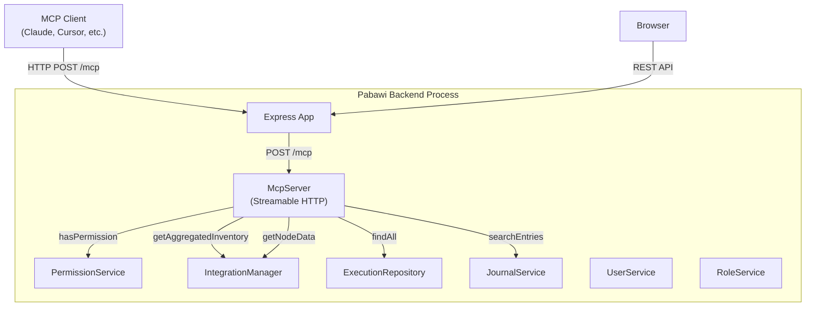
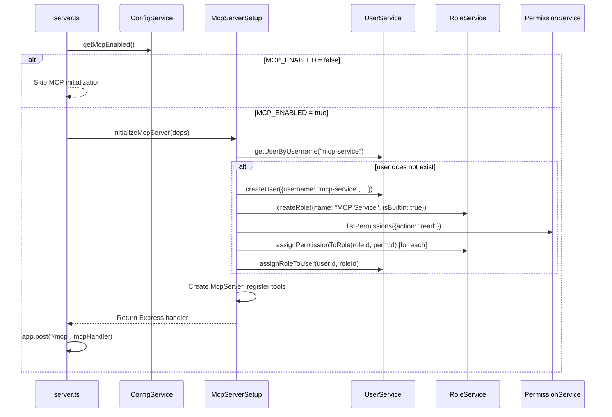

# Design Document: RBAC Enhancements and MCP Server

## Overview

This design covers three related workstreams:

1. **RBAC gap fixes** — Migration 013 adds missing permissions for Azure, Hiera, and SSH integrations, and backfills role-permission assignments for Viewer, Operator, Administrator, and Provisioner roles.
2. **Frontend bug fixes** — Fix the `fetchWithRetry` function to handle HTTP 204 No Content responses without JSON parse errors, implement the stub `CreateRoleDialog` component, and update `permissions.ts` types to include the new resources.
3. **Embedded MCP server** — An MCP server running inside the Express backend process, exposing read-only infrastructure tools over Streamable HTTP transport, gated by the existing RBAC permission system via a dedicated `mcp-service` user.

## Architecture

### System Context



### MCP Server Lifecycle



## Components and Interfaces

### 1. Migration 013 (`backend/src/database/migrations/013_azure_hiera_ssh_permissions.sql`)

A SQL migration that:

- Creates Azure permissions: `azure-read`, `azure-lifecycle`, `azure-provision`, `azure-destroy`, `azure-admin`
- Creates Hiera permissions: `hiera-read`, `hiera-admin`
- Creates SSH permissions: `ssh-read`, `ssh-execute`, `ssh-admin`
- Uses `INSERT OR IGNORE` for SQLite compatibility (idempotent)
- Assigns missing read permissions to Viewer role (`proxmox-read-001`, `aws-read-001`, `journal-read-001`, `integration_config-read-001`, plus new azure/hiera/ssh read)
- Assigns read + execute + lifecycle permissions to Operator role
- Assigns all new permissions to Administrator role
- Assigns Azure provisioning + Hiera read to Provisioner role

Permission ID convention follows existing pattern: `{resource}-{action}` (no numeric suffix for new permissions, matching the pattern that migration 007 established for IDs like `proxmox-read-001`). New permissions will use IDs like `azure-read-001`, `hiera-read-001`, `ssh-read-001` for consistency.

### 2. Frontend API Client Fix (`frontend/src/lib/api.ts`)

The `fetchWithRetry` function currently calls `response.json()` unconditionally on success. HTTP 204 responses have no body, causing a JSON parse error.

Fix: After the `response.ok` check, add a guard for 204 status:

```typescript
if (response.ok) {
  if (response.status === 204) {
    return undefined as T;
  }
  const data = await response.json() as T;
  // ... existing success logging
  return data;
}
```

This affects `post()` and `del()` wrappers which call `fetchWithRetry` — no changes needed to those wrappers since the fix is in the shared function.

### 3. CreateRoleDialog (`frontend/src/components/CreateRoleDialog.svelte`)

A Svelte 5 component using runes for state management.

**Props interface:**

```typescript
interface Props {
  isOpen: boolean;       // bindable, controls dialog visibility
  onClose: () => void;   // callback when dialog closes
  onCreated: () => void; // callback after successful creation
}
```

**State:**

- `roleName: string` — input value, validated 3-100 chars
- `description: string` — input value, validated 0-500 chars
- `isSubmitting: boolean` — loading state during POST
- `errorMessage: string` — server error display

**Behavior:**

- Validates name length (3-100) and description length (≤500) client-side before submission
- Sends `POST /api/roles` with `{ name, description }`
- On 201: closes dialog, calls `onCreated()`, shows success toast
- On 409: shows "role name already exists" error inline
- On other errors: shows error message inline, dialog stays open
- Accessible: uses `<dialog>` element, focus trap, ESC to close

**Integration with RoleManagementPage:**

- Import `CreateRoleDialog` in `RoleManagementPage.svelte`
- Add `isCreateDialogOpen` state
- Replace `handleCreateRole()` stub with `isCreateDialogOpen = true`
- Wire `onCreated` to `loadRoles()`

### 4. Frontend Permissions Update (`frontend/src/lib/permissions.ts`)

Add to `PermissionResource` union type:

```typescript
| 'azure'
| 'hiera'
| 'ssh'
```

Update `RESOURCE_CATEGORIES`:

```typescript
infrastructure: {
  label: 'Infrastructure',
  resources: ['proxmox', 'aws', 'azure'],
},
configuration: {
  label: 'Configuration',
  resources: ['integration_config', 'hiera'],
},
system: {
  label: 'System',
  resources: ['users', 'groups', 'roles', 'ansible', 'bolt', 'puppetdb', 'ssh'],
},
```

Update `RESOURCE_LABELS`:

```typescript
azure: 'Azure',
hiera: 'Hiera',
ssh: 'SSH',
```

### 5. ConfigService Schema Update (`backend/src/config/schema.ts`)

Add `mcpEnabled` to `AppConfigSchema`:

```typescript
mcpEnabled: z.boolean().default(false),
```

Add to `ConfigService`:

```typescript
public isMcpEnabled(): boolean {
  return this.config.mcpEnabled;
}
```

Add to `ConfigService.loadConfiguration()` parsing:

```typescript
mcpEnabled: process.env.MCP_ENABLED === 'true',
```

### 6. MCP Service User Provisioning (`backend/src/mcp/McpServiceUser.ts`)

A module that handles the idempotent provisioning of the `mcp-service` user at startup.

```typescript
interface McpServiceUserResult {
  userId: string;
  roleId: string;
}

async function provisionMcpServiceUser(
  userService: UserService,
  roleService: RoleService,
  permissionService: PermissionService,
  logger: LoggerService
): Promise<McpServiceUserResult>
```

**Logic:**

1. Check if user `mcp-service` exists via `userService.getUserByUsername("mcp-service")`
2. If exists: look up the user's roles, find the `MCP Service` role, return `{ userId, roleId }`
3. If not exists:
   a. Create user with `crypto.randomUUID()` password (never used for login), `isActive: true`, `isAdmin: false`
   b. Create role `MCP Service` with `isBuiltIn: true` via `roleService.createRole()`
   c. Query all permissions with action `read` via `permissionService.listPermissions({ action: 'read' })`
   d. Assign each read permission to the role via `roleService.assignPermissionToRole()`
   e. Assign role to user via `userService.assignRoleToUser()`
   f. Return `{ userId, roleId }`

The user is visible in the Users management page like any other user. The random password prevents login — this is a service account only.

### 7. MCP Server Module (`backend/src/mcp/McpServer.ts`)

The core MCP server setup module.

**Dependencies (new npm packages):**

- `@modelcontextprotocol/sdk` — MCP protocol SDK
- `@modelcontextprotocol/node` — Node.js Streamable HTTP transport

```typescript
interface McpDependencies {
  integrationManager: IntegrationManager;
  executionRepository: ExecutionRepository;
  journalService: JournalService;
  permissionService: PermissionService;
  hieraPlugin: HieraPlugin | undefined;
  mcpUserId: string;
  logger: LoggerService;
  version: string;
}

function createMcpServer(deps: McpDependencies): McpServer
```

**Server configuration:**

- Name: `"pabawi"`
- Version: from `package.json` version field
- Transport: `NodeStreamableHTTPServerTransport` with `enableJsonResponse: true` (stateless, no session management needed for tool-only server)

**Express integration in `server.ts`:**

```typescript
if (configService.isMcpEnabled()) {
  const { userId } = await provisionMcpServiceUser(userService, roleService, permissionService, logger);
  const mcpServer = createMcpServer({ ..., mcpUserId: userId });
  const transport = new NodeStreamableHTTPServerTransport({ enableJsonResponse: true });
  await mcpServer.connect(transport);
  app.post("/mcp", async (req, res) => {
    await transport.handleRequest(req, res, req.body);
  });
}
```

The `/mcp` endpoint is registered without `authMiddleware` — MCP protocol handles its own authentication. The MCP server uses the `mcp-service` user's permissions internally for all tool calls.

### 8. MCP Tool Implementations

Each tool follows a common pattern:

1. Check permission via `permissionService.hasPermission(mcpUserId, resource, action)`
2. If denied, return `{ content: [{ type: 'text', text: 'Insufficient permissions: requires {resource}/read' }], isError: true }`
3. Call the appropriate service directly (no HTTP round-trip)
4. Return results as JSON text content

**Tool Registry:**

| Tool Name | Resource/Action | Service Call | Parameters |
|---|---|---|---|
| `inventory_list` | `ansible`/`read` | `integrationManager.getAggregatedInventory()` | `search?: string` |
| `facts_get` | `puppetdb`/`read` | `integrationManager.getNodeData(certname)` | `certname: string` |
| `reports_query` | `puppetdb`/`read` | `puppetRunHistoryService` or PuppetDB direct | `certname?: string, limit?: number, status?: string` |
| `catalogs_get` | `puppetdb`/`read` | PuppetDB `getCatalog(certname)` | `certname: string` |
| `hiera_lookup` | `hiera`/`read` | `hieraPlugin.lookupKey(key, env)` | `key: string, environment?: string` |
| `executions_list` | `bolt`/`read` | `executionRepository.findAll(filters)` | `limit?: number, status?: string, tool?: string` |
| `integrations_list` | `integration_config`/`read` | `integrationManager.healthCheckAll()` | none |
| `journal_query` | `journal`/`read` | `journalService.searchEntries(filters)` | `nodeId?: string, eventType?: string, limit?: number` |

**Tool input schemas** use Zod (as required by the MCP SDK `registerTool` API):

```typescript
// Example: inventory_list
server.registerTool(
  'inventory_list',
  {
    description: 'List aggregated node inventory from all active integrations',
    inputSchema: z.object({
      search: z.string().optional().describe('Filter nodes by name or certname'),
    }),
    annotations: { readOnlyHint: true },
  },
  async ({ search }) => {
    const hasAccess = await deps.permissionService.hasPermission(deps.mcpUserId, 'ansible', 'read');
    if (!hasAccess) {
      return { content: [{ type: 'text', text: 'Insufficient permissions: requires ansible/read' }], isError: true };
    }
    const inventory = await deps.integrationManager.getAggregatedInventory();
    let nodes = inventory.nodes;
    if (search) {
      const q = search.toLowerCase();
      nodes = nodes.filter(n => n.name.toLowerCase().includes(q) || n.certname?.toLowerCase().includes(q));
    }
    return { content: [{ type: 'text', text: JSON.stringify(nodes, null, 2) }] };
  }
);
```

All tools follow this same permission-check-then-execute pattern. All tools are annotated with `readOnlyHint: true`.

## Data Models

### New Permissions (Migration 013)

| ID | Resource | Action | Description |
|---|---|---|---|
| `azure-read-001` | `azure` | `read` | View Azure resources |
| `azure-lifecycle-001` | `azure` | `lifecycle` | Start/stop/reboot Azure VMs |
| `azure-provision-001` | `azure` | `provision` | Create new Azure resources |
| `azure-destroy-001` | `azure` | `destroy` | Terminate Azure resources |
| `azure-admin-001` | `azure` | `admin` | Full Azure management |
| `hiera-read-001` | `hiera` | `read` | View Hiera data |
| `hiera-admin-001` | `hiera` | `admin` | Manage Hiera configuration |
| `ssh-read-001` | `ssh` | `read` | View SSH connections |
| `ssh-execute-001` | `ssh` | `execute` | Execute SSH commands |
| `ssh-admin-001` | `ssh` | `admin` | Full SSH management |

### Role-Permission Assignments (Migration 013)

**Viewer** (`role-viewer-001`): `proxmox-read-001`, `aws-read-001`, `journal-read-001`, `integration_config-read-001`, `azure-read-001`, `hiera-read-001`, `ssh-read-001`

**Operator** (`role-operator-001`): All Viewer permissions + `proxmox-lifecycle-001`, `aws-lifecycle-001`, `azure-lifecycle-001`, `ssh-execute-001`, `azure-read-001`, `hiera-read-001`, `ssh-read-001`

**Administrator** (`role-admin-001`): All new Azure (5), Hiera (2), SSH (3) permissions

**Provisioner** (`role-provisioner-001`): `azure-read-001`, `azure-lifecycle-001`, `azure-provision-001`, `azure-destroy-001`, `hiera-read-001`

### MCP Service User

```typescript
// Created at startup when MCP_ENABLED=true
{
  username: "mcp-service",
  password: crypto.randomUUID(), // random, never used for login
  isActive: true,
  isAdmin: false,
  role: {
    name: "MCP Service",
    isBuiltIn: true,
    permissions: [/* all permissions where action = 'read' */]
  }
}
```

## Correctness Properties

*A property is a characteristic or behavior that should hold true across all valid executions of a system — essentially, a formal statement about what the system should do. Properties serve as the bridge between human-readable specifications and machine-verifiable correctness guarantees.*

### Property 1: JSON round-trip for successful API responses

*For any* valid JSON-serializable object returned by the server with HTTP status 200 or 201, `fetchWithRetry` SHALL parse the response body and return an object deeply equal to the original. For HTTP 204 responses, `fetchWithRetry` SHALL return `undefined` without attempting JSON parsing.

**Validates: Requirements 6.1, 6.2**

### Property 2: CreateRoleDialog form validation

*For any* string `name` and string `description`, the CreateRoleDialog validation SHALL accept the input if and only if `name.length >= 3 && name.length <= 100 && description.length <= 500`. All other combinations SHALL be rejected and the form SHALL not submit.

**Validates: Requirements 7.3, 7.4**

### Property 3: inventory_list search filtering

*For any* list of inventory nodes and any non-empty search string `q`, calling `inventory_list` with `search = q` SHALL return only nodes where `node.name` or `node.certname` contains `q` (case-insensitive). When `search` is omitted, all nodes SHALL be returned.

**Validates: Requirements 11.2**

### Property 4: Universal MCP tool permission enforcement

*For any* MCP tool in the set {`inventory_list`, `facts_get`, `reports_query`, `catalogs_get`, `hiera_lookup`, `executions_list`, `integrations_list`, `journal_query`}, if `PermissionService.hasPermission` returns `false` for the tool's required resource/action pair, the tool SHALL return an error response containing the required permission string, and SHALL NOT invoke the underlying service.

**Validates: Requirements 19.1, 19.2**

## Error Handling

### Migration 013

- Uses `INSERT OR IGNORE` (SQLite) / `ON CONFLICT DO NOTHING` (Postgres) — silently skips if rows already exist. No runtime errors expected.

### API Client 204 Fix

- Returns `undefined as T` for 204 responses. Callers that expect a typed response from endpoints that return 204 must handle `undefined`. In practice, the `post()` and `del()` calls for permission assignment/removal don't use the return value.

### CreateRoleDialog

- Client-side validation prevents submission of invalid data
- 409 Conflict: shows inline error "A role with this name already exists"
- Other server errors: shows the error message inline, dialog stays open
- Network errors: caught by `fetchWithRetry` retry logic, eventually surfaces as error

### MCP Service User Provisioning

- If user creation fails (e.g., database error), the MCP server initialization fails and the `/mcp` endpoint is not registered. The rest of the application continues normally.
- If the user already exists, provisioning is a no-op — no errors.

### MCP Tool Errors

- Permission denied: returns `{ isError: true, content: [{ type: 'text', text: 'Insufficient permissions: requires {resource}/{action}' }] }`
- Service errors (e.g., integration unavailable): caught in tool handler, returned as `{ isError: true, content: [{ type: 'text', text: error.message }] }`
- Invalid parameters: handled by Zod schema validation in the MCP SDK — returns protocol-level error before reaching the handler

### MCP Transport Errors

- If the MCP SDK transport encounters an error, it returns an MCP protocol error response. The Express error handler does not interfere since the MCP handler manages its own response lifecycle.

## Testing Strategy

### Unit Tests

**Migration 013:**

- Run migration against in-memory SQLite, verify all permissions and role-permission assignments exist
- Run migration twice to verify idempotency

**API Client 204 Fix:**

- Mock `fetch` to return 204, verify `fetchWithRetry` returns `undefined`
- Mock `fetch` to return 200 with JSON body, verify parsed data returned
- Mock `fetch` to return 201 with JSON body, verify parsed data returned

**CreateRoleDialog:**

- Render with `isOpen=true`, verify form fields exist
- Submit with valid data, mock 201 response, verify dialog closes and `onCreated` called
- Submit with invalid name (too short/long), verify submission blocked
- Submit with too-long description, verify submission blocked
- Mock 409 response, verify duplicate name error shown
- Mock 500 response, verify error shown and dialog stays open

**Frontend permissions.ts:**

- Verify `RESOURCE_CATEGORIES` contains azure in infrastructure, hiera in configuration, ssh in system
- Verify `RESOURCE_LABELS` has correct labels for all new resources

**ConfigService:**

- Verify `isMcpEnabled()` returns `false` by default
- Verify `isMcpEnabled()` returns `true` when `MCP_ENABLED=true`

**MCP Service User Provisioning:**

- Mock UserService/RoleService/PermissionService, verify user+role+permissions created on first run
- Verify idempotency — second run reuses existing user

**MCP Tool Handlers:**

- For each tool: mock permission denied, verify error response and service not called
- For each tool: mock permission granted, mock service response, verify correct data returned
- For `inventory_list`: test search filtering with various inputs

### Property-Based Tests (fast-check)

- **Property 1**: Generate random JSON objects, mock fetch to return them as 200, verify `fetchWithRetry` returns equivalent object. Also generate 204 responses, verify `undefined` returned.
- **Property 2**: Generate random strings for name (0-200 chars) and description (0-600 chars), verify validation accepts iff `name.length ∈ [3,100] && description.length ≤ 500`.
- **Property 3**: Generate random node lists and search strings, verify filtering correctness.
- **Property 4**: For each tool × {true, false} permission state, verify permission enforcement.

Each property test runs minimum 100 iterations. Each test is tagged with:
`Feature: rbac-and-mcp-server, Property {N}: {title}`

### Integration Tests

- Start server with `MCP_ENABLED=true`, send MCP `initialize` request to `POST /mcp`, verify valid response with server name `pabawi`
- Send `tools/list`, verify all 8 tools registered
- Send `tools/call` for `inventory_list`, verify data returned (with mocked integrations)
