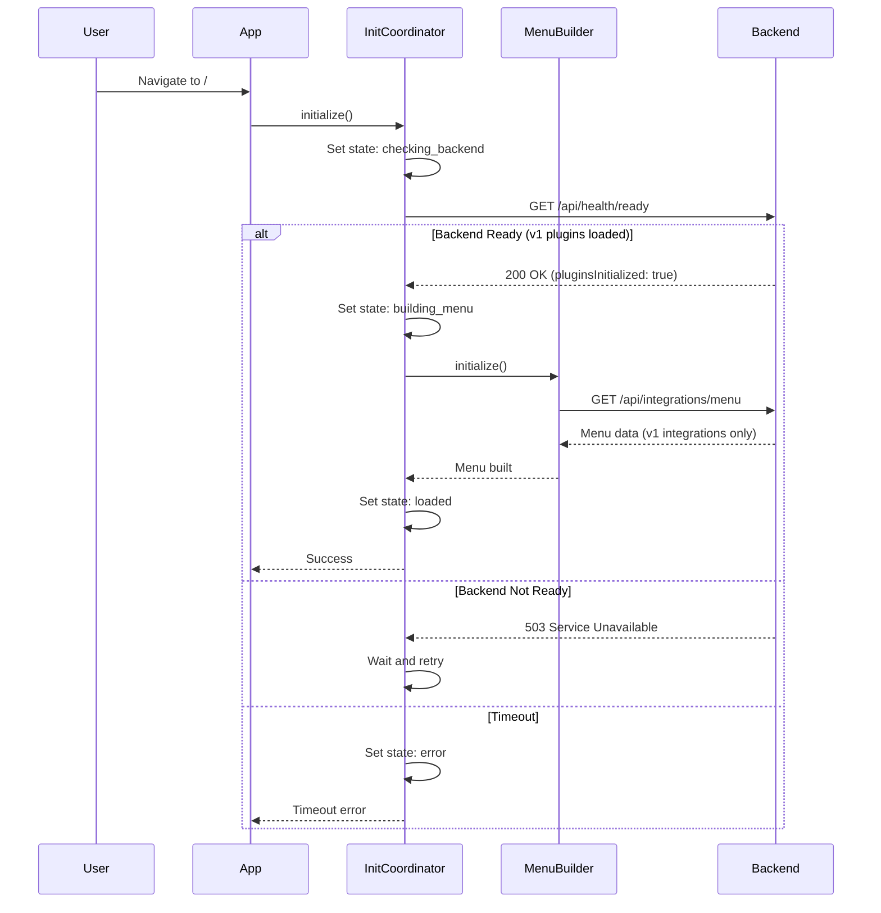
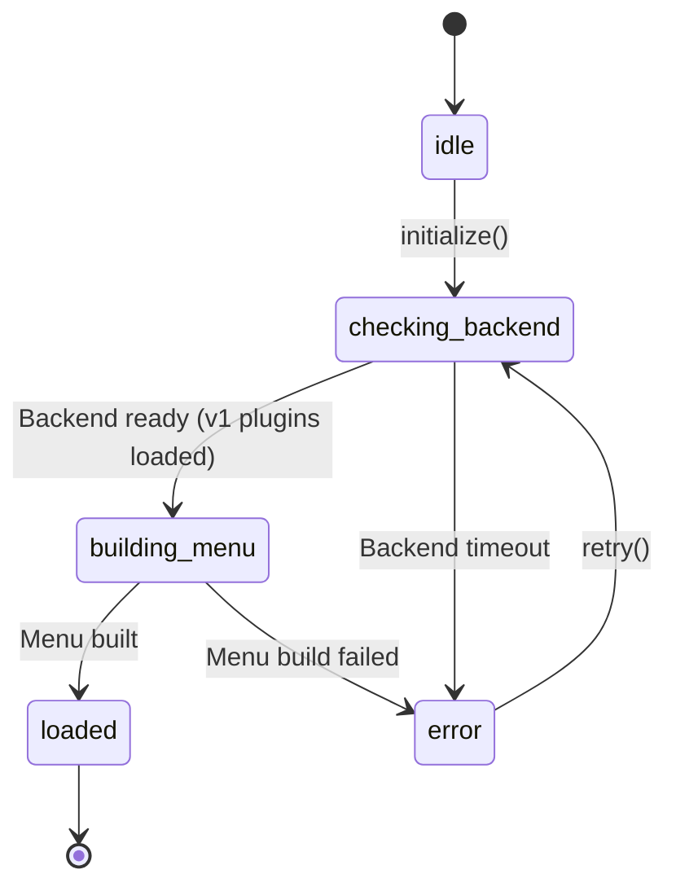

# Design Document: Home Page Loading and Menu Initialization Fixes

## Overview

This design addresses race conditions and initialization issues in the home page loading flow that cause the page to fail loading or get stuck at "Loading menu...". The solution implements a coordinated initialization system with proper state management, error handling, and timeout mechanisms.

### Problem Summary

The current architecture has several critical issues:

1. **Race Conditions**: App.svelte and DynamicNavigation.svelte both initialize plugins independently in their `onMount` handlers
2. **Timing Issues**: MenuBuilder calls `/api/integrations/menu` before backend plugins are guaranteed to be initialized
3. **No Coordination**: No synchronization between frontend components or between frontend and backend
4. **Silent Failures**: Errors in plugin loading or menu building are logged but not surfaced to users
5. **No Timeouts**: Loading can hang indefinitely with no user feedback

### Solution Approach

The solution introduces a centralized initialization coordinator that:

- Manages initialization state across all components
- Ensures proper sequencing (backend ready → frontend plugins → menu)
- Provides timeout and retry mechanisms
- Surfaces errors to users with actionable messages
- Uses Svelte 5 runes for reactive state management

## Architecture

### High-Level Flow



### State Machine

The initialization coordinator implements a state machine with the following states:



**State Definitions:**

- `idle`: Initial state, no initialization attempted
- `checking_backend`: Polling backend readiness endpoint (waiting for v1.0.0 plugins)
- `building_menu`: Menu is being built from backend plugin data
- `loaded`: Initialization complete, app ready
- `error`: Initialization failed, retry available

**Note**: The `loading_plugins` state has been removed since all plugins are v1.0.0 and loaded by the backend.

## Components and Interfaces

### 1. InitializationCoordinator (New)

Central coordinator for all initialization logic.

**Location**: `frontend/src/lib/initialization/InitializationCoordinator.svelte.ts`

**Responsibilities:**

- Manage initialization state machine
- Coordinate backend readiness checks
- Wait for backend v1.0.0 plugin initialization (no frontend plugin loading)
- Trigger menu building once backend is ready
- Handle timeouts and retries
- Emit progress events

**Interface:**

```typescript
interface InitializationState {
  status: 'idle' | 'checking_backend' | 'building_menu' | 'loaded' | 'error';
  progress: {
    step: string;
    message: string;
    percentage: number;
  };
  error: {
    message: string;
    details?: string;
    retryable: boolean;
  } | null;
  startedAt: Date | null;
  completedAt: Date | null;
}

interface InitializationConfig {
  backendReadyTimeout: number;      // Default: 10000ms
  backendReadyPollInterval: number; // Default: 500ms
  menuBuildTimeout: number;         // Default: 5000ms
  totalTimeout: number;             // Default: 15000ms
}

class InitializationCoordinator {
  // Reactive state (Svelte 5 runes)
  state: InitializationState;
  
  // Configuration
  config: InitializationConfig;
  
  // Methods
  async initialize(): Promise<void>;
  async retry(): Promise<void>;
  reset(): void;
  
  // State queries
  isInitialized(): boolean;
  isLoading(): boolean;
  hasError(): boolean;
  canRetry(): boolean;
  
  // Event subscription
  subscribe(handler: (state: InitializationState) => void): () => void;
}
```

**Key Behaviors:**

1. **Backend Readiness Check**: Polls `/api/health/ready` endpoint until backend reports v1.0.0 plugins initialized
2. **No Frontend Plugin Loading**: All plugins are v1.0.0 and loaded by backend
3. **Menu Building**: Once backend is ready, fetch and build menu
4. **Timeout Handling**: Each phase has its own timeout, plus overall timeout
5. **Idempotent**: Safe to call `initialize()` multiple times
6. **Progress Tracking**: Emits progress events for UI feedback

### 2. Backend Readiness Endpoint (New)

**Location**: `backend/src/routes/health.ts`

**Endpoint**: `GET /api/health/ready`

**Response:**

```typescript
interface ReadinessResponse {
  ready: boolean;
  pluginsInitialized: boolean;
  pluginCount: number;
  initializationTime?: number; // ms since server start
  message?: string;
}
```

**Behavior:**

- Returns `ready: true` only when IntegrationManager.isInitialized() is true
- Returns 503 Service Unavailable if not ready
- Returns 200 OK when ready

### 3. Modified App.svelte

**Changes:**

- Remove ALL v0.5 plugin initialization code (PluginLoader, WidgetRegistry)
- Remove direct plugin initialization from `onMount`
- Use InitializationCoordinator instead
- Display loading/error states based on coordinator state
- Remove duplicate initialization logic
- Only v1.0.0 integrations are used (backend handles all plugin loading)

**Code to Remove:**

```typescript
// REMOVE: All v0.5 plugin code
const pluginLoader = getPluginLoader();
const { getWidgetRegistry } = await import('./lib/plugins');
const widgetRegistry = getWidgetRegistry();
await pluginLoader.loadAll();
widgetRegistry.registerPluginWidgets(plugin);
```

**New Structure:**

```typescript
<script lang="ts">
  import { onMount } from 'svelte';
  import { getInitializationCoordinator } from './lib/initialization';
  
  const coordinator = getInitializationCoordinator();
  
  onMount(async () => {
    // Check setup status first
    const setupStatus = await checkSetupStatus();
    if (setupStatus.setupRequired) {
      navigate('/setup');
      return;
    }
    
    // Initialize via coordinator (no frontend plugin loading)
    // All plugins are v1.0.0 and loaded by backend
    await coordinator.initialize();
  });
</script>

{#if coordinator.state.status === 'loaded'}
  <!-- Normal app content -->
  <DynamicNavigation />
  <Router {routes} />
{:else if coordinator.state.status === 'error'}
  <!-- Error state with retry -->
  <ErrorDisplay 
    error={coordinator.state.error} 
    onRetry={() => coordinator.retry()} 
  />
{:else}
  <!-- Loading state with progress -->
  <LoadingDisplay 
    progress={coordinator.state.progress} 
  />
{/if}
```

### 4. Modified DynamicNavigation.svelte

**Changes:**

- Remove independent MenuBuilder initialization
- Subscribe to InitializationCoordinator state
- Only render menu when coordinator reports loaded state
- Remove duplicate error handling

**New Structure:**

```typescript
<script lang="ts">
  import { getInitializationCoordinator, useMenu } from '../lib/navigation';
  
  const coordinator = getInitializationCoordinator();
  const menu = useMenu();
  
  // No onMount initialization - coordinator handles it
</script>

{#if coordinator.state.status === 'loaded' && menu.value}
  <!-- Render menu (v1 integrations only, no legacy) -->
  <nav>
    {#each menu.value.sections as section}
      <!-- Menu rendering -->
    {/each}
  </nav>
{:else if coordinator.state.status === 'checking_backend' || coordinator.state.status === 'building_menu'}
  <div class="loading-indicator">
    Loading menu...
  </div>
{/if}
```

### 5. Modified MenuBuilder.svelte.ts

**Changes:**

- Remove automatic initialization in constructor
- Make `initialize()` method idempotent
- Add readiness check before fetching menu
- Improve error handling and propagation
- Remove legacy route handling (only v1 integrations)

**Key Changes:**

```typescript
class MenuBuilder {
  private initialized = $state(false);
  
  async initialize(): Promise<void> {
    // Idempotent - return early if already initialized
    if (this.initialized) {
      this.log('debug', 'Already initialized, skipping');
      return;
    }
    
    this.isBuilding = true;
    
    try {
      // Fetch integration menu from backend (v1 integrations only)
      await this.fetchIntegrationMenu();
      
      // Build menu structure (no legacy routes)
      this.rebuild();
      
      this.initialized = true;
    } catch (error) {
      this.lastError = error.message;
      throw error; // Propagate to coordinator
    } finally {
      this.isBuilding = false;
    }
  }
  
  private async fetchIntegrationMenu(): Promise<void> {
    const response = await apiGet<MenuResponse>("/api/integrations/menu");
    
    // Clear existing plugin contributions
    this.pluginContributions.clear();
    
    // Build contributions from v1 integration menu categories only
    for (const category of response.categories) {
      for (const integration of category.integrations) {
        // Create contribution for each v1 integration
        this.pluginContributions.set(integration.name, {
          pluginName: integration.name,
          displayName: integration.displayName,
          integrationType: category.type,
          items: [/* ... */],
          priority: category.priority,
        });
      }
    }
    
    // REMOVED: Legacy route handling
    // No longer process response.legacy
  }
  
  isInitialized(): boolean {
    return this.initialized;
  }
}
```

### 6. Modified IntegrationManager (Backend)

**Changes:**

- Add readiness tracking
- Expose initialization state via getter
- Track initialization timing

**Key Changes:**

```typescript
class IntegrationManager {
  private initializationStartTime: number | null = null;
  private initializationEndTime: number | null = null;
  
  async initializePlugins(): Promise<void> {
    this.initializationStartTime = Date.now();
    
    // Existing initialization logic...
    
    this.initialized = true;
    this.initializationEndTime = Date.now();
  }
  
  getInitializationTime(): number | null {
    if (!this.initializationStartTime || !this.initializationEndTime) {
      return null;
    }
    return this.initializationEndTime - this.initializationStartTime;
  }
}
```

## Data Models

### InitializationState

```typescript
interface InitializationState {
  // Current status in state machine
  status: 'idle' | 'checking_backend' | 'building_menu' | 'loaded' | 'error';
  
  // Progress information for UI
  progress: {
    step: string;           // Human-readable step name
    message: string;        // Detailed progress message
    percentage: number;     // 0-100
  };
  
  // Error information (null if no error)
  error: {
    message: string;        // User-friendly error message
    details?: string;       // Technical details for debugging
    retryable: boolean;     // Whether retry is possible
  } | null;
  
  // Timing information
  startedAt: Date | null;
  completedAt: Date | null;
}
```

### InitializationConfig

```typescript
interface InitializationConfig {
  // Backend readiness check
  backendReadyTimeout: number;      // Max time to wait for backend (default: 10000ms)
  backendReadyPollInterval: number; // How often to poll backend (default: 500ms)
  
  // Phase timeouts
  menuBuildTimeout: number;         // Max time for menu building (default: 5000ms)
  
  // Overall timeout
  totalTimeout: number;             // Max total initialization time (default: 15000ms)
}
```

### ReadinessResponse

```typescript
interface ReadinessResponse {
  ready: boolean;                   // Overall readiness status
  pluginsInitialized: boolean;      // Whether plugins are initialized
  pluginCount: number;              // Number of loaded plugins
  initializationTime?: number;      // Time taken to initialize (ms)
  message?: string;                 // Optional status message
}
```

## Correctness Properties

*A property is a characteristic or behavior that should hold true across all valid executions of a system—essentially, a formal statement about what the system should do. Properties serve as the bridge between human-readable specifications and machine-verifiable correctness guarantees.*

### Property 1: Successful Initialization Completes All Phases

*For any* initialization attempt that succeeds, the state must transition through all expected phases in order: idle → checking_backend → building_menu → loaded

**Validates: Requirements 1.1, 5.1**

### Property 2: Initialization Timeout Prevents Infinite Loading

*For any* initialization attempt, if the total time exceeds the configured timeout, the state must transition to error with a timeout message

**Validates: Requirements 1.5, 2.4**

### Property 3: Loading State Visibility During Initialization

*For any* time during initialization (status is checking_backend or building_menu), the loading indicator must be visible to the user

**Validates: Requirements 1.4, 2.1, 2.2**

### Property 4: Error Propagation to UI

*For any* error that occurs during initialization (plugin loading, menu building, or API calls), the error must be visible in the UI with an actionable message

**Validates: Requirements 1.3, 3.1, 3.2, 3.3, 3.4**

### Property 5: Progress Updates Through Phases

*For any* initialization attempt, the progress state must update to reflect the current phase with appropriate step names and messages

**Validates: Requirements 2.3**

### Property 6: Retry Functionality After Errors

*For any* initialization that ends in error state with retryable=true, calling retry() must restart the initialization process from the beginning

**Validates: Requirements 2.5**

### Property 7: Graceful Degradation on Partial Failures

*For any* initialization where some backend v1 plugins fail but others succeed, the menu must still be built with available plugins and the page must load

**Validates: Requirements 3.5**

### Property 8: Backend Initialization Before Menu Building

*For any* initialization attempt, menu building must not start until backend reports v1 plugins are initialized

**Validates: Requirements 4.2, 5.1, 5.2**

### Property 9: No Duplicate API Calls

*For any* initialization attempt, each API endpoint (/api/health/ready, /api/integrations/menu) must be called at most once per phase

**Validates: Requirements 4.4**

### Property 10: Backend Readiness Before Menu Requests

*For any* menu API request, the backend must report ready=true and pluginsInitialized=true, or the request must wait/retry

**Validates: Requirements 5.1, 5.3**

### Property 11: State Query API Correctness

*For any* time during or after initialization, the state query methods (isInitialized(), isLoading(), hasError()) must return values consistent with the current state.status

**Validates: Requirements 5.4**

### Property 12: Idempotent Initialization

*For any* initialization coordinator, calling initialize() multiple times must produce the same result as calling it once (subsequent calls return early if already initialized)

**Validates: Requirements 5.5**

### Property 13: State Machine Transitions

*For any* state transition, the new state must be one of the valid next states defined in the state machine (e.g., checking_backend can only transition to loading_plugins or error)

**Validates: Requirements 6.2**

### Property 14: Error State Structure

*For any* state where status='error', the error object must be non-null and contain both a message and a retryable boolean

**Validates: Requirements 6.3**

### Property 15: State Persistence Across Remounts

*For any* component that subscribes to the initialization coordinator, unmounting and remounting the component must not reset the coordinator's state

**Validates: Requirements 6.5**

## Error Handling

### Error Categories

1. **Backend Unavailable**
   - Cause: Backend not responding or not ready
   - Handling: Retry with exponential backoff up to timeout
   - User Message: "Backend is starting up. Please wait..."
   - Retryable: Yes

2. **Backend Timeout**
   - Cause: Backend doesn't become ready within timeout
   - Handling: Transition to error state
   - User Message: "Backend failed to start. Please refresh the page or check server logs."
   - Retryable: Yes

3. **Plugin Load Failure**
   - Cause: Backend v1 plugin loading fails
   - Handling: Log error, continue with available plugins
   - User Message: "Some integrations may be unavailable. The application will continue with limited functionality."
   - Retryable: Yes

4. **Menu Build Failure**
   - Cause: Menu API returns error or invalid data
   - Handling: Transition to error state
   - User Message: "Failed to load navigation menu. Please refresh the page."
   - Retryable: Yes

5. **Network Error**
   - Cause: Network connectivity issues
   - Handling: Retry with backoff
   - User Message: "Network error. Retrying..."
   - Retryable: Yes

### Error Recovery Strategies

1. **Automatic Retry**: For transient errors (network, backend starting), automatically retry with exponential backoff
2. **Graceful Degradation**: For plugin failures, continue with available plugins
3. **User-Initiated Retry**: For persistent errors, provide retry button
4. **Fallback UI**: Show minimal UI with error message and retry option

### Error Logging

All errors are logged with:

- Error category
- Error message
- Stack trace (if available)
- Initialization state at time of error
- Timing information

## Testing Strategy

### Unit Tests

Unit tests verify specific examples, edge cases, and error conditions:

1. **InitializationCoordinator**
   - State transitions for each phase
   - Timeout handling for each phase
   - Error handling for each error category
   - Retry logic
   - Idempotent initialization

2. **Backend Readiness Endpoint**
   - Returns 503 when not ready
   - Returns 200 when ready
   - Correct response structure

3. **MenuBuilder**
   - Idempotent initialization
   - Error propagation
   - Menu building with partial data (v1 integrations only)
   - No legacy route handling

### Property-Based Tests

Property tests verify universal properties across all inputs using a property-based testing library (fast-check for TypeScript). Each test runs a minimum of 100 iterations.

**Library**: fast-check (TypeScript/JavaScript property-based testing)

**Configuration**: Minimum 100 iterations per test

**Test Tags**: Each test includes a comment referencing the design property:

```typescript
// Feature: home-page-loading-fixes, Property 1: Successful Initialization Completes All Phases
```

**Property Test Examples:**

1. **Property 1: Phase Sequencing**

   ```typescript
   // Feature: home-page-loading-fixes, Property 1: Successful Initialization Completes All Phases
   test('initialization completes all phases in order', async () => {
     fc.assert(
       fc.asyncProperty(
         fc.record({
           backendDelay: fc.integer(0, 1000),
           pluginCount: fc.integer(0, 10),
         }),
         async ({ backendDelay, pluginCount }) => {
           const coordinator = new InitializationCoordinator();
           const states: string[] = [];
           
           coordinator.subscribe(state => states.push(state.status));
           
           await coordinator.initialize();
           
           // Verify phase sequence (no loading_plugins state)
           expect(states).toContain('checking_backend');
           expect(states).toContain('building_menu');
           expect(states[states.length - 1]).toBe('loaded');
           
           // Verify loading_plugins is NOT in the sequence
           expect(states).not.toContain('loading_plugins');
         }
       ),
       { numRuns: 100 }
     );
   });
   ```

2. **Property 12: Idempotent Initialization**

   ```typescript
   // Feature: home-page-loading-fixes, Property 12: Idempotent Initialization
   test('calling initialize multiple times is idempotent', async () => {
     fc.assert(
       fc.asyncProperty(
         fc.integer(2, 10), // Number of initialize calls
         async (callCount) => {
           const coordinator = new InitializationCoordinator();
           
           // Call initialize multiple times
           const results = await Promise.all(
             Array(callCount).fill(null).map(() => coordinator.initialize())
           );
           
           // All calls should succeed
           expect(coordinator.isInitialized()).toBe(true);
           expect(coordinator.state.status).toBe('loaded');
         }
       ),
       { numRuns: 100 }
     );
   });
   ```

### Integration Tests

Integration tests verify component interactions:

1. **App.svelte + InitializationCoordinator**
   - Full initialization flow
   - Error display and retry
   - Loading state display

2. **DynamicNavigation + MenuBuilder**
   - Menu rendering after initialization
   - Loading state during menu build

3. **Frontend + Backend**
   - Backend readiness polling
   - Menu API calls after backend ready

### Performance Tests

Performance tests verify timing requirements:

1. **Initialization Time**: Verify initialization completes within 3 seconds under normal conditions
2. **Timeout Handling**: Verify timeouts trigger at configured intervals
3. **Backend Polling**: Verify polling doesn't overwhelm backend

## Implementation Notes

### Svelte 5 Runes Usage

The implementation uses Svelte 5 runes for reactive state:

```typescript
class InitializationCoordinator {
  state = $state<InitializationState>({
    status: 'idle',
    progress: { step: '', message: '', percentage: 0 },
    error: null,
    startedAt: null,
    completedAt: null,
  });
  
  // Derived state
  isLoading = $derived(
    this.state.status !== 'idle' && 
    this.state.status !== 'loaded' && 
    this.state.status !== 'error'
  );
}
```

### Singleton Pattern

InitializationCoordinator uses singleton pattern to ensure single source of truth:

```typescript
let coordinatorInstance: InitializationCoordinator | null = null;

export function getInitializationCoordinator(): InitializationCoordinator {
  if (!coordinatorInstance) {
    coordinatorInstance = new InitializationCoordinator();
  }
  return coordinatorInstance;
}
```

### Backend Readiness Implementation

The backend readiness endpoint is added to the existing health router:

```typescript
// backend/src/routes/health.ts
router.get('/ready', (req, res) => {
  const integrationManager = getIntegrationManager();
  
  const ready = integrationManager.isInitialized();
  const pluginCount = integrationManager.getPluginCount();
  const initTime = integrationManager.getInitializationTime();
  
  if (!ready) {
    return res.status(503).json({
      ready: false,
      pluginsInitialized: false,
      pluginCount: 0,
      message: 'Backend is initializing plugins...',
    });
  }
  
  res.json({
    ready: true,
    pluginsInitialized: true,
    pluginCount,
    initializationTime: initTime,
  });
});
```

### Timeout Implementation

Timeouts are implemented using Promise.race:

```typescript
async function withTimeout<T>(
  promise: Promise<T>,
  timeoutMs: number,
  errorMessage: string
): Promise<T> {
  const timeout = new Promise<never>((_, reject) => {
    setTimeout(() => reject(new Error(errorMessage)), timeoutMs);
  });
  
  return Promise.race([promise, timeout]);
}
```

### Progress Tracking

Progress is tracked through state updates:

```typescript
private updateProgress(step: string, message: string, percentage: number): void {
  this.state.progress = { step, message, percentage };
}

// Usage
this.updateProgress('Checking Backend', 'Waiting for backend v1 plugins to initialize...', 30);
this.updateProgress('Building Menu', 'Building navigation menu from v1 integrations...', 70);
```

## Migration Strategy

### Phase 1: Add Backend Readiness Endpoint

1. Add `/api/health/ready` endpoint
2. Update IntegrationManager to track initialization state
3. Test endpoint independently

### Phase 2: Create InitializationCoordinator

1. Implement InitializationCoordinator class
2. Add unit tests
3. Add property-based tests

### Phase 3: Update App.svelte

1. Remove ALL v0.5 plugin initialization code (PluginLoader, WidgetRegistry)
2. Replace with InitializationCoordinator
3. Add loading/error UI components
4. Test initialization flow

### Phase 4: Update DynamicNavigation

1. Remove independent MenuBuilder initialization
2. Subscribe to coordinator state
3. Test menu rendering

### Phase 5: Update MenuBuilder

1. Make initialize() idempotent
2. Improve error handling
3. Test with coordinator

### Phase 6: Integration Testing

1. Test full initialization flow
2. Test error scenarios
3. Test retry functionality
4. Performance testing

## Security Considerations

1. **Backend Readiness Endpoint**: No authentication required (health check)
2. **Error Messages**: Don't expose sensitive backend details
3. **Timeout Values**: Prevent DoS by limiting retry attempts
4. **State Persistence**: Don't persist sensitive data in coordinator state

## Performance Considerations

1. **Backend Polling**: Use exponential backoff to reduce load
2. **Plugin Loading**: Load plugins in parallel where possible
3. **Menu Building**: Cache menu data to avoid rebuilds
4. **State Updates**: Batch state updates to minimize re-renders

## Accessibility Considerations

1. **Loading States**: Announce loading progress to screen readers
2. **Error Messages**: Ensure error messages are accessible
3. **Retry Button**: Keyboard accessible and properly labeled
4. **Progress Indicators**: Use ARIA live regions for updates

## Future Enhancements

1. **Progressive Loading**: Load critical plugins first, defer others
2. **Offline Support**: Cache menu data for offline use
3. **Health Monitoring**: Track initialization success rates
4. **Performance Metrics**: Measure and optimize initialization time
5. **Plugin Lazy Loading**: Load plugins on-demand rather than upfront
