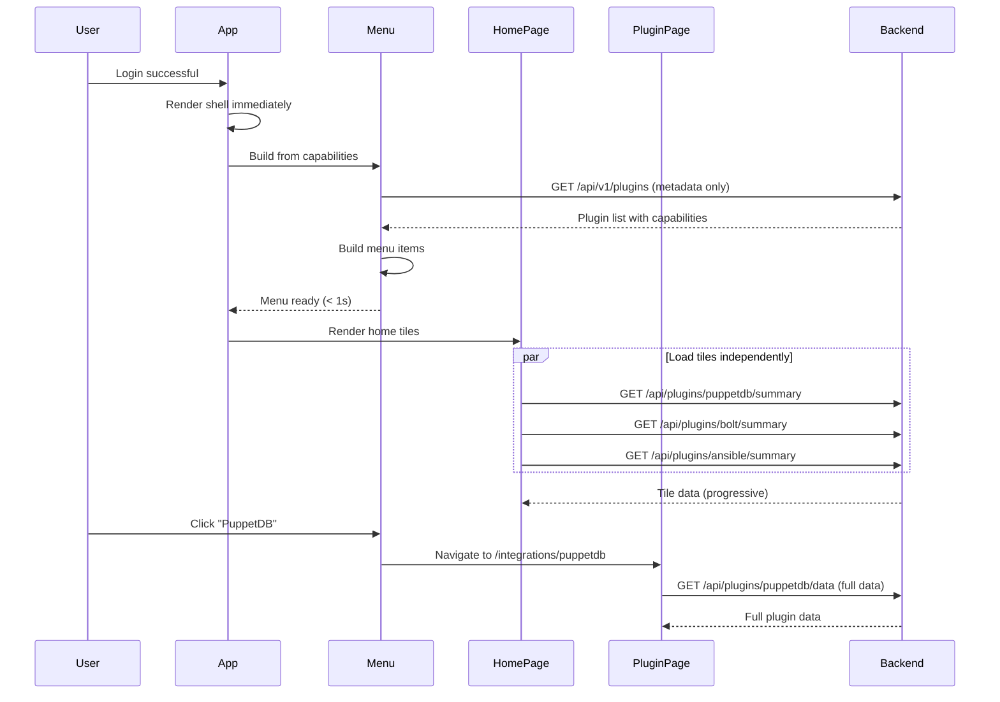

# Design Document: Progressive Loading Architecture for Home Page and Menu

## Overview

This design addresses critical browser performance issues after login where the system becomes extremely sluggish due to loading all plugin data upfront. The solution implements a progressive loading architecture where:

1. **App shell renders immediately** - Navigation and layout appear instantly
2. **Menu builds from capability metadata** - No data fetching, just capability availability
3. **Home page shows lightweight tiles** - Summary widgets that load independently
4. **Plugin home pages load on-demand** - Full data only when navigating to plugin pages

### Problem Summary (CRITICAL)

The current architecture has a critical performance issue:

1. **Browser Hangs After Login**: System tries to load ALL plugin data before rendering anything
2. **Blocking Architecture**: InitializationCoordinator blocks all rendering until complete
3. **No Progressive Enhancement**: Menu and home page wait for full initialization
4. **Missing Plugin Pages**: No dedicated home pages for plugins (puppetdb, puppetserver, hiera, bolt, ansible, ssh)
5. **Heavy Home Page**: Home page tries to load full widget data instead of lightweight summaries

### Solution Approach

The solution introduces a progressive loading architecture that:

- Renders app shell immediately (no blocking)
- Builds menu from capability metadata (no data API calls)
- Shows home tiles that load independently (progressive enhancement)
- Creates dedicated plugin home pages (data loads on-demand)
- Removes blocking initialization coordinator

## Architecture

### High-Level Flow



### Key Architectural Changes

1. **Remove InitializationCoordinator** - No blocking initialization, render immediately
2. **Capability-Based Menu** - Menu builds from `/api/v1/plugins` metadata only
3. **Progressive Home Tiles** - Each tile loads independently via widget system
4. **Plugin Home Pages** - Dedicated pages for each plugin with on-demand data loading
5. **Lazy Widget Loading** - Widgets load data when rendered, not during app init

## Components and Interfaces

### 1. App.svelte (Modified)

Main application component with immediate rendering.

**Location**: `frontend/src/App.svelte`

**Changes:**

- **Remove InitializationCoordinator** - No blocking initialization
- **Render shell immediately** - Navigation and layout appear instantly
- **Remove loading states** - No blocking loading screen
- **Keep auth check** - Still check setup status and authentication
- **Progressive enhancement** - Components load their own data

**New Structure:**

```typescript
<script lang="ts">
  import { onMount } from 'svelte';
  import Router from './components/Router.svelte';
  import DynamicNavigation from './components/DynamicNavigation.svelte';
  import { router, navigate } from './lib/router.svelte';
  import { get } from './lib/api';
  import { auth } from './lib/auth.svelte';

  // Routes remain the same
  const routes = { /* ... */ };
  const publicRoutes = ['/login', '/setup'];
  
  let authRequired = $state(false);

  onMount(async () => {
    // Only check setup status and auth - no initialization blocking
    if (router.currentPath !== '/setup' && router.currentPath !== '/login') {
      const status = await get('/api/setup/status');
      
      if (status.setupRequired) {
        navigate('/setup');
        return;
      }
      
      if (status.initialized && status.userCount > 0) {
        authRequired = true;
        if (!auth.isAuthenticated) {
          navigate(`/login?returnUrl=${encodeURIComponent(router.currentPath)}`);
          return;
        }
      }
    }
    // No coordinator.initialize() - components load their own data
  });
</script>

<!-- Render immediately - no loading states -->
<div class="min-h-screen bg-gray-50 dark:bg-gray-900 flex flex-col">
  {#if !publicRoutes.includes(router.currentPath)}
    <DynamicNavigation currentPath={router.currentPath} />
  {/if}
  
  <main class="flex-1">
    <Router {routes} />
  </main>
  
  <footer class="mt-auto py-8 border-t">
    <!-- Footer content -->
  </footer>
</div>
```

**Key Behaviors:**

1. **Immediate Render**: No blocking on initialization
2. **Auth Check Only**: Check setup and authentication, nothing else
3. **Progressive Loading**: Each component loads its own data
4. **No Loading Screen**: Shell renders immediately

### 2. MenuBuilder.svelte.ts (Modified)

Dynamic menu builder with capability-based construction.

**Location**: `frontend/src/lib/navigation/MenuBuilder.svelte.ts`

**Changes:**

- **Remove plugin loading** - No PluginLoader, no WidgetRegistry initialization
- **Build from metadata only** - Use `/api/v1/plugins` for capability metadata
- **No data fetching** - Menu items link to pages that load data on-demand
- **Remove fetchIntegrationMenu()** - Use simpler metadata endpoint
- **Immediate initialization** - No async delays, build synchronously from cached data

**New Interface:**

```typescript
interface PluginMetadata {
  name: string;
  displayName: string;
  description: string;
  integrationType: IntegrationType;
  color?: string;
  icon?: string;
  enabled: boolean;
  healthy: boolean;
  capabilities: Array<{
    name: string;
    category: string;
  }>;
}

interface PluginsMetadataResponse {
  plugins: PluginMetadata[];
}

class MenuBuilder {
  menu = $state<Menu | null>(null);
  isBuilding = $state(false);
  lastError = $state<string | null>(null);
  
  // Build menu from cached metadata (synchronous)
  buildFromMetadata(plugins: PluginMetadata[]): Menu;
  
  // Fetch metadata and rebuild (async, called once on mount)
  async fetchAndBuild(): Promise<void>;
  
  // Get menu section
  getSection(sectionId: string): MenuSection | undefined;
}
```

**Key Behaviors:**

1. **Metadata Only**: Fetch `/api/v1/plugins` for plugin list with capabilities
2. **No Data Loading**: Menu items are just links, no widget data
3. **Status Badges**: Show plugin health status in menu (loading/ready/error)
4. **Synchronous Build**: Once metadata is fetched, build menu synchronously
5. **Progressive Updates**: Menu can update as plugin status changes

### 3. HomePage.svelte (Modified)

Home page with progressive tile loading.

**Location**: `frontend/src/pages/HomePage.svelte`

**Changes:**

- **Remove integration status section** - Redundant with home tiles
- **Use home-summary widget slot** - Plugins provide lightweight summary tiles
- **Progressive loading** - Tiles load independently
- **No blocking** - Page renders immediately, tiles appear as they load

**New Structure:**

```typescript
<script lang="ts">
  import { WidgetSlot } from '../lib/plugins';
  import { auth } from '../lib/auth.svelte';
  
  let userCapabilities = $derived(auth.permissions?.allowed ?? []);
</script>

<div class="space-y-6">
  <!-- Page Header -->
  <div>
    <h1 class="text-2xl font-bold">Dashboard</h1>
    <p class="text-sm text-gray-500">
      Welcome to Pabawi - Infrastructure Management Interface
    </p>
  </div>

  <!-- Home Summary Tiles (Progressive Loading) -->
  <section class="bg-white dark:bg-gray-800 shadow rounded-lg">
    <div class="px-4 py-5 sm:p-6">
      <h2 class="text-lg font-medium mb-4">Integration Overview</h2>
      
      <!-- Widget slot for home-summary tiles -->
      <!-- Each tile loads independently, no blocking -->
      <WidgetSlot
        slot="home-summary"
        layout="grid"
        columns={3}
        gap="4"
        {userCapabilities}
        showEmptyState={true}
        emptyMessage="No integrations configured. Add plugins to see summaries here."
        showLoadingStates={true}
      />
    </div>
  </section>

  <!-- Quick Actions Widget Slot -->
  <section class="bg-white dark:bg-gray-800 shadow rounded-lg">
    <div class="px-4 py-5 sm:p-6">
      <h2 class="text-lg font-medium mb-4">Quick Actions</h2>
      <WidgetSlot
        slot="sidebar"
        layout="stack"
        {userCapabilities}
        showEmptyState={false}
      />
    </div>
  </section>
</div>
```

**Key Behaviors:**

1. **Immediate Render**: Page shell renders instantly
2. **Progressive Tiles**: Each home-summary widget loads independently
3. **No Blocking**: Failed tiles don't block other tiles
4. **Loading States**: Show skeleton loaders for pending tiles
5. **Click to Details**: Tiles link to plugin home pages

### 4. DynamicNavigation.svelte (Modified)

Navigation component with immediate menu rendering.

**Location**: `frontend/src/components/DynamicNavigation.svelte`

**Changes:**

- **Initialize menu immediately** - Call MenuBuilder on mount, don't wait
- **Show loading state per-item** - Menu renders with loading badges for pending plugins
- **No blocking** - Menu appears immediately with available data
- **Progressive updates** - Menu items update as plugin status changes

**New Structure:**

```typescript
<script lang="ts">
  import { onMount } from 'svelte';
  import { getMenuBuilder, useMenu } from '../lib/navigation';
  
  const menuBuilder = getMenuBuilder();
  const menu = useMenu();
  
  onMount(async () => {
    // Fetch metadata and build menu (non-blocking)
    // Menu appears immediately, updates as plugins load
    await menuBuilder.fetchAndBuild();
  });
</script>

<!-- Render menu immediately, even if empty -->
<nav class="bg-white dark:bg-gray-800 shadow">
  {#if menu.value}
    {#each menu.value.sections as section}
      <div class="menu-section">
        {#each section.items as item}
          {#if item.type === 'link'}
            <a href={item.path} class="menu-item">
              {item.label}
              {#if item.badge === 'loading'}
                <span class="badge loading">Loading...</span>
              {:else if item.badge === 'offline'}
                <span class="badge offline">Offline</span>
              {/if}
            </a>
          {:else if item.type === 'group'}
            <!-- Dropdown group -->
            <div class="menu-group">
              <button>{item.label}</button>
              <div class="dropdown">
                {#each item.children as child}
                  <!-- Render children -->
                {/each}
              </div>
            </div>
          {/if}
        {/each}
      </div>
    {/each}
  {:else}
    <!-- Skeleton loader for menu -->
    <div class="menu-skeleton">
      <div class="skeleton-item"></div>
      <div class="skeleton-item"></div>
      <div class="skeleton-item"></div>
    </div>
  {/if}
</nav>
```

**Key Behaviors:**

1. **Immediate Render**: Menu skeleton appears instantly
2. **Progressive Loading**: Menu items appear as metadata loads
3. **Status Badges**: Show loading/offline badges on menu items
4. **No Blocking**: Menu is interactive immediately

### 5. Plugin Home Pages (New)

Dedicated home pages for each plugin with on-demand data loading.

**Location**: `frontend/src/pages/IntegrationHomePage.svelte` (generic template)

**Plugin-Specific Pages:**

- `/integrations/puppetdb` - PuppetDB home page
- `/integrations/puppetserver` - Puppetserver home page
- `/integrations/hiera` - Hiera home page
- `/integrations/bolt` - Bolt home page
- `/integrations/ansible` - Ansible home page
- `/integrations/ssh` - SSH home page

**Structure:**

```typescript
<script lang="ts">
  import { onMount } from 'svelte';
  import { router } from '../lib/router.svelte';
  import { WidgetSlot } from '../lib/plugins';
  import { get } from '../lib/api';
  
  // Get plugin name from route params
  const pluginName = $derived(router.params.integrationName);
  
  // Plugin data (loaded on-demand)
  let pluginData = $state<any>(null);
  let loading = $state(true);
  let error = $state<string | null>(null);
  
  // Load plugin data when page mounts
  onMount(async () => {
    try {
      loading = true;
      // Fetch full plugin data (only when navigating to this page)
      pluginData = await get(`/api/plugins/${pluginName}/data`);
    } catch (err) {
      error = err instanceof Error ? err.message : 'Failed to load plugin data';
    } finally {
      loading = false;
    }
  });
</script>

<div class="space-y-6">
  <!-- Plugin Header -->
  <div class="flex items-center justify-between">
    <div>
      <h1 class="text-2xl font-bold">{pluginData?.displayName ?? pluginName}</h1>
      <p class="text-sm text-gray-500">{pluginData?.description}</p>
    </div>
    {#if pluginData?.healthy === false}
      <span class="badge offline">Offline</span>
    {/if}
  </div>

  {#if loading}
    <!-- Loading state -->
    <div class="loading-skeleton">Loading plugin data...</div>
  {:else if error}
    <!-- Error state -->
    <div class="error-message">{error}</div>
  {:else}
    <!-- Plugin-specific widgets (standalone-page slot) -->
    <WidgetSlot
      slot="standalone-page"
      layout="stack"
      context={{ pluginName, pluginData }}
      showEmptyState={true}
      emptyMessage="No widgets available for this plugin."
    />
  {/if}
</div>
```

**Key Behaviors:**

1. **On-Demand Loading**: Data loads only when navigating to plugin page
2. **No Blocking**: Doesn't affect app initialization
3. **Widget Slots**: Uses standalone-page slot for plugin-specific widgets
4. **Error Handling**: Shows error if plugin data fails to load
5. **Progressive Enhancement**: Page shell renders immediately, data loads after

### 6. Home Summary Widgets (New)

Lightweight summary widgets for home page tiles.

**Location**: Plugin-specific (e.g., `plugins/native/puppetdb/frontend/HomeWidget.svelte`)

**Widget Manifest Entry:**

```json
{
  "id": "puppetdb:home-widget",
  "name": "PuppetDB Summary",
  "component": "frontend/HomeWidget.svelte",
  "slots": ["home-summary"],
  "size": "medium",
  "requiredCapabilities": ["nodes.list"],
  "priority": 20
}
```

**Widget Structure:**

```typescript
<script lang="ts">
  import { onMount } from 'svelte';
  import { get } from '../../../frontend/src/lib/api';
  
  // Summary data (lightweight)
  let summary = $state<{
    nodeCount: number;
    healthyNodes: number;
    lastUpdate: string;
  } | null>(null);
  
  let loading = $state(true);
  let error = $state<string | null>(null);
  
  onMount(async () => {
    try {
      // Fetch lightweight summary data (not full node list)
      summary = await get('/api/plugins/puppetdb/summary');
    } catch (err) {
      error = err instanceof Error ? err.message : 'Failed to load summary';
    } finally {
      loading = false;
    }
  });
</script>

<div class="home-tile">
  <div class="tile-header">
    <h3>PuppetDB</h3>
    <span class="tile-icon">🗄️</span>
  </div>
  
  {#if loading}
    <div class="tile-skeleton">Loading...</div>
  {:else if error}
    <div class="tile-error">{error}</div>
  {:else if summary}
    <div class="tile-content">
      <div class="metric">
        <span class="metric-value">{summary.nodeCount}</span>
        <span class="metric-label">Nodes</span>
      </div>
      <div class="metric">
        <span class="metric-value">{summary.healthyNodes}</span>
        <span class="metric-label">Healthy</span>
      </div>
      <div class="tile-footer">
        <a href="/integrations/puppetdb" class="tile-link">
          View Details →
        </a>
      </div>
    </div>
  {/if}
</div>
```

**Key Behaviors:**

1. **Lightweight Data**: Fetch summary metrics only (counts, status)
2. **Independent Loading**: Each tile loads independently
3. **Error Isolation**: Failed tile doesn't block other tiles
4. **Click to Details**: Link to plugin home page for full data
5. **Progressive Enhancement**: Tile appears as data loads

## Data Models

### PluginMetadata (Frontend)

```typescript
interface PluginMetadata {
  name: string;                     // Plugin identifier
  displayName: string;              // Human-readable name
  description: string;              // Plugin description
  integrationType: IntegrationType; // Category (RemoteExecution, Info, etc.)
  color?: string;                   // Brand color
  icon?: string;                    // Icon identifier
  enabled: boolean;                 // Whether plugin is enabled
  healthy: boolean;                 // Health check status
  capabilities: Array<{
    name: string;                   // Capability identifier
    category: string;               // Capability category
  }>;
}

interface PluginsMetadataResponse {
  plugins: PluginMetadata[];
}
```

### PluginSummary (Backend API)

```typescript
interface PluginSummary {
  // Plugin identification
  pluginName: string;
  displayName: string;
  
  // Summary metrics (plugin-specific)
  metrics: Record<string, number | string>;
  
  // Status
  healthy: boolean;
  lastUpdate: string;
  
  // Optional error
  error?: string;
}

// Example for PuppetDB:
interface PuppetDBSummary extends PluginSummary {
  metrics: {
    nodeCount: number;
    healthyNodes: number;
    failedNodes: number;
    lastReportTime: string;
  };
}
```

### PluginData (Backend API)

```typescript
interface PluginData {
  // Plugin identification
  pluginName: string;
  displayName: string;
  description: string;
  
  // Full plugin data (plugin-specific)
  data: any;
  
  // Metadata
  healthy: boolean;
  lastUpdate: string;
  capabilities: string[];
}
```

## Correctness Properties

*Properties define characteristics that should hold true across all valid executions.*

### Property 1: Immediate Shell Rendering

*For any* user login, the app shell (navigation, layout) must render within 500ms without blocking on data loading

**Validates: Requirements 1.1, 7.1**

### Property 2: Menu Appears Within 1 Second

*For any* app initialization, the menu must appear within 1 second based on capability metadata only

**Validates: Requirements 1.2, 2.1, 7.2**

### Property 3: Browser Remains Responsive

*For any* initialization or data loading, the browser must remain responsive (no sluggishness, no blocking)

**Validates: Requirements 1.4, 7.3**

### Property 4: Progressive Tile Loading

*For any* home page load, tiles must load independently without blocking each other

**Validates: Requirements 1.3, 4.3**

### Property 5: No Blocking on Full Data

*For any* app initialization, no API calls for full plugin data must occur (only metadata and summaries)

**Validates: Requirements 1.5, 5.5, 7.5**

### Property 6: Plugin Home Pages Load On-Demand

*For any* plugin home page navigation, full data must load only when navigating to that page

**Validates: Requirements 3.7, 5.3**

### Property 7: Failed Tiles Don't Block Others

*For any* home tile that fails to load, other tiles must continue loading and rendering

**Validates: Requirements 4.4, 6.5**

### Property 8: Menu Updates Reactively

*For any* plugin status change, the menu must update to reflect the new status without full rebuild

**Validates: Requirements 2.5**

### Property 9: Widget Data Loads When Rendered

*For any* widget, data must load only when the widget is rendered, not during app initialization

**Validates: Requirements 5.4**

### Property 10: Summary Endpoints Are Lightweight

*For any* summary endpoint call, response time must be under 500ms and data size under 10KB

**Validates: Requirements 4.2, 7.4**

## Error Handling

### Error Categories

1. **Metadata Fetch Failure**
   - Cause: `/api/v1/plugins` endpoint fails
   - Handling: Show empty menu with error message, allow retry
   - User Message: "Failed to load menu. Click to retry."
   - Retryable: Yes

2. **Tile Load Failure**
   - Cause: Plugin summary endpoint fails
   - Handling: Show error in tile, don't block other tiles
   - User Message: "Failed to load [Plugin] summary. Click to retry."
   - Retryable: Yes (per-tile)

3. **Plugin Page Load Failure**
   - Cause: Plugin data endpoint fails
   - Handling: Show error page with retry button
   - User Message: "Failed to load [Plugin] data. Please try again."
   - Retryable: Yes

4. **Network Error**
   - Cause: Network connectivity issues
   - Handling: Show error with retry, cache last known state
   - User Message: "Network error. Retrying..."
   - Retryable: Yes

5. **Plugin Unhealthy**
   - Cause: Plugin health check fails
   - Handling: Show offline badge, allow navigation to plugin page
   - User Message: "Plugin is offline. Some features may be unavailable."
   - Retryable: No (automatic health check retry)

### Error Recovery Strategies

1. **Per-Component Retry**: Each component (menu, tile, page) handles its own errors and retries
2. **Graceful Degradation**: Failed components don't block others
3. **Cached State**: Use last known good state when possible
4. **Progressive Enhancement**: Show what's available, hide what's not
5. **User-Initiated Retry**: Provide retry buttons for failed components

## Testing Strategy

### Unit Tests

Unit tests verify specific component behaviors:

1. **MenuBuilder**
   - Builds menu from metadata
   - Handles missing/invalid metadata
   - Updates menu on status changes
   - Shows correct badges for plugin status

2. **HomePage**
   - Renders shell immediately
   - Loads tiles independently
   - Handles tile errors gracefully
   - Shows loading states correctly

3. **Plugin Home Pages**
   - Loads data on mount
   - Handles loading/error states
   - Renders widgets correctly
   - Shows plugin status

4. **Backend Summary Endpoints**
   - Returns metadata quickly (< 100ms)
   - Returns summaries quickly (< 500ms)
   - Handles plugin errors gracefully
   - Returns correct data structure

### Performance Tests

Performance tests verify timing requirements:

1. **Shell Render Time**: Verify app shell renders within 500ms
2. **Menu Appearance**: Verify menu appears within 1 second
3. **Browser Responsiveness**: Verify no blocking, no sluggishness
4. **Tile Load Time**: Verify each tile loads within 2 seconds
5. **Summary Endpoint**: Verify response time under 500ms

### Integration Tests

Integration tests verify component interactions:

1. **App.svelte + DynamicNavigation**
   - Shell renders immediately
   - Menu appears quickly
   - No blocking on initialization

2. **HomePage + Home Tiles**
   - Tiles load independently
   - Failed tiles don't block others
   - Click navigates to plugin page

3. **Menu + Plugin Pages**
   - Menu links to correct pages
   - Pages load data on-demand
   - Back navigation works correctly

### Load Tests

Load tests verify system under stress:

1. **Multiple Tiles**: Test with 10+ plugins, verify all tiles load
2. **Slow Endpoints**: Test with slow summary endpoints, verify no blocking
3. **Failed Plugins**: Test with some plugins failing, verify graceful degradation
4. **Concurrent Users**: Test with multiple users, verify no performance degradation

## Implementation Notes

### Svelte 5 Runes Usage

Components use Svelte 5 runes for reactive state:

```typescript
// Component state
let loading = $state(true);
let data = $state<PluginData | null>(null);
let error = $state<string | null>(null);

// Derived state
let isReady = $derived(data !== null && !loading && !error);
```

### Progressive Enhancement Pattern

Each component follows the progressive enhancement pattern:

```typescript
<script lang="ts">
  let data = $state<Data | null>(null);
  let loading = $state(true);
  let error = $state<string | null>(null);
  
  onMount(async () => {
    try {
      data = await fetchData();
    } catch (err) {
      error = err.message;
    } finally {
      loading = false;
    }
  });
</script>

<!-- Shell renders immediately -->
<div class="component-shell">
  {#if loading}
    <Skeleton />
  {:else if error}
    <Error message={error} onRetry={fetchData} />
  {:else if data}
    <Content {data} />
  {/if}
</div>
```

### Widget Slot Loading

WidgetSlot component handles progressive widget loading:

```typescript
// frontend/src/lib/plugins/WidgetSlot.svelte
<script lang="ts">
  import { onMount } from 'svelte';
  import { getWidgetRegistry } from './WidgetRegistry.svelte';
  
  let { slot, layout, showLoadingStates = false } = $props();
  
  const registry = getWidgetRegistry();
  let widgets = $derived(registry.getWidgetsForSlot(slot));
  
  // Each widget loads its own data independently
</script>

<div class="widget-slot {layout}">
  {#each widgets as widget}
    <div class="widget-container">
      <!-- Widget component loads its own data -->
      <svelte:component this={widget.component} />
    </div>
  {/each}
</div>
```

## Migration Strategy

### Phase 1: Add Backend Summary Endpoints

1. Create `/api/v1/plugins` endpoint for metadata
2. Create `/api/plugins/:name/summary` endpoints
3. Create `/api/plugins/:name/data` endpoints
4. Add `getSummary()` and `getData()` methods to plugin interface
5. Test endpoints independently

### Phase 2: Update MenuBuilder

1. Remove plugin loading code (PluginLoader, WidgetRegistry)
2. Change to fetch from `/api/v1/plugins` (metadata only)
3. Build menu synchronously from metadata
4. Add status badges for plugin health
5. Test menu building

### Phase 3: Update App.svelte

1. Remove InitializationCoordinator
2. Remove blocking loading states
3. Render shell immediately
4. Keep auth check only
5. Test immediate rendering

### Phase 4: Update HomePage

1. Remove integration status section
2. Add home-summary widget slot
3. Configure grid layout for tiles
4. Test progressive tile loading

### Phase 5: Create Home Summary Widgets

1. Update plugin manifests with home-summary widgets
2. Implement lightweight HomeWidget.svelte for each plugin
3. Fetch from summary endpoints
4. Test independent loading

### Phase 6: Create Plugin Home Pages

1. Update IntegrationHomePage.svelte to be generic
2. Add routes for each plugin (/integrations/:name)
3. Load full data on-demand
4. Use standalone-page widget slot
5. Test navigation and data loading

### Phase 7: Integration Testing

1. Test full flow: login → shell → menu → home → plugin page
2. Test performance (shell < 500ms, menu < 1s)
3. Test error scenarios (failed tiles, failed plugins)
4. Test browser responsiveness
5. Load testing with multiple plugins

## Security Considerations

1. **Backend Readiness Endpoint**: No authentication required (health check)
2. **Error Messages**: Don't expose sensitive backend details
3. **Timeout Values**: Prevent DoS by limiting retry attempts
4. **State Persistence**: Don't persist sensitive data in coordinator state

## Performance Considerations

1. **Metadata Caching**: Cache `/api/v1/plugins` response for 30 seconds
2. **Summary Caching**: Cache summary responses for 10 seconds
3. **Parallel Loading**: Load all home tiles in parallel
4. **Lazy Rendering**: Use virtual scrolling for large plugin lists
5. **Debounced Updates**: Debounce menu updates on plugin status changes
6. **Request Batching**: Batch multiple summary requests if possible
7. **Response Compression**: Enable gzip compression for API responses
8. **CDN for Static Assets**: Serve widget components from CDN if possible

## Accessibility Considerations

1. **Loading States**: Announce loading progress to screen readers
2. **Error Messages**: Ensure error messages are accessible
3. **Retry Button**: Keyboard accessible and properly labeled
4. **Progress Indicators**: Use ARIA live regions for updates

## Future Enhancements

1. **Virtual Scrolling**: For large plugin lists in menu
2. **Service Worker**: Cache metadata and summaries for offline use
3. **WebSocket Updates**: Real-time plugin status updates
4. **Prefetching**: Prefetch plugin data on hover
5. **Performance Monitoring**: Track and report initialization metrics
6. **A/B Testing**: Test different loading strategies
7. **Plugin Lazy Loading**: Load plugin code on-demand
8. **CDN Integration**: Serve static assets from CDN

## Code Cleanup

### Files to Remove

The following files/code will no longer be needed after implementing the progressive loading architecture:

#### 1. InitializationCoordinator (Complete Removal)

**File**: `frontend/src/lib/initialization/InitializationCoordinator.svelte.ts`
**Reason**: Blocking initialization is replaced by progressive loading
**Action**: Delete entire file

**File**: `frontend/src/lib/initialization/index.ts`
**Reason**: Only exports InitializationCoordinator
**Action**: Delete entire file

**Directory**: `frontend/src/lib/initialization/`
**Reason**: No longer needed
**Action**: Delete entire directory

#### 2. Backend Readiness Endpoint (Removal)

**File**: `backend/src/routes/health.ts`
**Section**: `/api/health/ready` endpoint
**Reason**: No longer polling for backend readiness
**Action**: Remove the `/ready` endpoint (keep other health endpoints)

```typescript
// REMOVE THIS:
router.get('/ready', (req, res) => {
  const integrationManager = getIntegrationManager();
  // ... readiness check logic
});
```

#### 3. Integration Menu Endpoint (Deprecation)

**File**: `backend/src/routes/integrations.ts`
**Section**: `/api/integrations/menu` endpoint
**Reason**: Replaced by `/api/v1/plugins` metadata endpoint
**Action**: Mark as deprecated, remove after migration complete

```typescript
// DEPRECATE THIS:
router.get('/menu', async (req, res) => {
  // ... menu building logic
});
```

#### 4. MenuBuilder Plugin Loading (Code Removal)

**File**: `frontend/src/lib/navigation/MenuBuilder.svelte.ts`
**Sections to Remove**:

```typescript
// REMOVE: Plugin loading method
private async loadPlugins(): Promise<void> {
  const { getPluginLoader, getWidgetRegistry } = await import("../plugins");
  const pluginLoader = getPluginLoader();
  const widgetRegistry = getWidgetRegistry();
  // ... plugin loading logic
}

// REMOVE: Integration menu fetching method
private async fetchIntegrationMenu(): Promise<void> {
  const response = await apiGet<MenuResponse>("/api/integrations/menu");
  // ... menu building from integration data
}

// REMOVE: Initialize method (replace with simpler version)
async initialize(): Promise<void> {
  // Old blocking initialization
}
```

**Action**: Remove these methods, replace with simpler `fetchAndBuild()` that only fetches metadata

#### 5. App.svelte Initialization Code (Code Removal)

**File**: `frontend/src/App.svelte`
**Sections to Remove**:

```typescript
// REMOVE: InitializationCoordinator import and usage
import { getInitializationCoordinator } from './lib/initialization';
const coordinator = getInitializationCoordinator();

// REMOVE: Coordinator initialization in onMount
await coordinator.initialize();

// REMOVE: All coordinator state checks
{#if coordinator.state.status === 'loaded'}
{:else if coordinator.state.status === 'error'}
{:else}
```

**Action**: Remove all coordinator-related code, render shell immediately

#### 6. HomePage Integration Status Section (Code Removal)

**File**: `frontend/src/pages/HomePage.svelte`
**Sections to Remove**:

```typescript
// REMOVE: Integration status fetching
async function fetchIntegrationStatus(refresh = false): Promise<void> {
  const data = await get<PluginsResponse>('/api/v1/plugins');
  // ... convert to integration status format
}

// REMOVE: IntegrationStatus component and related state
let integrations = $state<IntegrationStatusData[]>([]);
let integrationsLoading = $state(true);
let integrationsError = $state<string | null>(null);
```

```svelte
<!-- REMOVE: Integration Status Section -->
<div class="bg-white dark:bg-gray-800 shadow rounded-lg">
  <div class="px-4 py-5 sm:p-6">
    <IntegrationStatus {integrations} loading={integrationsLoading} />
  </div>
</div>
```

**Action**: Remove integration status section, replace with home-summary widget slot

#### 7. DynamicNavigation Coordinator Dependency (Code Removal)

**File**: `frontend/src/components/DynamicNavigation.svelte`
**Sections to Remove**:

```typescript
// REMOVE: Coordinator import and usage
import { getInitializationCoordinator } from '../lib/initialization';
const coordinator = getInitializationCoordinator();

// REMOVE: Coordinator state checks
{#if coordinator.state.status === 'loaded' && menu.value}
{:else if coordinator.state.status === 'checking_backend' || coordinator.state.status === 'building_menu'}
```

**Action**: Remove coordinator dependency, render menu immediately

### Files to Deprecate (Keep for Backward Compatibility)

#### 1. Legacy Integration Menu Endpoint

**File**: `backend/src/routes/integrations.ts`
**Endpoint**: `GET /api/integrations/menu`
**Action**: Add deprecation warning, keep for 1-2 releases, then remove

```typescript
router.get('/menu', async (req, res) => {
  console.warn('[DEPRECATED] /api/integrations/menu is deprecated. Use /api/v1/plugins instead.');
  // ... existing logic
});
```

#### 2. IntegrationStatus Component

**File**: `frontend/src/components/IntegrationStatus.svelte`
**Reason**: Replaced by home-summary widget tiles
**Action**: Mark as deprecated, remove after migration complete

### Code to Update (Not Remove)

#### 1. MenuBuilder - Simplify

**File**: `frontend/src/lib/navigation/MenuBuilder.svelte.ts`
**Changes**:

- Remove `loadPlugins()` method
- Remove `fetchIntegrationMenu()` method
- Replace `initialize()` with simpler `fetchAndBuild()`
- Add `fetchMetadata()` method for `/api/v1/plugins`
- Keep menu building logic but simplify

#### 2. WidgetRegistry - Keep but Don't Initialize in MenuBuilder

**File**: `frontend/src/lib/plugins/WidgetRegistry.svelte.ts`
**Changes**:

- Keep the registry (still needed for widget slots)
- Remove initialization from MenuBuilder
- Widgets register themselves when loaded

#### 3. PluginLoader - Keep but Use Differently

**File**: `frontend/src/lib/plugins/PluginLoader.svelte.ts`
**Changes**:

- Keep the loader (still needed for widget components)
- Don't call during app initialization
- Load plugins lazily when widgets are rendered

### Cleanup Checklist

After implementing the progressive loading architecture:

- [ ] Delete `frontend/src/lib/initialization/` directory
- [ ] Remove `/api/health/ready` endpoint from `backend/src/routes/health.ts`
- [ ] Mark `/api/integrations/menu` as deprecated
- [ ] Remove plugin loading from `MenuBuilder.svelte.ts`
- [ ] Remove coordinator code from `App.svelte`
- [ ] Remove integration status section from `HomePage.svelte`
- [ ] Remove coordinator dependency from `DynamicNavigation.svelte`
- [ ] Update MenuBuilder to use `/api/v1/plugins`
- [ ] Add deprecation warnings to legacy endpoints
- [ ] Update tests to remove coordinator tests
- [ ] Update documentation to remove coordinator references
- [ ] Remove unused imports across all files
- [ ] Run linter to catch unused code
- [ ] Test that app works without removed code
- [ ] After 1-2 releases, remove deprecated endpoints

### Estimated Code Reduction

- **Lines Removed**: ~800-1000 lines
- **Files Deleted**: 2-3 files
- **Complexity Reduction**: ~40% (removing state machine, polling, timeouts)
- **Bundle Size Reduction**: ~15-20KB (minified)
