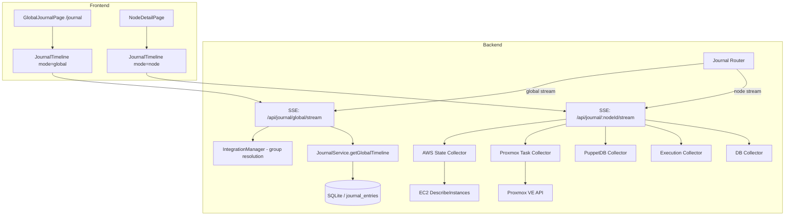

# Design Document: Journal Enhancements

## Overview

This feature extends the Pabawi journal system in four areas:

1. **Proxmox lifecycle event collection** — A new collector queries the Proxmox VE task history API for VM/container lifecycle events (start, stop, migrate, backup, snapshot) and converts them to journal entries streamed via SSE.
2. **AWS EC2 state change collection** — A new collector polls EC2 `DescribeInstances` to detect state transitions and records them as journal entries, using the existing journal database to track the last known state.
3. **Global journal API + service** — A new SSE endpoint (`GET /api/journal/global/stream`) and a `getGlobalTimeline` method on JournalService that queries entries across all nodes with filtering by nodeIds, groupId, eventType, source, and date range.
4. **Frontend: global page, compact display, shared component** — A `/journal` route with filter controls, a compact single-line entry display with expand-on-click, and a refactored `JournalTimeline` component that works in both `"node"` and `"global"` modes.

All new backend code follows existing patterns: collectors in `JournalCollectors.ts`, SSE protocol (init/batch/source_error/complete), Zod validation, asyncHandler, LoggerService, and RBAC middleware.

## Architecture



### Data Flow — Proxmox Task Collection

1. SSE stream opens for a Proxmox node → router identifies integration as Proxmox
2. `collectProxmoxTaskEntries(proxmoxClient, pveNode, vmid)` calls `GET /api2/json/nodes/{pveNode}/tasks?vmid={vmid}`
3. Each task record is mapped to a `JournalEntry` with deterministic ID `proxmox:task:{upid}`
4. Entries are emitted as a `batch` SSE event for source `"proxmox_tasks"`

### Data Flow — AWS State Collection

1. SSE stream opens for an AWS node → router identifies integration as AWS
2. `collectAWSStateEntry(awsService, instanceId, region, db, nodeId)` calls `DescribeInstances`
3. Compares current state against last recorded state in `journal_entries` (queried by nodeId + source="aws")
4. If state changed, creates a new `JournalEntry` with deterministic ID `aws:state:{instanceId}:{state}`
5. Entry is emitted as a `batch` SSE event for source `"aws_states"`

### Data Flow — Global Journal

1. Frontend connects to `GET /api/journal/global/stream?nodeIds=...&eventType=...&source=...&startDate=...&endDate=...`
2. Router validates query params with Zod, resolves `groupId` to nodeIds via IntegrationManager
3. Calls `JournalService.getGlobalTimeline(filters)` to query across all nodes
4. Emits results using the same SSE protocol (init → batch → complete)

## Components and Interfaces

### Proxmox Task Collector (in `JournalCollectors.ts`)

```typescript
/**
 * Map Proxmox task type to JournalEventType
 */
function mapProxmoxTaskType(taskType: string): JournalEventType;

/**
 * Collect Proxmox task history entries for a guest.
 * Queries GET /api2/json/nodes/{pveNode}/tasks?vmid={vmid}&limit=50
 * Returns JournalEntry[] with deterministic IDs based on UPID.
 */
async function collectProxmoxTaskEntries(
  proxmoxClient: ProxmoxClient,
  pveNode: string,
  vmid: number,
  nodeId: string,
): Promise<JournalEntry[]>;
```

Task type mapping:
| Proxmox type | JournalEventType |
|---|---|
| `qmstart`, `vzstart` | `start` |
| `qmstop`, `vzstop`, `qmshutdown`, `vzshutdown` | `stop` |
| `qmreboot` | `reboot` |
| `qmsuspend`, `vzsuspend` | `suspend` |
| `qmresume`, `vzresume` | `resume` |
| `qmmigrate`, `vzmigrate` | `info` |
| `vzdump` | `info` |
| `qmsnapshot`, `vzsnapshot` | `info` |
| other | `info` |

### AWS State Collector (in `JournalCollectors.ts`)

```typescript
/**
 * Map EC2 instance state to JournalEventType
 */
function mapEC2StateToEventType(state: string): JournalEventType;

/**
 * Collect AWS EC2 state change entry for an instance.
 * Calls DescribeInstances, compares against last recorded state in DB.
 * Returns 0 or 1 JournalEntry with deterministic ID.
 */
async function collectAWSStateEntry(
  awsService: AWSService,
  instanceId: string,
  region: string,
  db: DatabaseAdapter,
  nodeId: string,
): Promise<JournalEntry[]>;
```

EC2 state mapping:
| EC2 state | JournalEventType |
|---|---|
| `running` | `start` |
| `stopped` | `stop` |
| `terminated` | `destroy` |
| `pending` | `provision` |
| `shutting-down` | `stop` |
| `stopping` | `stop` |

### JournalService Extensions

```typescript
interface GlobalTimelineFilters {
  nodeIds?: string[];
  eventType?: JournalEventType;
  source?: JournalSource;
  startDate?: string;  // ISO 8601
  endDate?: string;    // ISO 8601
  limit?: number;      // default 50, max 200
  offset?: number;     // default 0
}

/**
 * Query journal entries across all nodes with optional filters.
 * Results sorted by timestamp descending with limit/offset pagination.
 */
async getGlobalTimeline(filters?: GlobalTimelineFilters): Promise<JournalEntry[]>;

/**
 * Count journal entries matching the provided filters (for pagination).
 */
async getGlobalEntryCount(filters?: GlobalTimelineFilters): Promise<number>;
```

### Journal Router Extensions

New SSE endpoint added to the existing journal router:

```typescript
/**
 * GET /api/journal/global/stream
 * 
 * Query params (all optional):
 *   nodeIds   - comma-separated node IDs
 *   groupId   - integration group ID (resolved to nodeIds via IntegrationManager)
 *   startDate - ISO 8601 datetime
 *   endDate   - ISO 8601 datetime
 *   eventType - JournalEventType value
 *   source    - JournalSource value
 *
 * Auth: requires authentication + "journal:read" RBAC permission
 * Protocol: same SSE (init → batch → source_error → complete) as node stream
 */
```

The existing `/:nodeId/stream` endpoint is extended to include `proxmox_tasks` and `aws_states` sources when the node belongs to those integrations.

### Frontend: JournalTimeline Component (refactored)

```typescript
interface JournalTimelineProps {
  mode: "node" | "global";
  // Node mode props
  nodeId?: string;
  active?: boolean;
  // Global mode props (filter values passed from parent)
  nodeIds?: string[];
  groupId?: string;
  startDate?: string;
  endDate?: string;
  eventType?: string;
  source?: string;
}
```

Key behavioral differences by mode:
- `"node"`: connects to `/api/journal/{nodeId}/stream`, shows "Add a Note" form
- `"global"`: connects to `/api/journal/global/stream` with filter query params, hides note form, shows node identifier on each entry

### Frontend: GlobalJournalPage

New page component at `/journal` route:
- Filter bar: node/group selector, date range picker, event type dropdown, source dropdown
- Renders `<JournalTimeline mode="global" ...filters />` below the filter bar
- Requires authentication

### Compact Entry Display

The existing entry display in JournalTimeline is refactored to a single-line compact format:

```
[●] 2024-01-15 14:32  ☁️  Started  "EC2 instance started — running"
```

Components on the compact line:
1. Color-coded status dot (green/red/yellow/blue/gray)
2. Timestamp
3. Source icon (emoji from existing `sourceConfig`)
4. Event type label
5. Summary text (truncated if needed)

Click expands to show full details (action, details object, nodeUri). Click again collapses.

## Data Models

### Proxmox Task Record (from API)

```typescript
/** Shape of a task record from GET /api2/json/nodes/{node}/tasks */
interface ProxmoxTaskRecord {
  upid: string;       // Unique Process ID
  node: string;       // PVE node name
  pid: number;        // Process ID
  pstart: number;     // Process start time (epoch)
  starttime: number;  // Task start time (epoch)
  endtime?: number;   // Task end time (epoch, absent if running)
  type: string;       // Task type (qmstart, vzstop, vzdump, etc.)
  status?: string;    // "OK", error message, or absent if running
  user: string;       // PVE user who initiated the task
  id: string;         // VMID as string
}
```

### Global Timeline Query Schema (Zod)

```typescript
const GlobalStreamQuerySchema = z.object({
  nodeIds: z.string().optional(),           // comma-separated
  groupId: z.string().optional(),
  startDate: z.string().datetime().optional(),
  endDate: z.string().datetime().optional(),
  eventType: JournalEventTypeSchema.optional(),
  source: JournalSourceSchema.optional(),
});
```

### Existing Models (unchanged)

- `JournalEntry` — id, nodeId, nodeUri, eventType, source, action, summary, details, userId, timestamp, isLive
- `JournalEventType` — enum of event types (already includes all needed values)
- `JournalSource` — enum including "proxmox" and "aws" (already present)

No database schema changes are required. The existing `journal_entries` table supports all new data through the flexible `details` JSON column and existing columns.


## Correctness Properties

*A property is a characteristic or behavior that should hold true across all valid executions of a system — essentially, a formal statement about what the system should do. Properties serve as the bridge between human-readable specifications and machine-verifiable correctness guarantees.*

### Property 1: Proxmox task record transformation preserves required fields

*For any* valid Proxmox task record (with any task type, status, UPID, node, and starttime), converting it via `collectProxmoxTaskEntries` SHALL produce a JournalEntry where:
- `eventType` matches the defined task type mapping (e.g., qmstart→start, vzstop→stop, vzdump→info)
- `source` equals `"proxmox"`
- `timestamp` is derived from the task's `starttime` epoch field
- `details` contains the keys `upid`, `status`, `type`, and `node` with values from the original task record

**Validates: Requirements 1.2, 1.3**

### Property 2: Proxmox entry ID determinism

*For any* Proxmox task record, running the transformation function twice with the same input SHALL produce JournalEntry objects with identical `id` fields, and the `id` SHALL follow the format `proxmox:task:{upid}`.

**Validates: Requirements 1.6**

### Property 3: AWS state change transformation preserves required fields

*For any* EC2 instance state change (where current state differs from previous state), converting it via `collectAWSStateEntry` SHALL produce a JournalEntry where:
- `eventType` matches the defined EC2 state mapping (running→start, stopped→stop, terminated→destroy, pending→provision)
- `source` equals `"aws"`
- `details` contains the keys `instanceId`, `region`, `previousState`, `currentState`, and `stateTransitionReason`

**Validates: Requirements 2.2, 2.3**

### Property 4: AWS entry ID determinism

*For any* EC2 instance ID and state combination, the generated JournalEntry `id` SHALL be deterministic — the same instanceId and state always produce the same `id`, following the format `aws:state:{instanceId}:{state}`.

**Validates: Requirements 2.6**

### Property 5: Global timeline filter correctness

*For any* combination of active filters (nodeIds, eventType, source, startDate, endDate) applied to `getGlobalTimeline`, every returned JournalEntry SHALL satisfy all active filter conditions simultaneously:
- If `nodeIds` is set, `entry.nodeId` is in the nodeIds set
- If `eventType` is set, `entry.eventType` equals the filter value
- If `source` is set, `entry.source` equals the filter value
- If `startDate` is set, `entry.timestamp >= startDate`
- If `endDate` is set, `entry.timestamp <= endDate`

**Validates: Requirements 3.2, 3.4, 3.5, 3.6, 4.1, 4.2**

### Property 6: Global timeline sort order and pagination

*For any* set of journal entries in the database and any valid limit/offset values, `getGlobalTimeline` SHALL return entries sorted by timestamp descending, and the number of returned entries SHALL not exceed the specified limit.

**Validates: Requirements 4.3**

### Property 7: Global entry count consistency

*For any* set of filters, `getGlobalEntryCount(filters)` SHALL equal the total number of entries that `getGlobalTimeline` would return with the same filters and no pagination limit applied.

**Validates: Requirements 4.4**

## Error Handling

### Proxmox Task Collector Errors

- **API unreachable / auth failure**: `collectProxmoxTaskEntries` catches all errors from `ProxmoxClient.get()`, logs via LoggerService, and returns `[]`. The router emits `source_error` for `"proxmox_tasks"`.
- **Malformed task records**: Individual records that fail to parse are skipped (logged as warnings). Valid records in the same batch are still returned.
- **Empty response**: If the API returns an empty array (no tasks), the collector returns `[]` and the router emits an empty `batch` event.

### AWS State Collector Errors

- **API unreachable / invalid credentials**: `collectAWSStateEntry` catches all errors from `AWSService.getNodeFacts()` or `DescribeInstances`, logs via LoggerService, and returns `[]`. The router emits `source_error` for `"aws_states"`.
- **No state change detected**: If the current state matches the last recorded state, the collector returns `[]` (no new entry). The router emits an empty `batch` event.
- **DB query failure** (for last-state lookup): Treated as "no previous state known" — the current state is recorded as a new entry.

### Global Journal Endpoint Errors

- **Invalid query parameters**: Zod validation rejects malformed params. Returns 400 with validation error details.
- **Invalid groupId**: If IntegrationManager cannot resolve the group, returns 400 with "Group not found" message.
- **Authentication/authorization failure**: Standard auth middleware returns 401/403.
- **Database query failure**: Returns 500 with generic error message. Logged with full context.

### SSE Connection Errors

- **Client disconnect**: Heartbeat interval is cleared, response stream is ended gracefully.
- **Source timeout**: Individual source collectors have implicit timeouts via the underlying HTTP clients. If a source hangs, other sources still complete and `complete` is sent after all promises settle.

## Testing Strategy

### Property-Based Tests (fast-check)

Each correctness property is implemented as a property-based test using `fast-check` with minimum 100 iterations per property. Tests are tagged with the format: `Feature: journal-enhancements, Property {number}: {title}`.

- **Property 1 & 2**: Generate random `ProxmoxTaskRecord` objects (random task types from the known set, random UPIDs, random epoch timestamps, random statuses). Run through the transformation function. Assert output fields match the mapping rules and ID is deterministic.
- **Property 3 & 4**: Generate random EC2 state pairs (previous ≠ current) with random instance IDs and regions. Run through the transformation function. Assert output fields match the mapping rules and ID is deterministic.
- **Property 5, 6, 7**: Seed an in-memory SQLite database with randomly generated journal entries (random nodeIds, eventTypes, sources, timestamps). Generate random filter combinations. Call `getGlobalTimeline` and `getGlobalEntryCount`. Assert filter correctness, sort order, pagination, and count consistency.

### Unit Tests (example-based)

- Proxmox collector: API call with correct endpoint, error handling returns `[]`
- AWS collector: state comparison logic, no-change returns `[]`, error handling
- Global stream endpoint: SSE protocol compliance (init/batch/complete order), auth required, RBAC enforced
- JournalTimeline component: mode switching, note form visibility, node identifier display, expand/collapse interaction
- GlobalJournalPage: filter controls rendered, filter values passed to component
- Status indicator color mapping: exhaustive test for all 16 event types

### Integration Tests

- Full SSE stream for a Proxmox node with mocked ProxmoxClient — verify proxmox_tasks source appears
- Full SSE stream for an AWS node with mocked AWSService — verify aws_states source appears
- Global stream with filters via supertest — verify correct entries returned
- Group resolution via mocked IntegrationManager — verify groupId resolves to nodeIds

### Test Configuration

- Framework: Vitest
- PBT library: fast-check
- Minimum iterations per property test: 100
- Database: in-memory SQLite for service/query tests
- HTTP: supertest for route tests
- Frontend: @testing-library/svelte for component tests
