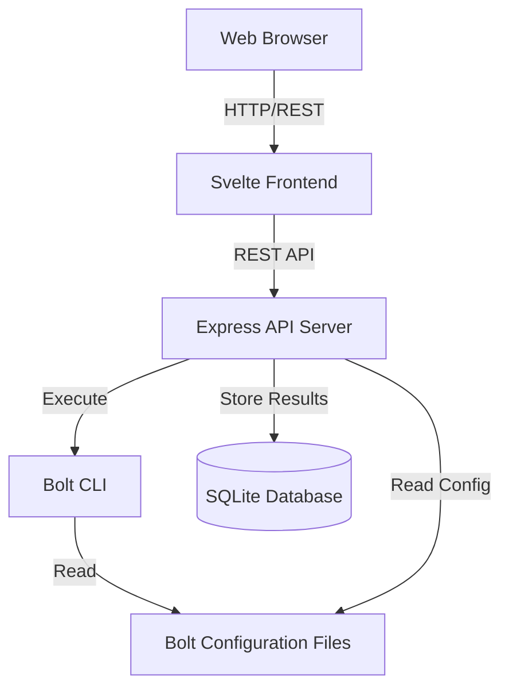

# Design Document

## Overview

Version 0.1.0 of Pabawi, a Unified Remote Execution Interface, provides a web-based interface for managing Bolt automation. The system consists of a Svelte frontend and a TypeScript/Node.js backend API server that orchestrates Bolt operations. The design emphasizes simplicity, using existing local Bolt configurations without requiring additional setup.

### Key Design Principles

- **Zero Configuration**: Use existing Bolt project files (inventory, credentials, modules) from the current working directory
- **Minimal Dependencies**: Single container deployment with embedded frontend
- **Direct Integration**: Execute Bolt CLI commands directly rather than using libraries
- **Stateless API**: Store execution history in SQLite for simplicity
- **Progressive Enhancement**: Build foundation for future multi-tool support

## Architecture

### High-Level Architecture



### Technology Stack

**Frontend:**
- Svelte 5 with TypeScript
- Tailwind CSS for styling
- Vite for build tooling
- Fetch API for HTTP requests

**Backend:**
- Node.js 20+ with TypeScript
- Express.js for REST API
- SQLite3 for execution history
- Child process execution for Bolt CLI
- Zod for request validation

**Deployment:**
- Docker container with multi-stage build
- Alpine Linux base image
- Single process serving both API and static frontend
- Environment variable configuration

## Components and Interfaces

### Frontend Components

#### 1. Inventory Page Component
**Responsibility:** Display and filter node inventory

**Key Features:**
- Virtual scrolling for large inventories (1000+ nodes)
- Search/filter by node name, transport type, status
- Grid or list view toggle
- Click navigation to node detail
- View by node group

**State Management:**
- Fetch inventory on mount
- Local filter state for search
- Loading and error states

#### 2. Node Detail Page Component
**Responsibility:** Display node information and execution controls

**Key Features:**
- Node metadata display (name, URI, transport)
- Facts display with collapsible sections
- Command execution form with validation
- Task execution form with parameter inputs
- Execution history for this node

**State Management:**
- Node ID from route parameter
- Facts loaded on demand
- Execution forms with local validation
- Real-time execution status updates

#### 3. Executions Page Component
**Responsibility:** Display execution history and results

**Key Features:**
- Paginated execution list
- Filter by date range, status, target
- Summary cards (total, success, failed)
- Drill-down to detailed results
- Status indicators (running, success, failed)

**State Management:**
- Paginated data fetching
- Filter state persistence
- Auto-refresh for running executions

#### 4. Shared Components
- **LoadingSpinner**: Consistent loading indicator
- **ErrorAlert**: Standardized error display
- **StatusBadge**: Color-coded status indicators
- **CommandOutput**: Formatted stdout/stderr display
- **FactsViewer**: Collapsible JSON tree for facts

### Backend Components

#### 1. Express API Server
**Responsibility:** HTTP server and routing

**Endpoints:**
```
GET  /api/inventory          - List all nodes
GET  /api/nodes/:id          - Get node details
GET  /api/nodes/:id/facts    - Gather facts for node
POST /api/nodes/:id/command  - Execute command on node
POST /api/nodes/:id/task     - Execute task on node
GET  /api/tasks              - List available tasks
GET  /api/executions         - List execution history
GET  /api/executions/:id     - Get execution details
GET  /api/config             - Get system configuration
```

**Middleware:**
- JSON body parser
- CORS headers
- Request logging
- Error handling
- Request validation (Zod schemas)

#### 2. Bolt Service
**Responsibility:** Interface with Bolt CLI

**Methods:**
```typescript
class BoltService {
  async getInventory(): Promise<Node[]>
  async gatherFacts(nodeId: string): Promise<Facts>
  async runCommand(nodeId: string, command: string): Promise<ExecutionResult>
  async runTask(nodeId: string, taskName: string, params: object): Promise<ExecutionResult>
  async listTasks(): Promise<Task[]>
  validateBoltConfig(): Promise<void>
}
```

**Implementation Details:**
- Execute Bolt CLI via `child_process.spawn`
- Parse JSON output from Bolt
- Handle stderr for error messages
- Set working directory to Bolt project root
- Timeout handling (configurable, default 5 minutes)

#### 3. Command Whitelist Service
**Responsibility:** Validate commands against security policy

**Methods:**
```typescript
class CommandWhitelistService {
  constructor(config: WhitelistConfig)
  isCommandAllowed(command: string): boolean
  getWhitelist(): string[]
  isAllowAllEnabled(): boolean
}
```

**Configuration:**
```typescript
interface WhitelistConfig {
  allowAll: boolean           // Default: false
  whitelist: string[]         // Array of allowed commands
  matchMode: 'exact' | 'prefix'  // Default: 'exact'
}
```

**Validation Logic:**
- If `allowAll` is true, permit all commands
- If `allowAll` is false and whitelist is empty, reject all
- Match command against whitelist entries
- Support exact match or prefix match modes

#### 4. Execution Repository
**Responsibility:** Persist and retrieve execution history

**Schema:**
```sql
CREATE TABLE executions (
  id TEXT PRIMARY KEY,
  type TEXT NOT NULL,           -- 'command' | 'task' | 'facts'
  target_nodes TEXT NOT NULL,   -- JSON array
  action TEXT NOT NULL,         -- command string or task name
  parameters TEXT,              -- JSON object
  status TEXT NOT NULL,         -- 'running' | 'success' | 'failed' | 'partial'
  started_at TEXT NOT NULL,
  completed_at TEXT,
  results TEXT NOT NULL,        -- JSON array of node results
  error TEXT
);

CREATE INDEX idx_executions_started ON executions(started_at DESC);
CREATE INDEX idx_executions_status ON executions(status);
```

**Methods:**
```typescript
class ExecutionRepository {
  async create(execution: ExecutionRecord): Promise<string>
  async update(id: string, updates: Partial<ExecutionRecord>): Promise<void>
  async findById(id: string): Promise<ExecutionRecord | null>
  async findAll(filters: ExecutionFilters, pagination: Pagination): Promise<ExecutionRecord[]>
  async countByStatus(): Promise<StatusCounts>
}
```

#### 5. Configuration Service
**Responsibility:** Load and validate system configuration

**Configuration Sources:**
1. Environment variables
2. `.env` file in working directory
3. Default values

**Configuration Schema:**
```typescript
interface AppConfig {
  port: number                    // Default: 3000
  boltProjectPath: string         // Default: process.cwd()
  commandWhitelist: WhitelistConfig
  executionTimeout: number        // Default: 300000 (5 min)
  logLevel: string               // Default: 'info'
  databasePath: string           // Default: './data/executions.db'
}
```

## Data Models

### Node
```typescript
interface Node {
  id: string              // Unique identifier (derived from name)
  name: string            // Node name from inventory
  uri: string             // Connection URI
  transport: 'ssh' | 'winrm' | 'docker' | 'local'
  config: {
    user?: string
    port?: number
    [key: string]: any
  }
}
```

### Facts
```typescript
interface Facts {
  nodeId: string
  gatheredAt: string      // ISO timestamp
  facts: {
    os: {
      family: string
      name: string
      release: {
        full: string
        major: string
      }
    }
    processors: {
      count: number
      models: string[]
    }
    memory: {
      system: {
        total: string
        available: string
      }
    }
    networking: {
      hostname: string
      interfaces: Record<string, any>
    }
    [key: string]: any    // Additional facts
  }
}
```

### ExecutionResult
```typescript
interface ExecutionResult {
  id: string
  type: 'command' | 'task' | 'facts'
  targetNodes: string[]
  action: string
  parameters?: Record<string, any>
  status: 'running' | 'success' | 'failed' | 'partial'
  startedAt: string
  completedAt?: string
  results: NodeResult[]
  error?: string
}

interface NodeResult {
  nodeId: string
  status: 'success' | 'failed'
  output?: {
    stdout?: string
    stderr?: string
    exitCode?: number
  }
  value?: any             // For task results
  error?: string
  duration: number        // Milliseconds
}
```

### Task
```typescript
interface Task {
  name: string
  description?: string
  parameters: TaskParameter[]
  modulePath: string
}

interface TaskParameter {
  name: string
  type: 'String' | 'Integer' | 'Boolean' | 'Array' | 'Hash'
  description?: string
  required: boolean
  default?: any
}
```

## Error Handling

### Error Response Format
```typescript
interface ErrorResponse {
  error: {
    code: string          // Machine-readable error code
    message: string       // Human-readable message
    details?: any         // Additional context
  }
}
```

### Error Categories

**Configuration Errors (500):**
- `BOLT_CONFIG_MISSING`: Required Bolt configuration files not found
- `BOLT_CONFIG_INVALID`: Bolt configuration is malformed
- `DATABASE_ERROR`: SQLite database operation failed

**Validation Errors (400):**
- `INVALID_REQUEST`: Request body validation failed
- `COMMAND_NOT_ALLOWED`: Command not in whitelist
- `INVALID_NODE_ID`: Node not found in inventory
- `INVALID_TASK_NAME`: Task does not exist

**Execution Errors (500):**
- `BOLT_EXECUTION_FAILED`: Bolt CLI returned non-zero exit code
- `BOLT_TIMEOUT`: Execution exceeded timeout limit
- `BOLT_PARSE_ERROR`: Could not parse Bolt output

### Frontend Error Handling

- Display errors in ErrorAlert component
- Provide retry buttons for transient failures
- Show detailed error information in expandable sections
- Log errors to console for debugging
- Graceful degradation (show partial data if available)

## Testing Strategy

### Unit Tests

**Backend:**
- BoltService: Mock child_process, test output parsing
- CommandWhitelistService: Test validation logic with various configurations
- ExecutionRepository: Test CRUD operations with in-memory SQLite
- Configuration loading and validation

**Frontend:**
- Component rendering with mock data
- Filter and search logic
- Form validation
- State management

**Tools:** Vitest for both frontend and backend

### Integration Tests

**API Endpoints:**
- Test each endpoint with valid and invalid inputs
- Verify response formats match OpenAPI spec
- Test error handling paths
- Test pagination and filtering

**Bolt Integration:**
- Test with mock Bolt CLI (scripted responses)
- Verify command construction
- Test timeout handling
- Test error parsing

**Tools:** Supertest for API testing

### End-to-End Tests

**Critical User Flows:**
- View inventory → Select node → Execute command → View results
- View inventory → Select node → Gather facts → View facts
- View inventory → Select node → Execute task → View results
- View executions → Filter by status → View execution details

**Tools:** Playwright for browser automation

### Manual Testing Checklist

- [ ] Test with real Bolt project (10+ nodes)
- [ ] Test with large inventory (1000+ nodes)
- [ ] Verify command whitelist enforcement
- [ ] Test error scenarios (invalid credentials, unreachable nodes)
- [ ] Verify responsive layout at different screen sizes
- [ ] Test concurrent executions
- [ ] Verify execution history persistence across restarts

## Security Considerations

### Command Execution Security

- Command whitelist enforced by default
- No shell interpolation in Bolt commands
- Validate all user inputs before passing to Bolt
- Log all command executions with user context (future: authentication)

### Credential Handling

- Never expose credentials through API
- Use Bolt's native credential management
- Credentials remain in local Bolt configuration files
- No credential storage in application database

### API Security

- Input validation on all endpoints (Zod schemas)
- Rate limiting (future enhancement)
- CORS restricted to same origin
- No sensitive data in error messages

### Container Security

- Run as non-root user in container
- Minimal base image (Alpine)
- No unnecessary packages installed
- Read-only filesystem where possible

## Performance Considerations

### Frontend Optimization

- Virtual scrolling for inventory (render only visible nodes)
- Lazy loading of facts and execution details
- Debounced search input (300ms)
- Pagination for execution history (50 items per page)
- Code splitting for route-based chunks

### Backend Optimization

- Database indexes on frequently queried columns
- Connection pooling for SQLite
- Streaming large Bolt outputs
- Execution timeout to prevent resource exhaustion
- Limit concurrent Bolt executions (configurable, default: 5)

### Caching Strategy

- Cache inventory for 30 seconds (configurable)
- Cache task list until server restart
- No caching of execution results (always fresh)
- Cache facts per node for 5 minutes (configurable)

## Deployment

### Docker Container

**Dockerfile Structure:**
```dockerfile
# Stage 1: Build frontend
FROM node:20-alpine AS frontend-builder
WORKDIR /app/frontend
COPY frontend/package*.json ./
RUN npm ci
COPY frontend/ ./
RUN npm run build

# Stage 2: Build backend
FROM node:20-alpine AS backend-builder
WORKDIR /app/backend
COPY backend/package*.json ./
RUN npm ci
COPY backend/ ./
RUN npm run build

# Stage 3: Production
FROM node:20-alpine
RUN apk add --no-cache bolt
WORKDIR /app
COPY --from=backend-builder /app/backend/dist ./dist
COPY --from=backend-builder /app/backend/node_modules ./node_modules
COPY --from=frontend-builder /app/frontend/dist ./public
EXPOSE 3000
CMD ["node", "dist/server.js"]
```

### Environment Variables

```bash
PORT=3000
BOLT_PROJECT_PATH=/bolt-project
COMMAND_WHITELIST_ALLOW_ALL=false
COMMAND_WHITELIST='["ls","pwd","whoami"]'
EXECUTION_TIMEOUT=300000
LOG_LEVEL=info
DATABASE_PATH=/data/executions.db
```

### Volume Mounts

- `/bolt-project`: Mount Bolt project directory (inventory, modules, bolt-project.yaml)
- `/data`: Persistent storage for SQLite database

### Running the Container

```bash
docker run -d \
  -p 3000:3000 \
  -v /path/to/bolt-project:/bolt-project:ro \
  -v bolt-data:/data \
  -e COMMAND_WHITELIST_ALLOW_ALL=false \
  bolt-web-interface:0.1.0
```

## Future Considerations

### Version 0.2.0 Preparation

- Abstract Bolt-specific code into adapter pattern
- Define common interfaces for inventory, facts, execution
- Prepare database schema for multi-tool support
- Design plugin architecture for tool adapters

### Scalability

- Consider Redis for caching in multi-instance deployments
- WebSocket support for real-time execution updates
- Background job queue for long-running executions
- Horizontal scaling with load balancer

### Observability

- Structured logging with correlation IDs
- Prometheus metrics endpoint
- OpenTelemetry tracing
- Health check endpoint

## Open Questions

1. Should we support Bolt plans in 0.1.0 or defer to workflow support in 0.4.0?
   - **Decision**: Defer to 0.4.0 to keep 0.1.0 scope minimal

2. How should we handle very long-running executions (hours)?
   - **Decision**: Implement configurable timeout, default 5 minutes, allow override per execution

3. Should facts be automatically gathered when viewing node details?
   - **Decision**: No, require explicit user action to avoid unnecessary load

4. What level of Bolt output verbosity should we capture?
   - **Decision**: Use `--format json` for structured output, capture stderr for errors

## Documents

Documentation for final users should always be placed in the docs/ directory.

Documentation generated during development should always be placed in the .kiro/ directory.

The summaries of each Kiro session should go under .kiro/summaries/
and be named like YYYYMMDD-HHMM-DESCRIPTION.md. (For example .kiro/summaries/20251113-1759-Setup_project_dirs.md).

If there are things left to do, like fixing tests or implement features which have not been completed in a session, they should be documented under .kiro/todos/ and named with the format YYYYMMDD-HHMM-DESCRIPTION.md

Scripts useful for testing, troubleshooring, development or maintenance should be placed in appropriate subdirs in the scripts/ directory.