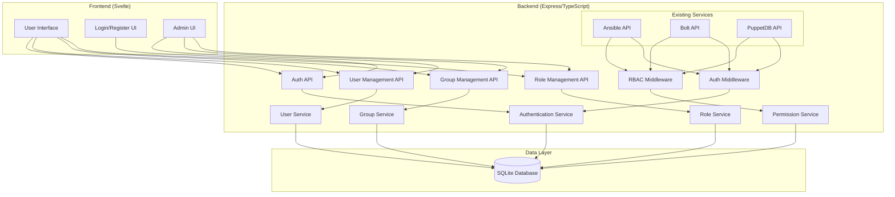
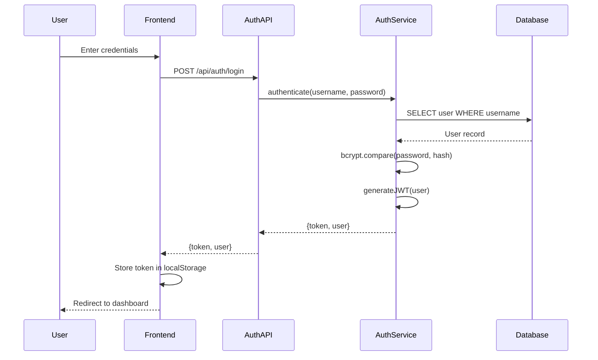
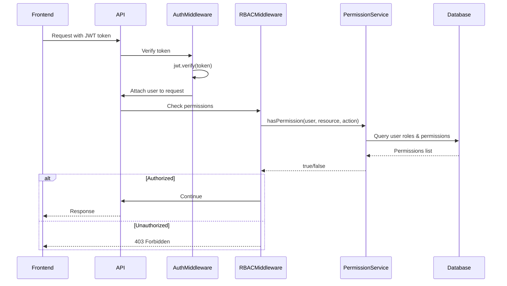

# Design Document: RBAC Authorization System

## Overview

This design document outlines a comprehensive Role-Based Access Control (RBAC) system for Pabawi, a web application that manages infrastructure automation through integrations with Ansible, Bolt, and PuppetDB. The RBAC system will provide user authentication, group management, and fine-grained authorization for all existing integrations (Ansible, Bolt, PuppetDB) and future integrations (SSH, Puppet ENC, Tiny Puppet, Psick).

The system follows industry-standard RBAC patterns with users, groups, roles, and permissions. It uses JWT tokens for stateless authentication, bcrypt for password hashing, and middleware-based authorization checks. The design is extensible to support future authentication providers (LDAP, OAuth, SAML) and integrates seamlessly with Pabawi's existing TypeScript backend and Svelte frontend.

## Architecture



## Sequence Diagrams

### User Authentication Flow



### Authorization Check Flow



## Components and Interfaces

### Authentication Service

**Purpose**: Handles user authentication, JWT token generation, and password management

**Interface**:

```typescript
interface AuthenticationService {
  // User authentication
  authenticate(username: string, password: string): Promise<AuthResult>;
  
  // Token management
  generateToken(user: User): string;
  verifyToken(token: string): Promise<TokenPayload>;
  refreshToken(refreshToken: string): Promise<AuthResult>;
  
  // Password management
  hashPassword(password: string): Promise<string>;
  comparePassword(password: string, hash: string): Promise<boolean>;
  
  // Session management
  revokeToken(token: string): Promise<void>;
  revokeAllUserTokens(userId: string): Promise<void>;
}

interface AuthResult {
  success: boolean;
  token?: string;
  refreshToken?: string;
  user?: UserDTO;
  error?: string;
}

interface TokenPayload {
  userId: string;
  username: string;
  roles: string[];
  iat: number;
  exp: number;
}
```

**Responsibilities**:

- Validate user credentials against database
- Generate and verify JWT tokens
- Hash passwords using bcrypt
- Manage token revocation and refresh
- Enforce password policies

### User Service

**Purpose**: Manages user accounts, profiles, and user-group relationships

**Interface**:

```typescript
interface UserService {
  // User CRUD operations
  createUser(data: CreateUserDTO): Promise<User>;
  getUserById(id: string): Promise<User | null>;
  getUserByUsername(username: string): Promise<User | null>;
  updateUser(id: string, data: UpdateUserDTO): Promise<User>;
  deleteUser(id: string): Promise<void>;
  listUsers(filters?: UserFilters): Promise<PaginatedResult<User>>;
  
  // User-Group management
  addUserToGroup(userId: string, groupId: string): Promise<void>;
  removeUserFromGroup(userId: string, groupId: string): Promise<void>;
  getUserGroups(userId: string): Promise<Group[]>;
  
  // User-Role management
  assignRoleToUser(userId: string, roleId: string): Promise<void>;
  removeRoleFromUser(userId: string, roleId: string): Promise<void>;
  getUserRoles(userId: string): Promise<Role[]>;
  
  // Status management
  activateUser(id: string): Promise<void>;
  deactivateUser(id: string): Promise<void>;
}
```

**Responsibilities**:

- Create, read, update, delete user accounts
- Manage user-group associations
- Manage user-role assignments
- Handle user activation/deactivation
- Validate user data

### Group Service

**Purpose**: Manages groups and group-role relationships

**Interface**:

```typescript
interface GroupService {
  // Group CRUD operations
  createGroup(data: CreateGroupDTO): Promise<Group>;
  getGroupById(id: string): Promise<Group | null>;
  updateGroup(id: string, data: UpdateGroupDTO): Promise<Group>;
  deleteGroup(id: string): Promise<void>;
  listGroups(filters?: GroupFilters): Promise<PaginatedResult<Group>>;
  
  // Group-Role management
  assignRoleToGroup(groupId: string, roleId: string): Promise<void>;
  removeRoleFromGroup(groupId: string, roleId: string): Promise<void>;
  getGroupRoles(groupId: string): Promise<Role[]>;
  
  // Group members
  getGroupMembers(groupId: string): Promise<User[]>;
  getGroupMemberCount(groupId: string): Promise<number>;
}
```

**Responsibilities**:

- Create, read, update, delete groups
- Manage group-role associations
- Query group membership
- Validate group data

### Role Service

**Purpose**: Manages roles and role-permission relationships

**Interface**:

```typescript
interface RoleService {
  // Role CRUD operations
  createRole(data: CreateRoleDTO): Promise<Role>;
  getRoleById(id: string): Promise<Role | null>;
  updateRole(id: string, data: UpdateRoleDTO): Promise<Role>;
  deleteRole(id: string): Promise<void>;
  listRoles(filters?: RoleFilters): Promise<PaginatedResult<Role>>;
  
  // Role-Permission management
  assignPermissionToRole(roleId: string, permissionId: string): Promise<void>;
  removePermissionFromRole(roleId: string, permissionId: string): Promise<void>;
  getRolePermissions(roleId: string): Promise<Permission[]>;
  
  // Built-in roles
  getBuiltInRoles(): Promise<Role[]>;
  isBuiltInRole(roleId: string): Promise<boolean>;
}
```

**Responsibilities**:

- Create, read, update, delete roles
- Manage role-permission associations
- Protect built-in system roles
- Validate role data

### Permission Service

**Purpose**: Manages permissions and authorization checks

**Interface**:

```typescript
interface PermissionService {
  // Permission CRUD operations
  createPermission(data: CreatePermissionDTO): Promise<Permission>;
  getPermissionById(id: string): Promise<Permission | null>;
  listPermissions(filters?: PermissionFilters): Promise<PaginatedResult<Permission>>;
  
  // Authorization checks
  hasPermission(userId: string, resource: string, action: string): Promise<boolean>;
  getUserPermissions(userId: string): Promise<Permission[]>;
  checkMultiplePermissions(userId: string, checks: PermissionCheck[]): Promise<PermissionCheckResult[]>;
  
  // Resource-based permissions
  getResourcePermissions(resource: string): Promise<Permission[]>;
  getUserResourceActions(userId: string, resource: string): Promise<string[]>;
}

interface PermissionCheck {
  resource: string;
  action: string;
}

interface PermissionCheckResult extends PermissionCheck {
  allowed: boolean;
}
```

**Responsibilities**:

- Create and manage permissions
- Perform authorization checks
- Aggregate user permissions from roles and groups
- Cache permission lookups for performance

## Data Models

### User Model

```typescript
interface User {
  id: string;                    // UUID
  username: string;              // Unique username
  email: string;                 // Unique email
  passwordHash: string;          // Bcrypt hash
  firstName: string;
  lastName: string;
  isActive: boolean;             // Account status
  isAdmin: boolean;              // Super admin flag
  createdAt: string;             // ISO 8601 timestamp
  updatedAt: string;             // ISO 8601 timestamp
  lastLoginAt: string | null;    // ISO 8601 timestamp
}

interface CreateUserDTO {
  username: string;
  email: string;
  password: string;
  firstName: string;
  lastName: string;
  isAdmin?: boolean;
}

interface UpdateUserDTO {
  email?: string;
  firstName?: string;
  lastName?: string;
  password?: string;
  isActive?: boolean;
}

interface UserDTO {
  id: string;
  username: string;
  email: string;
  firstName: string;
  lastName: string;
  isActive: boolean;
  isAdmin: boolean;
  createdAt: string;
  updatedAt: string;
  lastLoginAt: string | null;
  groups?: GroupDTO[];
  roles?: RoleDTO[];
}
```

**Validation Rules**:

- Username: 3-50 characters, alphanumeric and underscore only
- Email: Valid email format
- Password: Minimum 8 characters, must contain uppercase, lowercase, number, and special character
- Names: 1-100 characters

### Group Model

```typescript
interface Group {
  id: string;                    // UUID
  name: string;                  // Unique group name
  description: string;
  createdAt: string;             // ISO 8601 timestamp
  updatedAt: string;             // ISO 8601 timestamp
}

interface CreateGroupDTO {
  name: string;
  description: string;
}

interface UpdateGroupDTO {
  name?: string;
  description?: string;
}

interface GroupDTO {
  id: string;
  name: string;
  description: string;
  createdAt: string;
  updatedAt: string;
  memberCount?: number;
  roles?: RoleDTO[];
}
```

**Validation Rules**:

- Name: 3-100 characters, unique
- Description: 0-500 characters

### Role Model

```typescript
interface Role {
  id: string;                    // UUID
  name: string;                  // Unique role name
  description: string;
  isBuiltIn: boolean;            // System role flag
  createdAt: string;             // ISO 8601 timestamp
  updatedAt: string;             // ISO 8601 timestamp
}

interface CreateRoleDTO {
  name: string;
  description: string;
}

interface UpdateRoleDTO {
  name?: string;
  description?: string;
}

interface RoleDTO {
  id: string;
  name: string;
  description: string;
  isBuiltIn: boolean;
  createdAt: string;
  updatedAt: string;
  permissions?: PermissionDTO[];
}
```

**Validation Rules**:

- Name: 3-100 characters, unique
- Description: 0-500 characters
- Built-in roles cannot be deleted or renamed

### Permission Model

```typescript
interface Permission {
  id: string;                    // UUID
  resource: string;              // Resource identifier (e.g., 'ansible', 'bolt', 'puppetdb')
  action: string;                // Action identifier (e.g., 'read', 'write', 'execute', 'admin')
  description: string;
  createdAt: string;             // ISO 8601 timestamp
}

interface CreatePermissionDTO {
  resource: string;
  action: string;
  description: string;
}

interface PermissionDTO {
  id: string;
  resource: string;
  action: string;
  description: string;
  createdAt: string;
}
```

**Validation Rules**:

- Resource: 3-100 characters, lowercase, alphanumeric and underscore
- Action: 3-50 characters, lowercase, alphanumeric and underscore
- Unique constraint on (resource, action) combination

### Junction Tables

```typescript
// User-Group relationship
interface UserGroup {
  userId: string;
  groupId: string;
  assignedAt: string;            // ISO 8601 timestamp
}

// User-Role relationship (direct assignment)
interface UserRole {
  userId: string;
  roleId: string;
  assignedAt: string;            // ISO 8601 timestamp
}

// Group-Role relationship
interface GroupRole {
  groupId: string;
  roleId: string;
  assignedAt: string;            // ISO 8601 timestamp
}

// Role-Permission relationship
interface RolePermission {
  roleId: string;
  permissionId: string;
  assignedAt: string;            // ISO 8601 timestamp
}

// Token revocation list
interface RevokedToken {
  token: string;                 // JWT token (hashed)
  userId: string;
  revokedAt: string;             // ISO 8601 timestamp
  expiresAt: string;             // ISO 8601 timestamp
}
```

## Algorithmic Pseudocode

### Main Authentication Algorithm

```typescript
async function authenticate(username: string, password: string): Promise<AuthResult> {
  // INPUT: username (string), password (string)
  // OUTPUT: AuthResult with token or error
  // PRECONDITIONS:
  //   - username is non-empty string
  //   - password is non-empty string
  // POSTCONDITIONS:
  //   - Returns success=true with token if credentials valid
  //   - Returns success=false with error if credentials invalid
  //   - Updates lastLoginAt timestamp on success
  
  // Step 1: Validate input
  if (!username || !password) {
    return { success: false, error: 'Username and password required' };
  }
  
  // Step 2: Fetch user from database
  const user = await database.query(
    'SELECT * FROM users WHERE username = ? AND isActive = 1',
    [username]
  );
  
  if (!user) {
    // Use generic error to prevent username enumeration
    return { success: false, error: 'Invalid credentials' };
  }
  
  // Step 3: Verify password
  const isPasswordValid = await bcrypt.compare(password, user.passwordHash);
  
  if (!isPasswordValid) {
    // Log failed attempt for security monitoring
    await logFailedLogin(username);
    return { success: false, error: 'Invalid credentials' };
  }
  
  // Step 4: Generate JWT tokens
  const token = generateAccessToken(user);
  const refreshToken = generateRefreshToken(user);
  
  // Step 5: Update last login timestamp
  await database.execute(
    'UPDATE users SET lastLoginAt = ? WHERE id = ?',
    [new Date().toISOString(), user.id]
  );
  
  // Step 6: Return success result
  return {
    success: true,
    token,
    refreshToken,
    user: toUserDTO(user)
  };
}
```

**Preconditions**:

- username and password are provided
- Database connection is available
- bcrypt library is initialized

**Postconditions**:

- User is authenticated if credentials are valid
- JWT tokens are generated on success
- lastLoginAt is updated on success
- Failed attempts are logged for security

**Loop Invariants**: N/A (no loops in main flow)

### Permission Check Algorithm

```typescript
async function hasPermission(
  userId: string,
  resource: string,
  action: string
): Promise<boolean> {
  // INPUT: userId (string), resource (string), action (string)
  // OUTPUT: boolean indicating if user has permission
  // PRECONDITIONS:
  //   - userId is valid UUID
  //   - resource and action are non-empty strings
  // POSTCONDITIONS:
  //   - Returns true if user has permission through any path
  //   - Returns false if user lacks permission
  //   - Admin users always return true
  
  // Step 1: Check if user is admin (admins have all permissions)
  const user = await database.query(
    'SELECT isAdmin, isActive FROM users WHERE id = ?',
    [userId]
  );
  
  if (!user || !user.isActive) {
    return false;
  }
  
  if (user.isAdmin) {
    return true;
  }
  
  // Step 2: Check cache for permission result
  const cacheKey = `perm:${userId}:${resource}:${action}`;
  const cached = await cache.get(cacheKey);
  
  if (cached !== null) {
    return cached === 'true';
  }
  
  // Step 3: Query permissions through all paths
  // Path 1: Direct user-role-permission
  // Path 2: User-group-role-permission
  const hasPermissionQuery = `
    SELECT COUNT(*) as count FROM permissions p
    WHERE p.resource = ? AND p.action = ?
    AND p.id IN (
      -- Direct role assignment
      SELECT rp.permissionId FROM role_permissions rp
      INNER JOIN user_roles ur ON ur.roleId = rp.roleId
      WHERE ur.userId = ?
      
      UNION
      
      -- Group role assignment
      SELECT rp.permissionId FROM role_permissions rp
      INNER JOIN group_roles gr ON gr.roleId = rp.roleId
      INNER JOIN user_groups ug ON ug.groupId = gr.groupId
      WHERE ug.userId = ?
    )
  `;
  
  const result = await database.query(hasPermissionQuery, [
    resource,
    action,
    userId,
    userId
  ]);
  
  const hasAccess = result.count > 0;
  
  // Step 4: Cache result for 5 minutes
  await cache.set(cacheKey, hasAccess ? 'true' : 'false', 300);
  
  return hasAccess;
}
```

**Preconditions**:

- userId exists in database
- resource and action are valid permission identifiers
- Database and cache connections are available

**Postconditions**:

- Returns true if user has permission through any path
- Admin users always have permission
- Result is cached for performance
- Inactive users always denied

**Loop Invariants**: N/A (uses SQL UNION, no explicit loops)

### Token Generation Algorithm

```typescript
function generateAccessToken(user: User): string {
  // INPUT: user (User object)
  // OUTPUT: JWT access token string
  // PRECONDITIONS:
  //   - user object is valid and complete
  //   - JWT_SECRET environment variable is set
  // POSTCONDITIONS:
  //   - Returns valid JWT token
  //   - Token expires in 1 hour
  //   - Token contains user id, username, and roles
  
  const payload: TokenPayload = {
    userId: user.id,
    username: user.username,
    roles: [], // Will be populated from database
    iat: Math.floor(Date.now() / 1000),
    exp: Math.floor(Date.now() / 1000) + (60 * 60) // 1 hour
  };
  
  // Fetch user roles for token
  const roles = await getUserRoles(user.id);
  payload.roles = roles.map(r => r.name);
  
  // Sign token with secret
  const token = jwt.sign(payload, process.env.JWT_SECRET!, {
    algorithm: 'HS256'
  });
  
  return token;
}
```

**Preconditions**:

- User object is valid
- JWT_SECRET is configured
- User roles can be fetched

**Postconditions**:

- Valid JWT token is generated
- Token includes user identity and roles
- Token has 1-hour expiration

### User Permission Aggregation Algorithm

```typescript
async function getUserPermissions(userId: string): Promise<Permission[]> {
  // INPUT: userId (string)
  // OUTPUT: Array of Permission objects
  // PRECONDITIONS:
  //   - userId is valid UUID
  // POSTCONDITIONS:
  //   - Returns all unique permissions for user
  //   - Includes permissions from direct roles and group roles
  //   - Admin users get all permissions
  
  // Step 1: Check if user is admin
  const user = await database.query(
    'SELECT isAdmin FROM users WHERE id = ? AND isActive = 1',
    [userId]
  );
  
  if (!user) {
    return [];
  }
  
  if (user.isAdmin) {
    // Admin gets all permissions
    return await database.query('SELECT * FROM permissions');
  }
  
  // Step 2: Aggregate permissions from all sources
  const permissionsQuery = `
    SELECT DISTINCT p.* FROM permissions p
    INNER JOIN role_permissions rp ON rp.permissionId = p.id
    WHERE rp.roleId IN (
      -- Direct role assignments
      SELECT roleId FROM user_roles WHERE userId = ?
      
      UNION
      
      -- Group role assignments
      SELECT gr.roleId FROM group_roles gr
      INNER JOIN user_groups ug ON ug.groupId = gr.groupId
      WHERE ug.userId = ?
    )
    ORDER BY p.resource, p.action
  `;
  
  const permissions = await database.query(permissionsQuery, [userId, userId]);
  
  return permissions;
}
```

**Preconditions**:

- userId is valid
- User is active
- Database connection available

**Postconditions**:

- Returns all unique permissions
- Permissions are deduplicated
- Results are ordered by resource and action
- Admin users get all permissions

## Key Functions with Formal Specifications

### Function: authenticateUser()

```typescript
async function authenticateUser(
  username: string,
  password: string
): Promise<AuthResult>
```

**Preconditions:**

- `username` is non-empty string (length >= 3)
- `password` is non-empty string (length >= 8)
- Database connection is established
- bcrypt library is available

**Postconditions:**

- If credentials valid: Returns `{success: true, token: string, user: UserDTO}`
- If credentials invalid: Returns `{success: false, error: string}`
- User's `lastLoginAt` is updated on successful authentication
- Failed login attempts are logged for security monitoring
- No side effects on input parameters

**Loop Invariants:** N/A

### Function: verifyToken()

```typescript
async function verifyToken(token: string): Promise<TokenPayload>
```

**Preconditions:**

- `token` is non-empty string
- JWT_SECRET environment variable is configured
- Token is not in revocation list

**Postconditions:**

- Returns valid TokenPayload if token is valid and not expired
- Throws error if token is invalid, expired, or revoked
- No database modifications
- Token signature is cryptographically verified

**Loop Invariants:** N/A

### Function: hasPermission()

```typescript
async function hasPermission(
  userId: string,
  resource: string,
  action: string
): Promise<boolean>
```

**Preconditions:**

- `userId` is valid UUID format
- `resource` is non-empty string
- `action` is non-empty string
- Database connection is available

**Postconditions:**

- Returns `true` if user has permission through any path (direct role or group role)
- Returns `true` if user is admin (admins have all permissions)
- Returns `false` if user is inactive or doesn't exist
- Returns `false` if user lacks permission
- Result is cached for 5 minutes for performance
- No database modifications

**Loop Invariants:** N/A

### Function: createUser()

```typescript
async function createUser(data: CreateUserDTO): Promise<User>
```

**Preconditions:**

- `data.username` is unique and valid (3-50 chars, alphanumeric + underscore)
- `data.email` is unique and valid email format
- `data.password` meets complexity requirements (min 8 chars, mixed case, number, special char)
- `data.firstName` and `data.lastName` are non-empty (1-100 chars)
- Database connection is available

**Postconditions:**

- New user record is created in database
- Password is hashed using bcrypt (cost factor 10)
- User ID is generated as UUID
- `createdAt` and `updatedAt` timestamps are set
- `isActive` defaults to true
- `isAdmin` defaults to false unless specified
- Returns complete User object
- Throws error if username or email already exists

**Loop Invariants:** N/A

### Function: assignRoleToUser()

```typescript
async function assignRoleToUser(
  userId: string,
  roleId: string
): Promise<void>
```

**Preconditions:**

- `userId` exists in users table
- `roleId` exists in roles table
- User is active
- No existing assignment of this role to this user

**Postconditions:**

- New record created in user_roles table
- `assignedAt` timestamp is set to current time
- User's permission cache is invalidated
- No duplicate assignments are created
- Throws error if user or role doesn't exist

**Loop Invariants:** N/A

### Function: getUserPermissions()

```typescript
async function getUserPermissions(userId: string): Promise<Permission[]>
```

**Preconditions:**

- `userId` is valid UUID
- Database connection is available

**Postconditions:**

- Returns array of all unique permissions for user
- Includes permissions from direct role assignments
- Includes permissions from group role assignments
- Admin users receive all permissions
- Inactive users receive empty array
- Results are deduplicated
- Results are ordered by resource and action
- No database modifications

**Loop Invariants:**

- For permission aggregation: All previously processed permissions remain unique in result set

## Example Usage

### User Registration and Authentication

```typescript
// Example 1: Register a new user
const userService = new UserService(database);
const authService = new AuthenticationService(database);

const newUser = await userService.createUser({
  username: 'john.doe',
  email: 'john.doe@example.com',
  password: 'SecurePass123!',  // pragma: allowlist secret
  firstName: 'John',
  lastName: 'Doe'
});

// Example 2: Authenticate user
const authResult = await authService.authenticate('john.doe', 'SecurePass123!');

if (authResult.success) {
  console.log('Login successful');
  console.log('Token:', authResult.token);
  console.log('User:', authResult.user);
  
  // Store token in frontend
  localStorage.setItem('authToken', authResult.token);
} else {
  console.error('Login failed:', authResult.error);
}

// Example 3: Verify token in middleware
const token = request.headers.authorization?.replace('Bearer ', '');

try {
  const payload = await authService.verifyToken(token);
  request.user = payload;
  next();
} catch (error) {
  response.status(401).json({ error: 'Invalid token' });
}
```

### Group and Role Management

```typescript
// Example 4: Create group and assign roles
const groupService = new GroupService(database);
const roleService = new RoleService(database);

const devGroup = await groupService.createGroup({
  name: 'Developers',
  description: 'Development team members'
});

const devRole = await roleService.createRole({
  name: 'Developer',
  description: 'Can read and execute on all integrations'
});

// Assign role to group
await groupService.assignRoleToGroup(devGroup.id, devRole.id);

// Add user to group
await userService.addUserToGroup(newUser.id, devGroup.id);

// Example 5: Assign permissions to role
const permissionService = new PermissionService(database);

const readAnsible = await permissionService.createPermission({
  resource: 'ansible',
  action: 'read',
  description: 'View Ansible inventory and playbooks'
});

const executeAnsible = await permissionService.createPermission({
  resource: 'ansible',
  action: 'execute',
  description: 'Execute Ansible playbooks'
});

await roleService.assignPermissionToRole(devRole.id, readAnsible.id);
await roleService.assignPermissionToRole(devRole.id, executeAnsible.id);
```

### Authorization Checks

```typescript
// Example 6: Check permission in route handler
app.post('/api/ansible/playbooks/:id/execute', 
  authMiddleware,
  async (req, res) => {
    const hasPermission = await permissionService.hasPermission(
      req.user.userId,
      'ansible',
      'execute'
    );
    
    if (!hasPermission) {
      return res.status(403).json({ 
        error: 'Insufficient permissions' 
      });
    }
    
    // Execute playbook
    const result = await ansibleService.executePlaybook(req.params.id);
    res.json(result);
  }
);

// Example 7: Use RBAC middleware
app.use('/api/ansible', 
  authMiddleware,
  rbacMiddleware('ansible', 'read')
);

// Example 8: Check multiple permissions
const checks = [
  { resource: 'ansible', action: 'read' },
  { resource: 'ansible', action: 'execute' },
  { resource: 'bolt', action: 'read' }
];

const results = await permissionService.checkMultiplePermissions(
  userId,
  checks
);

results.forEach(result => {
  console.log(`${result.resource}:${result.action} = ${result.allowed}`);
});
```

### Complete Workflow Example

```typescript
// Example 9: Complete user onboarding workflow
async function onboardNewUser(userData: CreateUserDTO) {
  // Step 1: Create user
  const user = await userService.createUser(userData);
  
  // Step 2: Add to default group
  const defaultGroup = await groupService.getGroupByName('Users');
  await userService.addUserToGroup(user.id, defaultGroup.id);
  
  // Step 3: Assign viewer role
  const viewerRole = await roleService.getRoleByName('Viewer');
  await userService.assignRoleToUser(user.id, viewerRole.id);
  
  // Step 4: Send welcome email (not shown)
  await emailService.sendWelcomeEmail(user.email);
  
  return user;
}

// Example 10: Admin user management
async function promoteToAdmin(userId: string, adminUserId: string) {
  // Verify admin has permission
  const isAdmin = await permissionService.hasPermission(
    adminUserId,
    'users',
    'admin'
  );
  
  if (!isAdmin) {
    throw new Error('Only admins can promote users');
  }
  
  // Update user
  await userService.updateUser(userId, { isAdmin: true });
  
  // Log action for audit
  await auditService.log({
    action: 'user_promoted',
    performedBy: adminUserId,
    targetUser: userId,
    timestamp: new Date().toISOString()
  });
}
```

## Correctness Properties

### Authentication Properties

**Property 1: Password Security**

```
∀ user ∈ Users, password ∈ Passwords:
  stored(user.passwordHash) ⟹ 
    bcrypt.verify(password, user.passwordHash) ∧
    ¬∃ f: f(user.passwordHash) = password
```

*All passwords are hashed using bcrypt and cannot be reversed*

**Property 2: Token Validity**

```
∀ token ∈ Tokens:
  valid(token) ⟺ 
    (verify(token, JWT_SECRET) ∧
     token.exp > now() ∧
     token ∉ RevokedTokens)
```

*A token is valid if and only if it's properly signed, not expired, and not revoked*

**Property 3: Authentication Atomicity**

```
∀ username, password:
  authenticate(username, password).success = true ⟹
    (∃ user: user.username = username ∧
     user.isActive = true ∧
     bcrypt.compare(password, user.passwordHash) = true)
```

*Successful authentication requires valid credentials and active account*

### Authorization Properties

**Property 4: Permission Transitivity**

```
∀ user ∈ Users, role ∈ Roles, permission ∈ Permissions:
  (user ∈ role.users ∧ permission ∈ role.permissions) ⟹
    hasPermission(user, permission.resource, permission.action) = true
```

*Users inherit all permissions from their assigned roles*

**Property 5: Group Permission Inheritance**

```
∀ user ∈ Users, group ∈ Groups, role ∈ Roles, permission ∈ Permissions:
  (user ∈ group.members ∧ 
   role ∈ group.roles ∧ 
   permission ∈ role.permissions) ⟹
    hasPermission(user, permission.resource, permission.action) = true
```

*Users inherit permissions from roles assigned to their groups*

**Property 6: Admin Privilege**

```
∀ user ∈ Users, resource ∈ Resources, action ∈ Actions:
  user.isAdmin = true ⟹
    hasPermission(user, resource, action) = true
```

*Admin users have all permissions on all resources*

**Property 7: Inactive User Denial**

```
∀ user ∈ Users, resource ∈ Resources, action ∈ Actions:
  user.isActive = false ⟹
    hasPermission(user, resource, action) = false
```

*Inactive users have no permissions*

### Data Integrity Properties

**Property 8: Username Uniqueness**

```
∀ u1, u2 ∈ Users:
  u1.id ≠ u2.id ⟹ u1.username ≠ u2.username
```

*All usernames are unique across the system*

**Property 9: Email Uniqueness**

```
∀ u1, u2 ∈ Users:
  u1.id ≠ u2.id ⟹ u1.email ≠ u2.email
```

*All email addresses are unique across the system*

**Property 10: Permission Uniqueness**

```
∀ p1, p2 ∈ Permissions:
  (p1.resource = p2.resource ∧ p1.action = p2.action) ⟹ p1.id = p2.id
```

*Each resource-action combination has exactly one permission*

**Property 11: Role Assignment Idempotence**

```
∀ user ∈ Users, role ∈ Roles:
  assignRoleToUser(user, role) ∧ assignRoleToUser(user, role) ⟹
    |{r ∈ user.roles : r.id = role.id}| = 1
```

*Assigning the same role multiple times results in single assignment*

### Security Properties

**Property 12: Token Expiration**

```
∀ token ∈ Tokens:
  now() > token.exp ⟹ verify(token) = false
```

*Expired tokens are always rejected*

**Property 13: Revocation Effectiveness**

```
∀ token ∈ Tokens:
  revokeToken(token) ⟹ verify(token) = false
```

*Revoked tokens cannot be verified*

**Property 14: Password Complexity**

```
∀ password ∈ ValidPasswords:
  length(password) ≥ 8 ∧
  ∃ c ∈ password: isUppercase(c) ∧
  ∃ c ∈ password: isLowercase(c) ∧
  ∃ c ∈ password: isDigit(c) ∧
  ∃ c ∈ password: isSpecialChar(c)
```

*All passwords meet minimum complexity requirements*

**Property 15: Authorization Before Action**

```
∀ action ∈ ProtectedActions, user ∈ Users:
  execute(action, user) ⟹
    hasPermission(user, action.resource, action.type) = true
```

*All protected actions require prior authorization check*

## Error Handling

### Error Scenario 1: Invalid Credentials

**Condition**: User provides incorrect username or password during authentication

**Response**:

- Return generic error message "Invalid credentials" (prevent username enumeration)
- Log failed attempt with timestamp and IP address
- Implement rate limiting after 5 failed attempts (15-minute lockout)
- Return HTTP 401 Unauthorized

**Recovery**:

- User can retry with correct credentials
- Account lockout expires after timeout period
- Admin can manually unlock account if needed

### Error Scenario 2: Expired Token

**Condition**: User attempts to access protected resource with expired JWT token

**Response**:

- Return error "Token expired"
- Clear token from client storage
- Return HTTP 401 Unauthorized
- Include refresh token endpoint in error response

**Recovery**:

- Client automatically attempts token refresh using refresh token
- If refresh fails, redirect to login page
- User re-authenticates to obtain new tokens

### Error Scenario 3: Insufficient Permissions

**Condition**: Authenticated user attempts action without required permission

**Response**:

- Return error "Insufficient permissions to perform this action"
- Log authorization failure for audit
- Return HTTP 403 Forbidden
- Include required permission in error response (for debugging)

**Recovery**:

- User contacts administrator to request permission
- Administrator assigns appropriate role or permission
- User retries action after permission granted

### Error Scenario 4: Duplicate Username/Email

**Condition**: Attempt to create user with existing username or email

**Response**:

- Return specific error "Username already exists" or "Email already exists"
- Return HTTP 409 Conflict
- Do not create user record

**Recovery**:

- User chooses different username/email
- Admin can deactivate existing account if it's a duplicate
- User retries registration with unique credentials

### Error Scenario 5: Database Connection Failure

**Condition**: Database becomes unavailable during operation

**Response**:

- Return error "Service temporarily unavailable"
- Log error with full stack trace
- Return HTTP 503 Service Unavailable
- Implement circuit breaker pattern

**Recovery**:

- System automatically retries connection (exponential backoff)
- Health check endpoint reports degraded status
- Operations resume when database connection restored
- Queued operations are processed after recovery

### Error Scenario 6: Token Revocation Race Condition

**Condition**: Token is revoked while request is in flight

**Response**:

- Check revocation list before processing request
- Return error "Token has been revoked"
- Return HTTP 401 Unauthorized

**Recovery**:

- User re-authenticates to obtain new token
- System ensures revocation check happens before authorization
- No partial operations are committed

### Error Scenario 7: Built-in Role Modification Attempt

**Condition**: Admin attempts to delete or modify built-in system role

**Response**:

- Return error "Cannot modify built-in system role"
- Return HTTP 400 Bad Request
- No changes are made to role

**Recovery**:

- Admin creates custom role with desired permissions
- Built-in roles remain protected
- System integrity is maintained

### Error Scenario 8: Circular Group Membership

**Condition**: Attempt to create group hierarchy that would cause circular reference

**Response**:

- Return error "Circular group membership detected"
- Return HTTP 400 Bad Request
- No changes are made to group relationships

**Recovery**:

- Admin restructures group hierarchy
- System validates group relationships before commit
- Existing valid relationships are preserved

### Error Scenario 9: Password Complexity Violation

**Condition**: User attempts to set password that doesn't meet requirements

**Response**:

- Return detailed error listing all violated requirements
- Return HTTP 400 Bad Request
- Password is not changed

**Recovery**:

- User creates password meeting all requirements
- System provides clear guidance on requirements
- User retries with compliant password

### Error Scenario 10: Session Hijacking Detection

**Condition**: Token is used from different IP address or user agent than original

**Response**:

- Optionally revoke token (configurable security policy)
- Log security event for investigation
- Return HTTP 401 Unauthorized if revoked
- Send security alert to user's email

**Recovery**:

- User re-authenticates from legitimate device
- Security team investigates suspicious activity
- Compromised tokens are revoked
- User may be required to change password

## Testing Strategy

### Unit Testing Approach

**Authentication Service Tests**:

- Test password hashing with bcrypt (verify hash format, cost factor)
- Test password comparison (valid/invalid passwords)
- Test JWT token generation (payload structure, expiration, signature)
- Test JWT token verification (valid/expired/invalid tokens)
- Test token revocation (revoked tokens fail verification)
- Test refresh token flow (generate, verify, exchange)

**User Service Tests**:

- Test user creation (valid data, duplicate username/email)
- Test user retrieval (by ID, by username, by email)
- Test user update (partial updates, validation)
- Test user deletion (soft delete, cascade effects)
- Test user activation/deactivation
- Test user-group associations (add, remove, list)
- Test user-role assignments (add, remove, list)

**Permission Service Tests**:

- Test permission creation (unique resource-action pairs)
- Test hasPermission with direct role assignment
- Test hasPermission with group role assignment
- Test hasPermission for admin users (always true)
- Test hasPermission for inactive users (always false)
- Test permission caching (cache hit, cache miss, cache invalidation)
- Test getUserPermissions aggregation (deduplication, ordering)

**Middleware Tests**:

- Test auth middleware with valid token
- Test auth middleware with missing token
- Test auth middleware with expired token
- Test auth middleware with revoked token
- Test RBAC middleware with sufficient permissions
- Test RBAC middleware with insufficient permissions
- Test RBAC middleware with admin user

**Coverage Goals**: Minimum 85% code coverage for all services and middleware

### Property-Based Testing Approach

**Property Test Library**: fast-check (TypeScript property-based testing library)

**Property Test 1: Password Hashing Consistency**

```typescript
fc.assert(
  fc.property(fc.string({ minLength: 8 }), async (password) => {
    const hash1 = await authService.hashPassword(password);
    const hash2 = await authService.hashPassword(password);
    
    // Different hashes due to salt
    expect(hash1).not.toBe(hash2);
    
    // Both verify correctly
    expect(await authService.comparePassword(password, hash1)).toBe(true);
    expect(await authService.comparePassword(password, hash2)).toBe(true);
  })
);
```

**Property Test 2: Permission Transitivity**

```typescript
fc.assert(
  fc.property(
    fc.uuid(),
    fc.uuid(),
    fc.uuid(),
    async (userId, roleId, permissionId) => {
      // Setup: user -> role -> permission
      await userService.assignRoleToUser(userId, roleId);
      await roleService.assignPermissionToRole(roleId, permissionId);
      
      const permission = await permissionService.getPermissionById(permissionId);
      
      // Property: user should have permission
      const hasAccess = await permissionService.hasPermission(
        userId,
        permission.resource,
        permission.action
      );
      
      expect(hasAccess).toBe(true);
    }
  )
);
```

**Property Test 3: Token Expiration**

```typescript
fc.assert(
  fc.property(
    fc.record({
      userId: fc.uuid(),
      username: fc.string(),
      roles: fc.array(fc.string())
    }),
    fc.integer({ min: -3600, max: 3600 }),
    async (user, expiryOffset) => {
      const token = generateToken(user, expiryOffset);
      
      if (expiryOffset <= 0) {
        // Expired or immediate expiry
        await expect(authService.verifyToken(token)).rejects.toThrow();
      } else {
        // Valid token
        const payload = await authService.verifyToken(token);
        expect(payload.userId).toBe(user.userId);
      }
    }
  )
);
```

**Property Test 4: Username Uniqueness**

```typescript
fc.assert(
  fc.property(
    fc.array(fc.record({
      username: fc.string({ minLength: 3, maxLength: 50 }),
      email: fc.emailAddress(),
      password: fc.string({ minLength: 8 })
    }), { minLength: 2 }),
    async (users) => {
      const createdUsers = [];
      
      for (const userData of users) {
        try {
          const user = await userService.createUser(userData);
          createdUsers.push(user);
        } catch (error) {
          // Duplicate username/email expected
        }
      }
      
      // Property: all created users have unique usernames
      const usernames = createdUsers.map(u => u.username);
      const uniqueUsernames = new Set(usernames);
      expect(usernames.length).toBe(uniqueUsernames.size);
    }
  )
);
```

**Property Test 5: Admin Privilege**

```typescript
fc.assert(
  fc.property(
    fc.uuid(),
    fc.string(),
    fc.string(),
    async (userId, resource, action) => {
      // Setup: make user admin
      await userService.updateUser(userId, { isAdmin: true });
      
      // Property: admin has all permissions
      const hasAccess = await permissionService.hasPermission(
        userId,
        resource,
        action
      );
      
      expect(hasAccess).toBe(true);
    }
  )
);
```

### Integration Testing Approach

**Test Scenario 1: Complete Authentication Flow**

- Register new user via API
- Authenticate with credentials
- Verify token is returned
- Use token to access protected endpoint
- Verify user data is correct

**Test Scenario 2: Permission Inheritance Through Groups**

- Create group with role
- Assign permissions to role
- Add user to group
- Verify user has inherited permissions
- Remove user from group
- Verify permissions are revoked

**Test Scenario 3: Token Refresh Flow**

- Authenticate and receive tokens
- Wait for access token to expire
- Use refresh token to get new access token
- Verify new token works
- Verify old token is rejected

**Test Scenario 4: Multi-Path Permission Check**

- Assign permission via direct role
- Assign same permission via group role
- Verify user has permission
- Remove direct role
- Verify user still has permission via group
- Remove from group
- Verify permission is revoked

**Test Scenario 5: Admin User Management**

- Create admin user
- Admin creates new user
- Admin assigns roles to user
- Admin promotes user to admin
- Verify audit log entries

**Integration Test Environment**:

- Use in-memory SQLite database
- Mock external services (email, etc.)
- Reset database between tests
- Use test JWT secret
- Disable rate limiting for tests

## Performance Considerations

### Caching Strategy

**Permission Cache**:

- Cache permission check results for 5 minutes
- Cache key format: `perm:{userId}:{resource}:{action}`
- Invalidate cache on role/permission changes
- Use Redis or in-memory cache (node-cache)
- Estimated cache hit rate: 80-90%

**User Session Cache**:

- Cache user object with roles for token lifetime
- Cache key format: `user:{userId}`
- Reduces database queries for authenticated requests
- Invalidate on user update or role change

**Role-Permission Cache**:

- Cache role permissions mapping
- Cache key format: `role:{roleId}:permissions`
- Long TTL (1 hour) as roles change infrequently
- Invalidate on permission assignment/removal

### Database Optimization

**Indexes**:

```sql
-- User lookups
CREATE INDEX idx_users_username ON users(username);
CREATE INDEX idx_users_email ON users(email);
CREATE INDEX idx_users_active ON users(isActive);

-- Permission checks
CREATE INDEX idx_user_roles_user ON user_roles(userId);
CREATE INDEX idx_user_roles_role ON user_roles(roleId);
CREATE INDEX idx_group_roles_group ON group_roles(groupId);
CREATE INDEX idx_group_roles_role ON group_roles(roleId);
CREATE INDEX idx_user_groups_user ON user_groups(userId);
CREATE INDEX idx_user_groups_group ON user_groups(groupId);
CREATE INDEX idx_role_permissions_role ON role_permissions(roleId);
CREATE INDEX idx_role_permissions_perm ON role_permissions(permissionId);

-- Permission lookups
CREATE INDEX idx_permissions_resource_action ON permissions(resource, action);

-- Token revocation
CREATE INDEX idx_revoked_tokens_token ON revoked_tokens(token);
CREATE INDEX idx_revoked_tokens_expires ON revoked_tokens(expiresAt);
```

**Query Optimization**:

- Use prepared statements for all queries
- Batch permission checks when possible
- Use UNION instead of OR for better query plans
- Limit result sets with pagination
- Use EXISTS instead of COUNT when checking existence

### Response Time Targets

- Authentication: < 200ms (including bcrypt)
- Token verification: < 10ms (cached)
- Permission check: < 50ms (cached), < 200ms (uncached)
- User CRUD operations: < 100ms
- Group/Role operations: < 100ms
- Bulk permission checks: < 500ms for 100 checks

### Scalability Considerations

**Horizontal Scaling**:

- Stateless authentication (JWT tokens)
- Shared cache layer (Redis) for multi-instance deployments
- Database connection pooling
- Read replicas for permission checks

**Load Handling**:

- Rate limiting: 100 requests/minute per user
- Token bucket algorithm for rate limiting
- Circuit breaker for database failures
- Graceful degradation (cache-only mode)

**Memory Usage**:

- Estimated 1KB per cached permission check
- 10,000 cached checks = 10MB memory
- User session cache: ~2KB per user
- 1,000 active users = 2MB memory

### Monitoring Metrics

- Authentication success/failure rate
- Token verification latency (p50, p95, p99)
- Permission check latency (p50, p95, p99)
- Cache hit rate (target: >80%)
- Database query latency
- Failed login attempts per user
- Active sessions count
- Token revocation rate

## Security Considerations

### Authentication Security

**Password Security**:

- Bcrypt with cost factor 10 (adjustable for future hardware)
- Minimum password length: 8 characters
- Complexity requirements: uppercase, lowercase, number, special character
- Password history: prevent reuse of last 5 passwords
- Force password change every 90 days (configurable)

**Token Security**:

- JWT tokens signed with HS256 algorithm
- Access token lifetime: 1 hour
- Refresh token lifetime: 7 days
- Token revocation list for logout/compromise
- Rotate JWT secret periodically (manual process)
- Include token ID (jti) for revocation tracking

**Brute Force Protection**:

- Rate limiting: 5 failed attempts per 15 minutes
- Progressive delays after failed attempts
- Account lockout after 10 failed attempts
- CAPTCHA after 3 failed attempts (optional)
- Log all failed authentication attempts

### Authorization Security

**Principle of Least Privilege**:

- Default deny (no permissions unless explicitly granted)
- Granular permissions per resource and action
- Separate read/write/execute/admin permissions
- No implicit permission inheritance beyond defined paths

**Permission Validation**:

- Validate permissions before every protected action
- Check both authentication and authorization
- Log all authorization failures
- Audit trail for permission changes

**Admin Protection**:

- Require re-authentication for sensitive admin actions
- Multi-factor authentication for admin accounts (future)
- Separate admin interface with additional security
- Audit log for all admin actions

### Data Protection

**Sensitive Data**:

- Never log passwords (even hashed)
- Redact sensitive fields in logs
- Encrypt database at rest (SQLite encryption extension)
- Use HTTPS for all API communication
- Secure cookie flags (httpOnly, secure, sameSite)

**SQL Injection Prevention**:

- Use parameterized queries exclusively
- Validate and sanitize all user inputs
- Use ORM/query builder with automatic escaping
- Regular security audits of database queries

**XSS Prevention**:

- Sanitize all user-generated content
- Content Security Policy headers
- Escape output in frontend templates
- Validate input on both client and server

### Audit and Compliance

**Audit Logging**:

- Log all authentication attempts (success/failure)
- Log all authorization failures
- Log all user/role/permission changes
- Log all admin actions
- Include timestamp, user ID, IP address, action

**Compliance Requirements**:

- GDPR: User data export and deletion
- SOC 2: Access control and audit trails
- HIPAA: Encryption and access logging (if applicable)
- Regular security assessments

**Data Retention**:

- Audit logs: 1 year minimum
- Revoked tokens: Until expiration + 7 days
- Deleted user data: 30-day soft delete period
- Failed login attempts: 90 days

## Dependencies

### Backend Dependencies

**Core Dependencies**:

- `jsonwebtoken` (^9.0.0): JWT token generation and verification
- `bcrypt` (^5.1.0): Password hashing
- `zod` (^3.22.0): Input validation and schema definition
- `express` (^4.18.0): Web framework (already in use)
- `sqlite3` (^5.1.0): Database (already in use)

**Optional Dependencies**:

- `node-cache` (^5.1.0): In-memory caching (alternative to Redis)
- `ioredis` (^5.3.0): Redis client for distributed caching
- `express-rate-limit` (^7.1.0): Rate limiting middleware
- `helmet` (^7.1.0): Security headers middleware

### Frontend Dependencies

**Core Dependencies**:

- `svelte` (^4.0.0): Frontend framework (already in use)
- `@sveltejs/kit` (^1.0.0): Application framework (if using SvelteKit)

**Optional Dependencies**:

- `svelte-forms-lib` (^2.0.0): Form handling
- `yup` (^1.3.0): Client-side validation

### Development Dependencies

**Testing**:

- `vitest` (^1.0.0): Unit testing (already in use)
- `fast-check` (^3.15.0): Property-based testing
- `supertest` (^6.3.0): API integration testing (already in use)
- `@playwright/test` (^1.40.0): E2E testing (already in use)

**Code Quality**:

- `eslint` (^8.0.0): Linting (already in use)
- `typescript` (^5.0.0): Type checking (already in use)
- `prettier` (^3.0.0): Code formatting

### Infrastructure Dependencies

**Database**:

- SQLite 3.35+ (for JSON functions and better performance)
- Optional: PostgreSQL 13+ for production deployments

**Caching** (Optional):

- Redis 6.0+ for distributed caching
- Alternative: In-memory cache for single-instance deployments

**Monitoring** (Optional):

- Prometheus for metrics collection
- Grafana for metrics visualization
- ELK stack for log aggregation

## Migration Strategy

### Phase 1: Database Schema

1. Create RBAC tables (users, groups, roles, permissions, junction tables)
2. Create indexes for performance
3. Seed built-in roles and permissions
4. Create default admin user

### Phase 2: Backend Services

1. Implement authentication service
2. Implement user/group/role/permission services
3. Implement middleware (auth, RBAC)
4. Add API routes for user management
5. Add API routes for admin functions

### Phase 3: Integration

1. Add authentication to existing routes
2. Add authorization checks to existing integrations
3. Update error handling for auth failures
4. Add audit logging

### Phase 4: Frontend

1. Create login/register pages
2. Create user management UI (admin)
3. Create role/permission management UI (admin)
4. Add authentication state management
5. Add permission-based UI rendering

### Phase 5: Testing and Deployment

1. Unit tests for all services
2. Integration tests for auth flows
3. E2E tests for user journeys
4. Security audit
5. Performance testing
6. Documentation
7. Gradual rollout with feature flags
