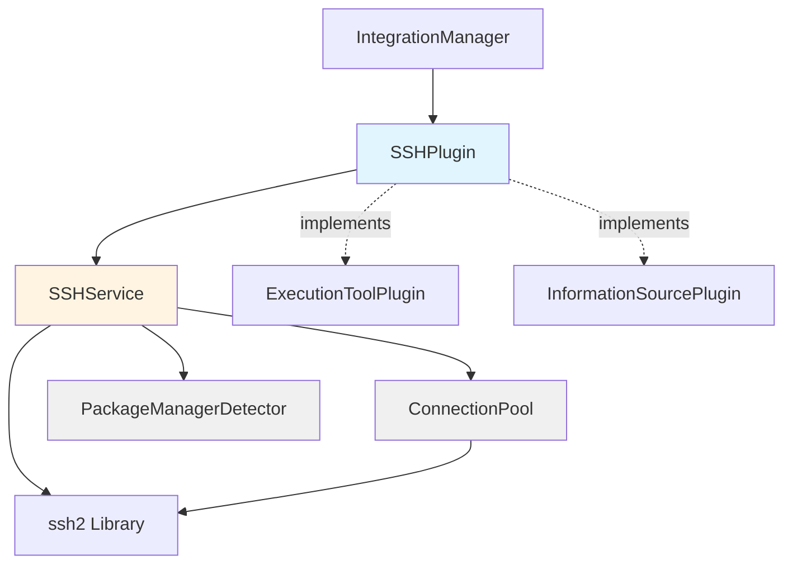

# Design Document: SSH Integration

## Overview

The SSH integration adds native remote execution capabilities to Pabawi through a plugin that implements both ExecutionToolPlugin and InformationSourcePlugin interfaces. This design enables Pabawi to execute commands, manage packages, and maintain inventory on remote hosts via SSH without requiring external automation tools like Ansible or Bolt.

The SSH plugin follows Pabawi's established plugin architecture pattern, integrating with the IntegrationManager for unified access to execution and inventory capabilities. It provides connection pooling for performance, supports multiple authentication methods, and handles concurrent execution across multiple hosts.

### Key Design Goals

- Seamless integration with existing plugin architecture
- Efficient connection management through pooling
- Support for multiple Linux package managers
- Concurrent execution with configurable limits
- Comprehensive error handling and logging
- Security-first approach to authentication and key management

## Architecture

### Component Overview

The SSH integration consists of four primary components:



### Component Responsibilities

**SSHPlugin** (extends BasePlugin)

- Plugin lifecycle management (initialization, health checks)
- Interface implementation for ExecutionToolPlugin and InformationSourcePlugin
- Configuration validation and environment variable processing
- Inventory file loading and watching
- Routing requests to SSHService

**SSHService**

- SSH connection establishment and authentication
- Command execution orchestration
- Package management operations
- Privilege escalation handling
- Result formatting and error handling

**ConnectionPool**

- SSH connection lifecycle management
- Connection reuse and pooling
- Idle connection cleanup
- Connection health monitoring
- Concurrency limiting

**PackageManagerDetector**

- Package manager detection on target hosts
- Command generation for different package managers
- Support for apt, yum, dnf, zypper, pacman

### Integration with Pabawi Architecture

The SSH plugin integrates with Pabawi's existing architecture at multiple points:

1. **IntegrationManager**: Registers as both execution tool and information source
2. **ExecutionRepository**: Stores execution history for SSH commands
3. **LoggerService**: Centralized logging with structured context
4. **PerformanceMonitorService**: Execution timing and metrics
5. **ConfigService**: Environment variable configuration

## Components and Interfaces

### SSHPlugin Class

```typescript
export class SSHPlugin extends BasePlugin implements ExecutionToolPlugin, InformationSourcePlugin {
  private sshService: SSHService;
  private inventoryPath?: string;
  private inventory: Node[] = [];
  private inventoryWatcher?: FSWatcher;
  
  constructor(
    sshService: SSHService,
    logger?: LoggerService,
    performanceMonitor?: PerformanceMonitorService
  );
  
  // BasePlugin implementation
  protected async performInitialization(): Promise<void>;
  protected async performHealthCheck(): Promise<Omit<HealthStatus, "lastCheck">>;
  
  // ExecutionToolPlugin implementation
  async executeAction(action: Action): Promise<ExecutionResult>;
  listCapabilities(): Capability[];
  
  // InformationSourcePlugin implementation
  async getInventory(): Promise<Node[]>;
  async getNodeFacts(nodeId: string): Promise<Facts>;
  async getNodeData(nodeId: string, dataType: string): Promise<unknown>;
  
  // Internal methods
  private loadInventory(): Promise<void>;
  private watchInventory(): void;
  private parseInventoryFile(content: string, format: 'yaml' | 'json'): Node[];
}
```

### SSHService Class

```typescript
export class SSHService {
  private connectionPool: ConnectionPool;
  private packageDetector: PackageManagerDetector;
  private config: SSHConfig;
  private logger: LoggerService;
  
  constructor(config: SSHConfig, logger: LoggerService);
  
  // Connection management
  async connect(host: SSHHost): Promise<SSHConnection>;
  async disconnect(host: SSHHost): Promise<void>;
  async testConnection(host: SSHHost): Promise<boolean>;
  
  // Command execution
  async executeCommand(
    host: SSHHost,
    command: string,
    options?: ExecutionOptions
  ): Promise<CommandResult>;
  
  async executeOnMultipleHosts(
    hosts: SSHHost[],
    command: string,
    options?: ExecutionOptions
  ): Promise<Map<string, CommandResult>>;
  
  // Package management
  async installPackage(host: SSHHost, packageName: string): Promise<CommandResult>;
  async removePackage(host: SSHHost, packageName: string): Promise<CommandResult>;
  async updatePackage(host: SSHHost, packageName: string): Promise<CommandResult>;
  
  // Privilege escalation
  private wrapWithSudo(command: string, options: SudoOptions): string;
}
```

### ConnectionPool Class

```typescript
export class ConnectionPool {
  private connections: Map<string, PooledConnection>;
  private config: PoolConfig;
  private logger: LoggerService;
  private cleanupInterval?: NodeJS.Timeout;
  
  constructor(config: PoolConfig, logger: LoggerService);
  
  async acquire(host: SSHHost): Promise<Client>;
  async release(hostKey: string): Promise<void>;
  async remove(hostKey: string): Promise<void>;
  async closeAll(): Promise<void>;
  
  private startCleanup(): void;
  private stopCleanup(): void;
  private cleanupIdleConnections(): Promise<void>;
  private getHostKey(host: SSHHost): string;
}
```

### PackageManagerDetector Class

```typescript
export class PackageManagerDetector {
  private cache: Map<string, PackageManager>;
  
  async detect(connection: Client): Promise<PackageManager>;
  
  getInstallCommand(pm: PackageManager, packageName: string): string;
  getRemoveCommand(pm: PackageManager, packageName: string): string;
  getUpdateCommand(pm: PackageManager, packageName: string): string;
  
  private detectApt(connection: Client): Promise<boolean>;
  private detectYum(connection: Client): Promise<boolean>;
  private detectDnf(connection: Client): Promise<boolean>;
  private detectZypper(connection: Client): Promise<boolean>;
  private detectPacman(connection: Client): Promise<boolean>;
}
```

## Data Models

### Configuration Types

```typescript
interface SSHConfig {
  enabled: boolean;
  inventoryPath?: string;
  defaultUser: string;
  defaultPort: number;
  defaultKeyPath?: string;
  hostKeyCheck: boolean;
  connectionTimeout: number;
  commandTimeout: number;
  maxConnections: number;
  maxConnectionsPerHost: number;
  idleTimeout: number;
  concurrencyLimit: number;
  sudo: {
    enabled: boolean;
    command: string;
    passwordless: boolean;
    password?: string;
    runAsUser?: string;
  };
}

interface SSHHost {
  name: string;
  uri: string;
  alias?: string;
  user?: string;
  port?: number;
  privateKeyPath?: string;
  password?: string;
  groups?: string[];
}

interface ExecutionOptions {
  timeout?: number;
  sudo?: boolean;
  sudoUser?: string;
  env?: Record<string, string>;
  cwd?: string;
}

interface CommandResult {
  stdout: string;
  stderr: string;
  exitCode: number;
  duration: number;
  host: string;
  command: string;
  timestamp: string;
}

interface PooledConnection {
  client: Client;
  host: SSHHost;
  lastUsed: number;
  inUse: boolean;
}

interface PoolConfig {
  maxConnections: number;
  maxConnectionsPerHost: number;
  idleTimeout: number;
  cleanupInterval: number;
}

type PackageManager = 'apt' | 'yum' | 'dnf' | 'zypper' | 'pacman' | 'unknown';
```

### SSH Config File Format

The SSH integration uses the standard OpenSSH client configuration file format (`~/.ssh/config` syntax). This provides compatibility with existing SSH configurations and follows familiar conventions.

Example SSH config file:

```
# Web servers
Host web-server-01 web01
    HostName 192.168.1.10
    User deploy
    Port 22
    IdentityFile /path/to/key
    # Custom metadata for Pabawi
    # Groups: webservers,production

Host db-server-01 db01
    HostName 192.168.1.20
    User dbadmin
    Port 2222
    IdentityFile /path/to/db_key
    # Groups: databases,production

# Wildcard for all production servers
Host *.prod
    User deploy
    StrictHostKeyChecking yes
    
# Default settings
Host *
    ServerAliveInterval 60
    ServerAliveCountMax 3
```

Supported SSH config keywords:

- `Host` - Host pattern/alias (first value used as node name)
- `HostName` - Target hostname or IP address
- `User` - SSH username
- `Port` - SSH port (default: 22)
- `IdentityFile` - Path to private key file
- `# Groups:` - Custom comment-based metadata for group assignment

## Correctness Properties

*A property is a characteristic or behavior that should hold true across all valid executions of a system—essentially, a formal statement about what the system should do. Properties serve as the bridge between human-readable specifications and machine-verifiable correctness guarantees.*

### Property 1: SSH Config File Round Trip

*For any* valid SSH config data structure, serializing to SSH config format and then parsing should produce an equivalent data structure with all host properties preserved.

**Validates: Requirements 2.2, 2.3, 2.5**

### Property 2: Configuration Parsing Completeness

*For any* valid set of SSH environment variables, the parsed configuration should contain all specified values with correct types and defaults applied for missing optional values.

**Validates: Requirements 10.1, 10.2, 10.3, 10.4, 10.5, 10.6, 10.7, 10.8, 10.9, 10.10**

### Property 3: Configuration Validation Failure

*For any* configuration missing required values, initialization should fail and set initialized to false.

**Validates: Requirements 10.11**

### Property 4: Priority-Based Deduplication

*For any* set of nodes with duplicate IDs from sources with different priorities, the deduplicated result should contain only the node from the highest priority source for each ID.

**Validates: Requirements 1.4**

### Property 5: SSH Config File Error Recovery

*For any* SSH config file with syntax errors, the plugin should continue operating with the last valid configuration and log the error without crashing.

**Validates: Requirements 2.7**

### Property 6: Connection Reuse

*For any* sequence of commands to the same host, all commands should use the same connection instance until the connection is explicitly closed or becomes invalid.

**Validates: Requirements 4.2**

### Property 7: Connection Pool Size Limit

*For any* connection pool with maximum size N, attempting to create connection N+1 should trigger eviction of the least recently used connection.

**Validates: Requirements 4.5, 4.6**

### Property 8: Connection Pool Error Handling

*For any* connection that fails during use, the connection should be removed from the pool and subsequent requests should create a new connection.

**Validates: Requirements 4.7**

### Property 9: Timeout Configuration Bounds

*For any* timeout configuration value, the system should accept values within the specified range (connection: 5-300s, command: 10-3600s) and reject values outside the range.

**Validates: Requirements 3.6, 5.5**

### Property 10: Timeout Enforcement

*For any* command that exceeds the configured timeout, the system should terminate the command and return a timeout error result.

**Validates: Requirements 5.6**

### Property 11: Execution Result Completeness

*For any* completed command execution, the result should contain all required fields: stdout, stderr, exit_code, duration, host, command, timestamp, and tool name "ssh".

**Validates: Requirements 5.8, 5.9, 14.2, 14.3**

### Property 12: Sudo Command Wrapping

*For any* command executed with sudo enabled, the generated command should be prefixed with the configured sudo command and include the run-as user flag if specified.

**Validates: Requirements 6.1, 6.2, 6.5**

### Property 13: Package Manager Command Generation

*For any* package manager type and operation (install/remove/update), the generated command should match the expected format for that package manager.

**Validates: Requirements 7.2, 7.9**

### Property 14: Unsupported Package Manager Error

*For any* host where no package manager is detected, package operations should return an error indicating the system is unsupported.

**Validates: Requirements 7.10**

### Property 15: Inventory Source Attribution

*For any* node returned from getInventory(), the node should have a source property set to "ssh" and contain all required properties: name, uri, alias, groups, connection_parameters.

**Validates: Requirements 8.2, 8.3, 8.5**

### Property 16: Health Status Determination

*For any* health check result, the status should be "healthy" when all tested connections succeed, "degraded" when some fail, and "unhealthy" when none succeed.

**Validates: Requirements 9.3, 9.4, 9.5**

### Property 17: Health Check Caching

*For any* health check result, subsequent health check requests within the TTL period should return the cached result without re-executing connection tests.

**Validates: Requirements 9.7**

### Property 18: Concurrent Execution Limit

*For any* set of N commands where N exceeds the concurrency limit, at most concurrency_limit commands should execute simultaneously, with remaining commands queued.

**Validates: Requirements 12.2, 12.3**

### Property 19: Parallel Execution Independence

*For any* set of commands to multiple hosts, each command should return an individual result, and failure of one command should not prevent execution of others.

**Validates: Requirements 12.4, 12.5**

### Property 20: Sensitive Data Obfuscation

*For any* log output containing passwords or private keys, the sensitive values should be replaced with placeholder text like "[REDACTED]" or "[PRIVATE_KEY]".

**Validates: Requirements 11.7, 13.7**

### Property 21: Private Key Permission Validation

*For any* private key file with permissions more permissive than 0600, the system should detect the insecure permissions and log a warning.

**Validates: Requirements 13.3**

### Property 22: Execution Result Re-execution

*For any* execution result stored in history, calling executeAction() with the result's action parameters should produce a new execution with the same command and target.

**Validates: Requirements 14.4, 14.5**

## Error Handling

### Error Categories

The SSH integration handles errors across multiple categories:

**Connection Errors**

- Network unreachable
- Connection timeout
- Connection refused
- Host key verification failure
- Authentication failure

**Execution Errors**

- Command timeout
- Non-zero exit codes
- Permission denied
- Command not found

**Configuration Errors**

- Missing required configuration
- Invalid inventory file format
- Invalid timeout values
- Missing private key files

**Resource Errors**

- Connection pool exhausted
- Too many open connections
- File system errors

### Error Handling Strategy

1. **Graceful Degradation**: When some hosts fail, continue executing on remaining hosts
2. **Detailed Error Messages**: Include host, command, and error details in all error results
3. **Connection Recovery**: Automatically remove failed connections from pool and retry
4. **Configuration Validation**: Fail fast during initialization if configuration is invalid
5. **Logging**: Log all errors with appropriate context for troubleshooting

### Error Result Format

All errors return ExecutionResult objects with:

- `success: false`
- `exitCode: -1` (for connection/timeout errors)
- `stderr`: Error message with details
- `error`: Structured error object with type and details

Example error result:

```typescript
{
  success: false,
  exitCode: -1,
  stdout: "",
  stderr: "Connection timeout after 30 seconds",
  duration: 30000,
  host: "web-server-01",
  command: "uptime",
  timestamp: "2024-01-15T10:30:00Z",
  tool: "ssh",
  error: {
    type: "CONNECTION_TIMEOUT",
    message: "Connection timeout after 30 seconds",
    host: "web-server-01",
    timeout: 30
  }
}
```

## Testing Strategy

### Dual Testing Approach

The SSH integration requires both unit tests and property-based tests for comprehensive coverage:

**Unit Tests** focus on:

- Specific examples of package manager command generation (apt, yum, dnf, zypper, pacman)
- Plugin registration in IntegrationManager
- Error message formatting
- Configuration validation edge cases
- Inventory file parsing examples

**Property-Based Tests** focus on:

- Configuration parsing across all valid input combinations
- Inventory file round-trip (serialize → parse → verify equivalence)
- Connection pool behavior under various load patterns
- Concurrent execution with different concurrency limits
- Timeout enforcement across random timeout values
- Result format validation across all execution types
- Sensitive data obfuscation in logs

### Property-Based Testing Configuration

The project uses **fast-check** library for property-based testing in TypeScript. Each property test should:

- Run minimum 100 iterations to ensure comprehensive input coverage
- Include a comment tag referencing the design property
- Use appropriate generators for SSH-specific data types

Example property test structure:

```typescript
import fc from 'fast-check';

// Feature: ssh-integration, Property 1: Inventory File Round Trip
test('inventory file round trip preserves data', () => {
  fc.assert(
    fc.property(
      inventoryDataGenerator(),
      (inventoryData) => {
        const yaml = serializeToYAML(inventoryData);
        const parsed = parseYAML(yaml);
        expect(parsed).toEqual(inventoryData);
      }
    ),
    { numRuns: 100 }
  );
});
```

### Custom Generators

The test suite will include custom generators for:

- SSH host configurations with valid/invalid combinations
- Inventory file structures with various group hierarchies
- Command strings with special characters
- Timeout values within and outside valid ranges
- Connection pool states with various occupancy levels

### Integration Testing

While property-based tests validate logic, integration tests verify actual SSH functionality:

- Real SSH connections to test containers
- Package manager detection on different Linux distributions
- Sudo execution with actual privilege escalation
- Connection pooling with real network connections
- File watching for inventory reloads

Integration tests should use Docker containers with SSH servers to provide isolated, reproducible test environments.

### Test Organization

```
backend/src/integrations/ssh/
├── __tests__/
│   ├── SSHPlugin.test.ts          # Unit tests
│   ├── SSHPlugin.property.test.ts # Property-based tests
│   ├── SSHService.test.ts
│   ├── SSHService.property.test.ts
│   ├── ConnectionPool.test.ts
│   ├── ConnectionPool.property.test.ts
│   ├── PackageManagerDetector.test.ts
│   └── integration/
│       ├── ssh-execution.integration.test.ts
│       └── inventory-loading.integration.test.ts
├── SSHPlugin.ts
├── SSHService.ts
├── ConnectionPool.ts
├── PackageManagerDetector.ts
└── types.ts
```

### Test Coverage Goals

- Unit test coverage: >80% for all components
- Property test coverage: All 22 correctness properties implemented
- Integration test coverage: All SSH operations (connect, execute, package management)
- Error path coverage: All error categories tested

## Implementation Notes

### SSH Library Selection

The implementation will use **ssh2** library for Node.js, which provides:

- Pure JavaScript implementation (no native dependencies)
- Support for all required authentication methods
- Connection pooling capabilities
- Stream-based command execution
- Active maintenance and community support

Installation:

```bash
npm install ssh2 @types/ssh2
```

### Inventory File Watching

Use Node.js `fs.watch()` with debouncing to detect SSH config file changes:

- Debounce period: 1 second to avoid multiple reloads
- Reload on file modification events
- Maintain last valid configuration on parse errors
- Log reload events for troubleshooting

### Connection Pool Implementation

The connection pool uses a Map-based structure with:

- Host key format: `${user}@${host}:${port}`
- LRU eviction using lastUsed timestamps
- Periodic cleanup interval: 60 seconds
- Connection health checks before reuse

### Package Manager Detection

Detection order (first match wins):

1. Check for `apt-get` (Debian/Ubuntu)
2. Check for `dnf` (Fedora 22+)
3. Check for `yum` (RHEL/CentOS)
4. Check for `zypper` (SUSE/openSUSE)
5. Check for `pacman` (Arch Linux)

Cache detection results per host to avoid repeated checks.

### Security Considerations

1. **Private Key Permissions**: Warn if key files have permissions more permissive than 0600
2. **Password Storage**: Never log passwords; store encrypted in memory if needed
3. **Host Key Verification**: Enable by default; allow disabling only via explicit configuration
4. **Sudo Password**: Support environment variable or secure prompt; never log
5. **Command Injection**: Validate and sanitize all command inputs
6. **Connection Limits**: Enforce limits to prevent resource exhaustion

### Performance Optimization

1. **Connection Pooling**: Reuse connections to reduce handshake overhead
2. **Parallel Execution**: Execute commands on multiple hosts concurrently
3. **Lazy Loading**: Load inventory only when needed
4. **Caching**: Cache package manager detection and health check results
5. **Streaming**: Stream command output for long-running commands

### Logging Strategy

Use structured logging with LoggerService:

- **Info**: Plugin initialization, inventory loads, successful executions
- **Warn**: Connection issues, retry attempts, permission warnings
- **Error**: Connection failures, command failures, configuration errors
- **Debug**: Connection pool operations, command details, timing information

All logs include context:

```typescript
logger.info("SSH command executed", {
  component: "SSHService",
  operation: "executeCommand",
  metadata: {
    host: "web-server-01",
    command: "uptime",
    duration: 234,
    exitCode: 0
  }
});
```

### Environment Variables

Complete list of supported environment variables:

```bash
# Core configuration
SSH_ENABLED=true
SSH_CONFIG_PATH=/path/to/ssh_config
SSH_DEFAULT_USER=deploy
SSH_DEFAULT_PORT=22
SSH_DEFAULT_KEY=/path/to/key

# Connection settings
SSH_HOST_KEY_CHECK=true
SSH_CONNECTION_TIMEOUT=30
SSH_COMMAND_TIMEOUT=300
SSH_MAX_CONNECTIONS=50
SSH_MAX_CONNECTIONS_PER_HOST=5
SSH_IDLE_TIMEOUT=300
SSH_CONCURRENCY_LIMIT=10

# Sudo configuration
SSH_SUDO_ENABLED=false
SSH_SUDO_COMMAND=sudo
SSH_SUDO_PASSWORDLESS=true
SSH_SUDO_PASSWORD=
SSH_SUDO_USER=root

# Plugin priority
SSH_PRIORITY=50
```

### Migration Path

For existing Pabawi deployments:

1. SSH plugin is disabled by default (SSH_ENABLED=false)
2. No breaking changes to existing integrations
3. Inventory format compatible with Ansible inventory structure
4. Can coexist with Ansible and Bolt plugins
5. Gradual migration: test with subset of hosts first
