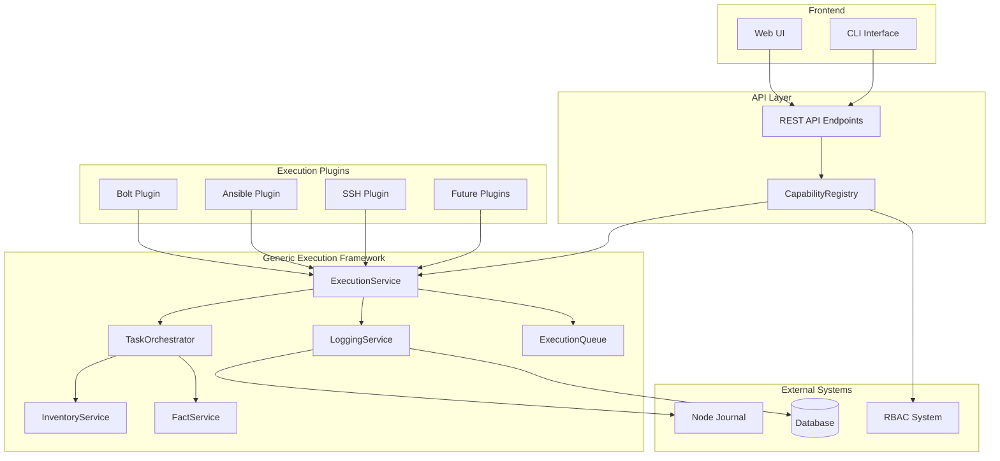
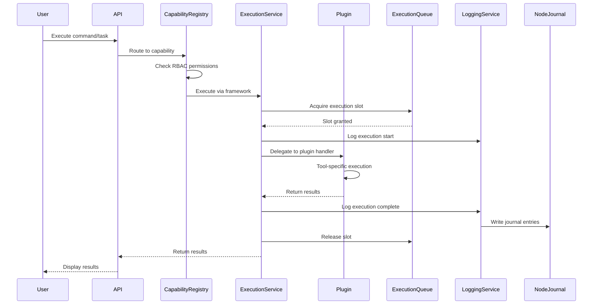

# Design Document: Generic Execution Framework

## Overview

The Generic Execution Framework provides a standardized, reusable infrastructure layer for execution plugins (Bolt, Ansible, SSH, etc.) to eliminate code duplication and ensure consistent behavior across all execution tools. The framework acts as a shared backend service that plugins interface with, providing common functionality for command execution, task orchestration, inventory management, fact collection, logging, and reporting.

### Design Philosophy

- **Separation of Concerns**: Framework handles common infrastructure; plugins handle tool-specific logic
- **Plugin-Agnostic**: Framework interfaces work with any execution tool
- **Type-Safe**: Full TypeScript typing with runtime validation via Zod schemas
- **Integration-First**: Seamless integration with existing Pabawi systems (CapabilityRegistry, ExecutionQueue, RBAC)
- **Future-Ready**: Designed to integrate with Node Journal and Events system when implemented

### Key Benefits

- **Reduced Code Duplication**: Common execution logic written once, used by all plugins
- **Consistent Behavior**: All execution plugins behave the same way for logging, error handling, progress tracking
- **Easier Plugin Development**: Plugin developers focus on tool-specific logic, not infrastructure
- **Unified CLI/API**: Consistent interfaces across all execution tools
- **Comprehensive Observability**: Standardized logging, metrics, and audit trails

## Architecture

### High-Level Architecture



### Component Interaction Flow



## Components and Interfaces

### 1. ExecutionService

The core service that coordinates all execution operations.

**Responsibilities:**

- Command execution lifecycle management
- Integration with ExecutionQueue for concurrency control
- Streaming output handling
- Timeout management
- Error handling and retry logic
- Debug mode support

**Interface:**

```typescript
interface ExecutionOptions {
  targets: string[];
  timeout?: number;
  environment?: Record<string, string>;
  async?: boolean;
  debugMode?: boolean;
  retryCount?: number;
  retryBackoff?: 'linear' | 'exponential';
}

interface ExecutionResult {
  id: string;
  status: 'running' | 'success' | 'failed' | 'partial' | 'timeout';
  startedAt: string;
  completedAt?: string;
  results: NodeResult[];
  error?: string;
  debugInfo?: {
    stdout?: string;
    stderr?: string;
    fullOutput?: string;
  };
}

interface NodeResult {
  nodeId: string;
  status: 'success' | 'failed' | 'timeout';
  output?: {
    stdout?: string;
    stderr?: string;
    exitCode?: number;
  };
  error?: string;
  duration: number;
}

class ExecutionService {
  async executeCommand(
    command: string,
    options: ExecutionOptions,
    context: ExecutionContext
  ): Promise<ExecutionResult>;
  
  async getExecutionStatus(executionId: string): Promise<ExecutionResult>;
  
  async cancelExecution(executionId: string): Promise<boolean>;
  
  async streamOutput(
    executionId: string,
    callback: (chunk: OutputChunk) => void
  ): Promise<void>;
}
```

### 2. TaskOrchestrator

Manages task lifecycle, dependencies, and execution ordering.

**Responsibilities:**

- Task state management (queued → running → completed/failed)
- Dependency resolution and ordering
- Parallel vs sequential execution
- Progress tracking
- Task cancellation

**Interface:**

```typescript
interface TaskDefinition {
  id: string;
  name: string;
  type: 'command' | 'task' | 'playbook' | 'script';
  targets: string[];
  parameters: Record<string, unknown>;
  dependencies?: string[];
  executionMode: 'parallel' | 'sequential';
  timeout?: number;
}

interface TaskState {
  id: string;
  status: 'queued' | 'running' | 'completed' | 'failed' | 'cancelled';
  progress: {
    total: number;
    completed: number;
    failed: number;
  };
  startedAt?: string;
  completedAt?: string;
  error?: string;
}

class TaskOrchestrator {
  async submitTask(
    task: TaskDefinition,
    context: ExecutionContext
  ): Promise<string>;
  
  async getTaskState(taskId: string): Promise<TaskState>;
  
  async cancelTask(taskId: string): Promise<boolean>;
  
  async waitForDependencies(taskId: string): Promise<void>;
  
  subscribeToProgress(
    taskId: string,
    callback: (progress: TaskState) => void
  ): () => void;
}
```

### 3. InventoryService

Provides unified inventory access across multiple sources.

**Responsibilities:**

- Inventory source registration
- Multi-source inventory aggregation
- Node deduplication and merging
- Inventory caching with TTL
- Dynamic inventory refresh
- Group management

**Interface:**

```typescript
interface InventorySource {
  name: string;
  priority: number;
  listNodes(): Promise<Node[]>;
  getNode(nodeId: string): Promise<Node | null>;
  getGroups(): Promise<string[]>;
  getNodesByGroup(group: string): Promise<Node[]>;
  refresh(): Promise<void>;
}

interface InventoryCache {
  nodes: Map<string, Node>;
  groups: Map<string, string[]>;
  lastRefresh: string;
  ttl: number;
}

class InventoryService {
  registerSource(source: InventorySource): void;
  
  async listNodes(options?: {
    refresh?: boolean;
    groups?: string[];
  }): Promise<Node[]>;
  
  async getNode(nodeId: string): Promise<Node | null>;
  
  async getGroups(): Promise<string[]>;
  
  async getNodesByGroup(group: string): Promise<Node[]>;
  
  async refreshInventory(): Promise<void>;
  
  clearCache(): void;
}
```

### 4. FactService

Manages fact collection, caching, and aggregation.

**Responsibilities:**

- Fact provider registration
- Multi-provider fact aggregation
- Fact caching with expiration
- Priority-based fact merging
- Force refresh support

**Interface:**

```typescript
interface FactProvider {
  name: string;
  priority: number;
  collectFacts(nodeId: string): Promise<Facts>;
  getSupportedFactKeys(): string[];
}

interface FactCache {
  facts: Map<string, Facts>;
  expiresAt: Map<string, string>;
  ttl: number;
}

class FactService {
  registerProvider(provider: FactProvider): void;
  
  async getFacts(
    nodeId: string,
    options?: {
      refresh?: boolean;
      providers?: string[];
    }
  ): Promise<Facts>;
  
  async getFactKey(
    nodeId: string,
    key: string
  ): Promise<unknown>;
  
  async refreshFacts(nodeId: string): Promise<Facts>;
  
  clearCache(nodeId?: string): void;
}
```

### 5. LoggingService

Provides structured logging, execution history, and audit trails.

**Responsibilities:**

- Structured execution logging
- Execution history storage
- Performance metrics collection
- Node Journal integration
- Query interface for history

**Interface:**

```typescript
interface ExecutionLog {
  id: string;
  type: 'command' | 'task' | 'facts' | 'package' | 'provisioning';
  user: string;
  targets: string[];
  action: string;
  parameters?: Record<string, unknown>;
  status: 'running' | 'success' | 'failed' | 'partial';
  startedAt: string;
  completedAt?: string;
  duration?: number;
  results: NodeResult[];
  error?: string;
  debugInfo?: Record<string, unknown>;
}

interface ExecutionMetrics {
  totalExecutions: number;
  successRate: number;
  averageDuration: number;
  targetCount: number;
  errorRate: number;
}

interface JournalEntry {
  nodeId: string;
  entryType: 'execution' | 'package' | 'provisioning' | 'event' | 'manual';
  timestamp: string;
  user?: string;
  action: string;
  details: Record<string, unknown>;
  executionId?: string;
  status?: 'success' | 'failed';
}

class LoggingService {
  async logExecutionStart(
    execution: Partial<ExecutionLog>
  ): Promise<string>;
  
  async logExecutionComplete(
    executionId: string,
    result: ExecutionResult
  ): Promise<void>;
  
  async logExecutionError(
    executionId: string,
    error: Error
  ): Promise<void>;
  
  async getExecutionHistory(options?: {
    timeRange?: { start: string; end: string };
    user?: string;
    target?: string;
    status?: string;
    limit?: number;
  }): Promise<ExecutionLog[]>;
  
  async getExecutionMetrics(
    timeRange?: { start: string; end: string }
  ): Promise<ExecutionMetrics>;
  
  async writeJournalEntry(entry: JournalEntry): Promise<void>;
  
  async getNodeJournal(
    nodeId: string,
    options?: {
      entryTypes?: string[];
      limit?: number;
    }
  ): Promise<JournalEntry[]>;
}
```

### 6. PluginInterface

Interface that execution plugins must implement.

**Responsibilities:**

- Tool-specific execution logic
- Capability registration
- Configuration validation
- Health checks

**Interface:**

```typescript
interface ExecutionPluginInterface extends BasePluginInterface {
  // Execution capabilities
  executeCommand?(
    command: string,
    targets: string[],
    options: ExecutionOptions
  ): Promise<ExecutionResult>;
  
  executeTask?(
    taskName: string,
    targets: string[],
    parameters: Record<string, unknown>,
    options: ExecutionOptions
  ): Promise<ExecutionResult>;
  
  // Inventory capabilities
  listInventory?(): Promise<Node[]>;
  
  getNodeInfo?(nodeId: string): Promise<Node>;
  
  // Fact capabilities
  collectFacts?(nodeId: string): Promise<Facts>;
  
  // Plugin lifecycle
  initialize(): Promise<void>;
  
  healthCheck(): Promise<HealthStatus>;
  
  shutdown?(): Promise<void>;
}
```

### 7. CLI Interface Generator

Generates consistent CLI commands from capability schemas.

**Responsibilities:**

- CLI command generation from schemas
- Argument parsing and validation
- Help documentation generation
- Common interface patterns

**Interface:**

```typescript
interface CLICommand {
  name: string;
  description: string;
  arguments: CLIArgument[];
  examples: string[];
  handler: (args: Record<string, unknown>) => Promise<void>;
}

interface CLIArgument {
  name: string;
  type: 'string' | 'number' | 'boolean' | 'array';
  description: string;
  required: boolean;
  default?: unknown;
  choices?: unknown[];
}

class CLIGenerator {
  generateInventoryCommands(plugin: string): CLICommand[];
  
  generateExecutionCommands(plugin: string): CLICommand[];
  
  generateInfoCommands(plugin: string): CLICommand[];
  
  generateEventCommands(plugin: string): CLICommand[];
  
  generateHelp(command: CLICommand): string;
  
  validateArguments(
    command: CLICommand,
    args: Record<string, unknown>
  ): ValidationResult;
}
```

## Data Models

### Core Data Types

```typescript
// Node representation
interface Node {
  id: string;
  name: string;
  uri?: string;
  transport?: string;
  config?: Record<string, unknown>;
  source?: string;
  groups?: string[];
  metadata?: Record<string, unknown>;
  certificateStatus?: 'signed' | 'requested' | 'revoked';
}

// Facts representation
type Facts = Record<string, unknown>;

// Execution context
interface ExecutionContext {
  user: {
    id: string;
    username: string;
    roles: string[];
  };
  correlationId?: string;
  widgetId?: string;
  metadata?: Record<string, unknown>;
}

// Output chunk for streaming
interface OutputChunk {
  nodeId: string;
  stream: 'stdout' | 'stderr';
  data: string;
  timestamp: string;
}

// Validation result
interface ValidationResult {
  valid: boolean;
  errors?: Array<{
    field: string;
    message: string;
  }>;
}
```

### Configuration Schemas

```typescript
// Framework configuration
interface ExecutionFrameworkConfig {
  execution: {
    defaultTimeout: number;
    maxConcurrency: number;
    retryCount: number;
    retryBackoff: 'linear' | 'exponential';
  };
  inventory: {
    cacheTTL: number;
    refreshInterval: number;
  };
  facts: {
    cacheTTL: number;
    defaultProviders: string[];
  };
  logging: {
    retentionDays: number;
    debugMode: boolean;
    journalEnabled: boolean;
  };
}

// Plugin configuration
interface PluginConfig {
  enabled: boolean;
  priority: number;
  timeout?: number;
  retryCount?: number;
  customSettings?: Record<string, unknown>;
}
```

## Correctness Properties

*A property is a characteristic or behavior that should hold true across all valid executions of a system—essentially, a formal statement about what the system should do. Properties serve as the bridge between human-readable specifications and machine-verifiable correctness guarantees.*

### Execution Properties

**Property 1: Command execution interface acceptance**
*For any* valid command text, target node list, and execution options, the execution interface should accept them without validation errors
**Validates: Requirements 1.1**

**Property 2: Execution mode support**
*For any* command execution, both synchronous and asynchronous execution modes should be supported and function correctly
**Validates: Requirements 1.2**

**Property 3: Async execution returns ID immediately**
*For any* asynchronous command execution, an execution ID should be returned immediately without waiting for completion
**Validates: Requirements 1.3**

**Property 4: Output stream separation**
*For any* command execution that produces output, stdout and stderr should be captured in separate streams
**Validates: Requirements 1.4**

**Property 5: Exit code capture**
*For any* completed command execution, each target node result should include an exit code
**Validates: Requirements 1.5**

**Property 6: Timeout termination**
*For any* command execution that exceeds its timeout, the execution should be terminated with timeout status
**Validates: Requirements 1.6**

**Property 7: Environment variable support**
*For any* command execution with environment variables specified, those variables should be available during execution
**Validates: Requirements 1.7**

**Property 8: Error information capture**
*For any* failed command execution, the result should include detailed error information with the failure reason
**Validates: Requirements 1.8**

### Task Orchestration Properties

**Property 9: Task definition acceptance**
*For any* valid task definition with name, parameters, targets, and execution options, the task orchestrator should accept it without validation errors
**Validates: Requirements 2.1**

**Property 10: Task state machine**
*For any* task, the state transitions should follow the valid sequence: queued → running → (completed | failed | cancelled), with initial state always being queued
**Validates: Requirements 2.2, 2.3, 2.4, 2.5**

**Property 11: Progress tracking accuracy**
*For any* task execution, the progress (completed/total) should accurately reflect the number of processed targets
**Validates: Requirements 2.6**

**Property 12: Dependency ordering**
*For any* task with dependencies, execution should not start until all prerequisite tasks have completed
**Validates: Requirements 2.7, 2.10**

**Property 13: Parallel execution concurrency**
*For any* task in parallel execution mode, multiple targets should be processed concurrently (not sequentially)
**Validates: Requirements 2.8**

**Property 14: Sequential execution ordering**
*For any* task in sequential execution mode, targets should be processed one at a time in order
**Validates: Requirements 2.9**

### Inventory Properties

**Property 15: Inventory interface returns nodes**
*For any* inventory query, the interface should return a list of available nodes
**Validates: Requirements 3.1**

**Property 16: Node grouping support**
*For any* node, it should be assignable to arbitrary group names and queryable by those groups
**Validates: Requirements 3.2**

**Property 17: Group filtering correctness**
*For any* inventory query filtered by group, all returned nodes should be members of that group
**Validates: Requirements 3.3**

**Property 18: Dynamic inventory refresh**
*For any* inventory source, it should support on-demand refresh that updates the cached inventory data
**Validates: Requirements 3.4**

**Property 19: Inventory cache behavior**
*For any* cached inventory data, repeated queries within the TTL should return cached data without querying sources, and expired cache should trigger automatic refresh
**Validates: Requirements 3.5, 3.6**

**Property 20: Multi-source aggregation**
*For any* inventory query with multiple sources, results should include nodes from all sources
**Validates: Requirements 3.7**

**Property 21: Node deduplication with priority**
*For any* node present in multiple inventory sources, the final node data should come from the highest priority source
**Validates: Requirements 3.8**

**Property 22: Inventory metadata as facts**
*For any* node with inventory metadata, that metadata should be accessible as facts in the node detail view
**Validates: Requirements 3.9**

**Property 23: Inventory format mapping**
*For any* inventory plugin data, it should be correctly mapped to the common inventory API format
**Validates: Requirements 3.10**

### Fact Collection Properties

**Property 24: Fact collection interface**
*For any* valid node identifier, the fact collection interface should accept it and return node facts
**Validates: Requirements 4.1**

**Property 25: Fact provider registration**
*For any* custom fact provider, it should be registrable with the framework and participate in fact collection
**Validates: Requirements 4.5**

**Property 26: Fact cache behavior**
*For any* node facts, repeated queries within the cache TTL should return cached facts without querying providers, and expired cache should trigger provider queries
**Validates: Requirements 4.2, 4.3, 4.4**

**Property 27: Multi-provider fact aggregation**
*For any* node with multiple fact providers, facts should be aggregated from all registered providers
**Validates: Requirements 4.6**

**Property 28: Fact priority merging**
*For any* fact key returned by multiple providers, the value from the highest priority provider should be used
**Validates: Requirements 4.7**

**Property 29: Force refresh bypasses cache**
*For any* fact query with refresh flag set, facts should be retrieved from providers regardless of cache state
**Validates: Requirements 4.8**

### Logging and Reporting Properties

**Property 30: Execution logging completeness**
*For any* command or task execution, a structured log entry should be created with execution ID, user, targets, action, status, and timestamps
**Validates: Requirements 5.1, 5.2, 5.3**

**Property 31: Real-time progress updates**
*For any* execution in progress, real-time progress updates should be provided through callbacks or subscriptions
**Validates: Requirements 5.4**

**Property 32: Execution history persistence**
*For any* completed execution, it should be queryable from the execution history
**Validates: Requirements 5.5**

**Property 33: Error diagnostic logging**
*For any* failed execution, the log entry should include detailed error diagnostics including stack traces
**Validates: Requirements 5.6**

**Property 34: Performance metrics collection**
*For any* execution, performance metrics (duration, target count, success rate) should be collected and queryable
**Validates: Requirements 5.7**

**Property 35: History query filtering**
*For any* execution history query with filters (time range, user, target, status), only matching executions should be returned
**Validates: Requirements 5.8**

**Property 36: Debug mode output capture**
*For any* execution with debug mode enabled, complete stdout and stderr should be captured and returned
**Validates: Requirements 5.10**

**Property 37: Normal mode output summarization**
*For any* execution with debug mode disabled, output should be summarized to reduce data transfer
**Validates: Requirements 5.11**

**Property 38: Debug mode toggle**
*For any* execution request, debug mode should be configurable per execution independently
**Validates: Requirements 5.12**

### Plugin Integration Properties

**Property 39: Plugin configuration passing**
*For any* plugin initialization, plugin-specific configuration should be passed to the plugin correctly
**Validates: Requirements 6.2**

**Property 40: Capability registration**
*For any* plugin capability, it should be registrable with the CapabilityRegistry
**Validates: Requirements 6.3**

**Property 41: Plugin interface validation**
*For any* plugin attempting to register a capability, the framework should validate that required interface methods are implemented
**Validates: Requirements 6.4**

**Property 42: RBAC permission enforcement**
*For any* capability invocation, RBAC permissions should be checked before execution, and unauthorized users should be rejected
**Validates: Requirements 6.5, 6.6**

**Property 43: Plugin lifecycle hooks**
*For any* plugin, lifecycle hooks (initialization, health checks, shutdown) should be called at appropriate times
**Validates: Requirements 6.7**

**Property 44: Plugin priority ordering**
*For any* capability provided by multiple plugins, the highest priority plugin should be selected for execution
**Validates: Requirements 6.8**

### Error Handling Properties

**Property 45: Partial failure isolation**
*For any* multi-node execution where some nodes are unreachable, the unreachable nodes should be marked as failed and remaining nodes should continue processing
**Validates: Requirements 7.1**

**Property 46: Partial success status**
*For any* multi-node execution with some failures and some successes, the overall status should be "partial"
**Validates: Requirements 7.2**

**Property 47: Error message completeness**
*For any* execution error, the error message should include the node ID, error type, and failure reason
**Validates: Requirements 7.3**

**Property 48: Exception handling**
*For any* plugin exception during execution, the framework should catch the exception and return a structured error (not crash)
**Validates: Requirements 7.4**

**Property 49: Retry execution with logging**
*For any* failed execution with retry count > 0, the execution should be retried up to the configured count with the specified backoff strategy, and each retry attempt should be logged
**Validates: Requirements 7.5, 7.6**

**Property 50: Circuit breaker behavior**
*For any* component with repeated failures exceeding the threshold, the circuit breaker should open and reject new requests with circuit state logged
**Validates: Requirements 7.7, 7.8**

### Performance Properties

**Property 51: Concurrent execution support**
*For any* multi-node execution, multiple target nodes should be processed concurrently
**Validates: Requirements 8.1**

**Property 52: Concurrency limit enforcement**
*For any* execution, the number of concurrent operations should not exceed the configured concurrency limit
**Validates: Requirements 8.2**

**Property 53: Performance metrics availability**
*For any* time range, performance metrics (throughput, execution count, success rate) should be queryable for monitoring
**Validates: Requirements 8.7**

**Property 54: Execution cancellation**
*For any* in-progress execution, calling cancel should terminate the execution and update its status to cancelled
**Validates: Requirements 8.8**

### Validation Properties

**Property 55: Parameter validation**
*For any* execution request with invalid parameters (missing required, wrong type, or invalid value), a validation error should be returned before execution starts
**Validates: Requirements 9.3, 9.4, 9.5**

**Property 56: Validation error clarity**
*For any* validation error, the error message should clearly identify which parameter is invalid and why
**Validates: Requirements 9.6**

**Property 57: Plugin configuration validation**
*For any* plugin initialization with invalid configuration, the initialization should fail with a validation error
**Validates: Requirements 9.8**

### Integration Properties

**Property 58: ExecutionQueue integration**
*For any* asynchronous execution, the framework should acquire a slot from ExecutionQueue before starting and release it upon completion
**Validates: Requirements 10.1**

**Property 59: CapabilityRegistry integration**
*For any* plugin capability, it should be registered with CapabilityRegistry and routable via capability name
**Validates: Requirements 10.2**

**Property 60: Backward compatibility**
*For any* existing v1.x plugin, it should work with the framework without requiring code changes
**Validates: Requirements 10.4, 10.8**

### Node Journal Properties

**Property 61: Journal entry creation per node**
*For any* execution (command, task, package, provisioning, event), when Node Journal is implemented, a journal entry should be created for each affected node
**Validates: Requirements 11.1, 11.2, 11.3, 11.4, 11.5, 11.10**

**Property 62: Manual journal entry support**
*For any* manual journal entry created from the web interface, when Node Journal is implemented, it should be stored and queryable
**Validates: Requirements 11.6**

**Property 63: Journal entry completeness**
*For any* journal entry, it should include entry type, execution ID, timestamp, user, action, and result status
**Validates: Requirements 11.7**

**Property 64: Journal logging level configuration**
*For any* plugin, journal logging levels should be configurable independently
**Validates: Requirements 11.8**

**Property 65: Selective journaling**
*For any* plugin, it should be able to specify which execution types should be journaled
**Validates: Requirements 11.9**

**Property 66: Journal entry linking**
*For any* journal entry created from an execution, it should reference the original execution record for traceability
**Validates: Requirements 11.11**

**Property 67: Custom event interface**
*For any* plugin, it should be able to write custom events using the journal entry interface
**Validates: Requirements 11.12**

### CLI Properties

**Property 68: CLI interface consistency**
*For any* plugin implementing inventory, execution, info, or event capabilities, the generated CLI commands should follow the common interface patterns for that capability type
**Validates: Requirements 12.1, 12.2, 12.3, 12.4, 12.5, 12.6, 12.7**

**Property 69: CLI extensibility**
*For any* plugin-specific CLI extension, it should work while maintaining common interface patterns
**Validates: Requirements 12.8**

**Property 70: CLI help generation**
*For any* capability with a schema, CLI help documentation should be automatically generated from the schema
**Validates: Requirements 12.9**

**Property 71: CLI argument validation**
*For any* CLI command invocation, arguments should be validated against the capability schema before execution
**Validates: Requirements 12.10**

## Error Handling

### Error Categories

The framework defines the following error categories:

1. **ValidationError**: Invalid input parameters or configuration
2. **AuthorizationError**: RBAC permission denied
3. **TimeoutError**: Execution exceeded timeout
4. **ConnectionError**: Unable to reach target node
5. **ExecutionError**: Command/task execution failed
6. **PluginError**: Plugin-specific error
7. **QueueFullError**: ExecutionQueue at capacity
8. **CircuitBreakerError**: Circuit breaker open

### Error Handling Strategy

```typescript
interface ErrorContext {
  executionId?: string;
  nodeId?: string;
  plugin?: string;
  capability?: string;
  timestamp: string;
  correlationId?: string;
}

interface StructuredError {
  code: string;
  message: string;
  category: ErrorCategory;
  context: ErrorContext;
  details?: Record<string, unknown>;
  stack?: string;
}

class ErrorHandler {
  handleError(error: Error, context: ErrorContext): StructuredError;
  
  shouldRetry(error: StructuredError): boolean;
  
  getRetryDelay(attemptNumber: number, strategy: 'linear' | 'exponential'): number;
  
  recordError(error: StructuredError): void;
}
```

### Retry Logic

- **Linear Backoff**: delay = baseDelay * attemptNumber
- **Exponential Backoff**: delay = baseDelay * (2 ^ attemptNumber)
- **Max Retries**: Configurable per execution (default: 3)
- **Retryable Errors**: ConnectionError, TimeoutError (configurable)
- **Non-Retryable Errors**: ValidationError, AuthorizationError

### Circuit Breaker

```typescript
interface CircuitBreakerConfig {
  failureThreshold: number;  // Number of failures before opening
  resetTimeout: number;      // Time before attempting to close
  halfOpenRequests: number;  // Requests to test in half-open state
}

enum CircuitState {
  CLOSED = 'closed',      // Normal operation
  OPEN = 'open',          // Rejecting requests
  HALF_OPEN = 'half_open' // Testing if service recovered
}
```

## Testing Strategy

### Dual Testing Approach

The framework requires both unit tests and property-based tests for comprehensive coverage:

**Unit Tests:**

- Specific examples demonstrating correct behavior
- Edge cases (empty inputs, boundary conditions)
- Error conditions (invalid inputs, timeouts, failures)
- Integration points between components
- Mock external dependencies (ExecutionQueue, CapabilityRegistry, Node Journal)

**Property-Based Tests:**

- Universal properties that hold for all inputs
- Comprehensive input coverage through randomization
- Minimum 100 iterations per property test
- Each property test references its design document property
- Tag format: `Feature: generic-execution-framework, Property {number}: {property_text}`

### Property-Based Testing Library

**TypeScript/JavaScript**: Use `fast-check` library

- Mature, well-maintained PBT library for TypeScript
- Excellent TypeScript support with type inference
- Built-in generators for common types
- Shrinking support for minimal failing examples

```typescript
import fc from 'fast-check';

// Example property test
test('Feature: generic-execution-framework, Property 1: Command execution interface acceptance', () => {
  fc.assert(
    fc.property(
      fc.string(),                    // command
      fc.array(fc.string()),          // targets
      fc.record({                     // options
        timeout: fc.option(fc.nat()),
        async: fc.boolean(),
        debugMode: fc.boolean()
      }),
      (command, targets, options) => {
        // Test that interface accepts valid inputs
        const result = executionService.validateInput(command, targets, options);
        expect(result.valid).toBe(true);
      }
    ),
    { numRuns: 100 }
  );
});
```

### Test Organization

```
tests/
├── unit/
│   ├── ExecutionService.test.ts
│   ├── TaskOrchestrator.test.ts
│   ├── InventoryService.test.ts
│   ├── FactService.test.ts
│   ├── LoggingService.test.ts
│   └── ErrorHandler.test.ts
├── property/
│   ├── execution.properties.test.ts
│   ├── task.properties.test.ts
│   ├── inventory.properties.test.ts
│   ├── facts.properties.test.ts
│   ├── logging.properties.test.ts
│   └── integration.properties.test.ts
├── integration/
│   ├── plugin-integration.test.ts
│   ├── capability-registry.test.ts
│   ├── execution-queue.test.ts
│   └── rbac.test.ts
└── fixtures/
    ├── mock-plugins.ts
    ├── test-data.ts
    └── generators.ts
```

### Key Test Scenarios

**Execution Tests:**

- Synchronous and asynchronous execution
- Timeout handling
- Output streaming
- Environment variable passing
- Multi-node execution with partial failures

**Task Orchestration Tests:**

- State transitions
- Dependency resolution
- Parallel vs sequential execution
- Progress tracking
- Task cancellation

**Inventory Tests:**

- Multi-source aggregation
- Node deduplication
- Group filtering
- Cache behavior
- Dynamic refresh

**Fact Collection Tests:**

- Multi-provider aggregation
- Priority-based merging
- Cache behavior
- Force refresh

**Logging Tests:**

- Structured log creation
- History queries
- Metrics calculation
- Journal integration (when implemented)
- Debug mode vs normal mode

**Error Handling Tests:**

- Partial failure isolation
- Retry logic with different backoff strategies
- Circuit breaker state transitions
- Exception handling

**Integration Tests:**

- ExecutionQueue integration
- CapabilityRegistry integration
- RBAC permission checking
- Plugin lifecycle
- Backward compatibility with v1.x plugins

## Implementation Notes

### Phase 1: Core Infrastructure

1. ExecutionService with basic command execution
2. TaskOrchestrator with state management
3. Error handling and retry logic
4. Integration with ExecutionQueue

### Phase 2: Data Services

1. InventoryService with caching
2. FactService with multi-provider support
3. LoggingService with history storage
4. Performance metrics collection

### Phase 3: Plugin Integration

1. Plugin interface definition
2. CapabilityRegistry integration
3. RBAC integration
4. Plugin lifecycle management

### Phase 4: Advanced Features

1. Circuit breaker implementation
2. Connection pooling
3. Streaming and backpressure
4. CLI generator

### Phase 5: Node Journal Integration

1. Journal entry interface
2. Per-node entry creation
3. Event streaming
4. Manual entry support

### Technology Stack

- **Language**: TypeScript
- **Validation**: Zod for runtime schema validation
- **Testing**: Jest + fast-check for property-based testing
- **Logging**: Existing LoggerService
- **Metrics**: Existing PerformanceMonitorService
- **Queue**: Existing ExecutionQueue
- **Registry**: Existing CapabilityRegistry

### Configuration

```typescript
// Framework configuration file: backend/src/config/execution-framework.ts
export const executionFrameworkConfig: ExecutionFrameworkConfig = {
  execution: {
    defaultTimeout: 300000,        // 5 minutes
    maxConcurrency: 10,
    retryCount: 3,
    retryBackoff: 'exponential'
  },
  inventory: {
    cacheTTL: 300000,              // 5 minutes
    refreshInterval: 600000        // 10 minutes
  },
  facts: {
    cacheTTL: 600000,              // 10 minutes
    defaultProviders: []
  },
  logging: {
    retentionDays: 90,
    debugMode: false,
    journalEnabled: true
  },
  circuitBreaker: {
    failureThreshold: 5,
    resetTimeout: 60000,           // 1 minute
    halfOpenRequests: 3
  }
};
```

### Migration Path for Existing Plugins

Existing v1.x plugins can adopt the framework incrementally:

1. **Phase 1**: Use ExecutionService for command execution (no other changes)
2. **Phase 2**: Adopt InventoryService and FactService for data operations
3. **Phase 3**: Use LoggingService for structured logging
4. **Phase 4**: Implement full plugin interface for new features

The framework maintains backward compatibility, so plugins can migrate at their own pace.
