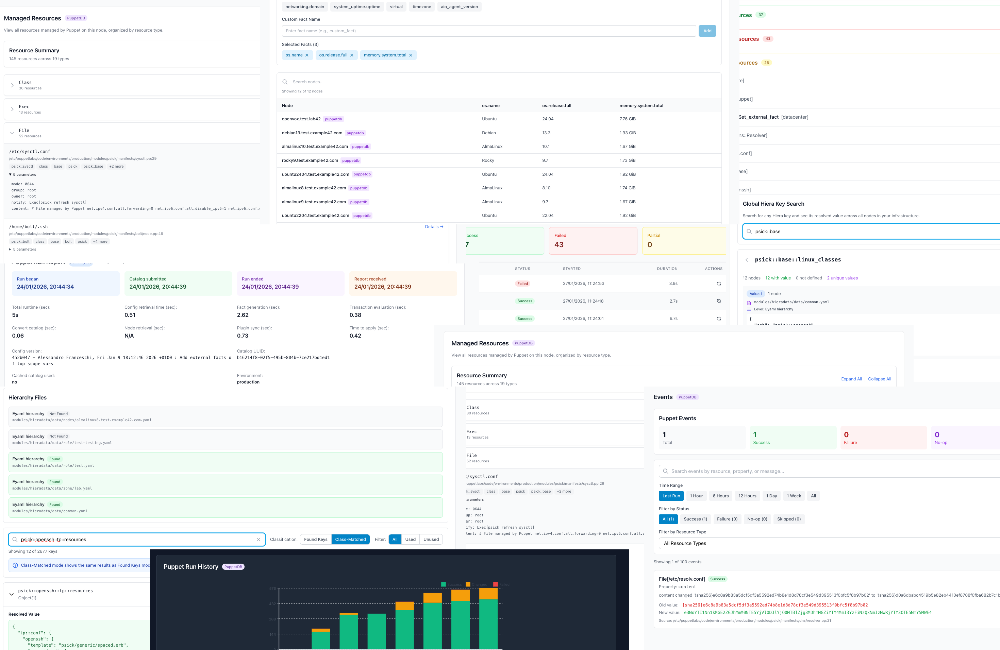

# Pabawi

<table>
<tr>
<td width="150">
  
</td>
<td>
  <h3>Classic Infrastructures Command & Control Awesomeness</h3>
  <p>Pabawi is a web frontend for infrastructure management, inventory and remote execution. It currently provides integrations with Puppet, Bolt, PuppetDB, and Hiera. It supports both Puppet Enterprise and Open Source Puppet / OpenVox. It provides a unified web interface for managing infrastructure, executing commands, viewing system information, and tracking operations across your entire environment.</p>
</td>
</tr>
</table>

## Table of Contents

- [Security Notice](#security-notice)
- [Features](#features)
  - [Core Capabilities](#core-capabilities)
  - [Advanced Features](#advanced-features)
- [Project Structure](#project-structure)
- [Screenshots](#screenshots)
- [Prerequisites](#prerequisites)
  - [Bolt Integration](#bolt-integration)
  - [PuppetDB Integration](#puppetdb-integration)
  - [PuppetServer Integration](#puppetserver-integration)
  - [Hiera Integration](#hiera-integration)
- [Installation](#installation)
  - [Via NPM](#via-npm)
  - [Using Docker Image](#using-docker-image)
- [Configuration](#configuration)
- [Troubleshooting](#troubleshooting)
- [Development and Contributing](#development-and-contributing)
- [Roadmap](#roadmap)
  - [Planned Features](#planned-features)
  - [Version History](#version-history)
- [License](#license)
- [Support](#support)
  - [Documentation](#documentation)
  - [Getting Help](#getting-help)
- [Acknowledgments](#acknowledgments)

## Security Notice

**⚠️ IMPORTANT: Currently Pabawi is designed for local use by Puppet administrators and developers on their workstations.**

- **No Built-in Authentication**: Pabawi currently has no user authentication or authorization system
- **Localhost Access Only**: The application should only be accessed via `localhost` or `127.0.0.1`
- **Network Access Not Recommended**: Do not expose Pabawi directly to network access without external authentication
- **Production Deployment**: If network access is required, use a reverse proxy (nginx, Apache) with proper authentication and SSL termination
- **Privileged Operations**: Pabawi can execute commands and tasks on your infrastructure, based on your Bolt configurations - restrict access accordingly

For production or multi-user environments, implement external authentication through a reverse proxy before allowing network access.

## Features

### Core Capabilities

- **Multi-Source Inventory**: View and manage nodes from Bolt inventory and PuppetDB
- **Command Execution**: Run ad-hoc commands on remote nodes with whitelist security
- **Task Execution**: Execute Bolt tasks with parameters automatic discovery
- **Package Management**: Install and manage packages across your infrastructure
- **Execution History**: Track all operations with detailed results and re-execution capability
- **Node Facts**: View comprehensive system information from Puppet agents
- **Puppet Reports**: Browse detailed Puppet run reports with metrics and resource changes
- **Catalog Inspection**: Examine compiled Puppet catalogs and resource relationships
- **Event Tracking**: Monitor individual resource changes and failures over time
- **Catalogs diff**: Compare and show differences in catalogs from different environments
- **Hiera Data Browser**: Explore hierarchical configuration data and key usage analysis

### Advanced Features

- **Re-execution**: Quickly repeat previous operations with preserved or modified parameters
- **Expert Mode**: View complete command lines and full output for debugging and auditing
- **Real-time Streaming**: Monitor command and task execution with live output
- **Multi-Source Architecture**: Seamlessly integrate data from multiple backend systems
- **Graceful Degradation**: Continue operating when individual integrations are unavailable

## Project Structure

```text
pabawi/
├── frontend/          # Svelte 5 + Vite frontend
│   ├── src/
│   │   ├── components/    # UI components
│   │   ├── pages/         # Page components
│   │   └── lib/           # Utilities and stores
│   ├── package.json
│   └── vite.config.ts
├── backend/           # Node.js + TypeScript API server
│   ├── src/
│   │   ├── bolt/          # Bolt integration (temp)
│   │   ├── integrations/  # Plugin architecture
│   │   │   ├── bolt/      # Bolt plugin
│   │   │   ├── puppetdb/  # PuppetDB integration
│   │   │   ├── puppetserver/ # Puppetserver integration
│   │   │   └── hiera/     # Hiera integration
│   │   ├── database/      # SQLite database
│   │   ├── routes/        # API endpoints
│   │   └── services/      # Business logic
│   ├── test/              # Unit and integration tests
│   ├── package.json
│   └── tsconfig.json
├── docs/              # Documentation
└── package.json       # Root workspace configuration
```

## Screenshots

> **📸 [View Complete Screenshots Gallery](docs/screenshots.md)** - Comprehensive visual documentation of all Pabawi features and interfaces.

To have an idea of Pabawi awesomeness, here some random screenshots



## Prerequisites

- Node.js 20+
- npm 9+
- Container engine (when used via container image)

### Bolt Integration

- Bolt CLI installed
- A local Bolt project directory
- Any required SSH keys used in Bolt configuration
- For details: [Bolt Setup](docs/integrations/bolt.md)

### PuppetDB Integration

- Network access to PuppetDB port 8081
- A local certificate signed by the Puppet CA used by PuppetDB
- For details: [PuppetDB Setup](docs/integrations/puppetdb.md)

### PuppetServer Integration

- Network access to PuppetServer port 8140
- A local certificate signed by the Puppet CA used by PuppetServer
- For details: [PuppetServer Setup](docs/integrations/puppetserver.md)

### Hiera Integration

- A local copy of your control-repo, with any external modules in Puppetfile
- If PuppetDB integration is not active, node facts files must be present on a local directory
- For details: [Hiera Setup](docs/integrations/hiera.md)

## Installation

### Via NPM

To run pabawi locally you need NPM installed. Then:

```bash

# Clone the pabawi repo
git clone https://github.com/example42/pabawi
cd pabawi

# Install all dependencies
npm run install:all

# Create your configuration file in:
backend/.env

# Run Pabawi
npm run dev:fullstack
```

This will start the application at <http://localhost:3000>.

### Using Docker image

To start Pabawi with Docker Compose using the default configuration:

```bash
# HINT to keep things simple: Create a dedicated directory where to place:
# data dir for SQLite
# certs dir for puppetdb / puppetserver integration
# control-repo dir for hiera integration
# bolt-project dir for Bolt integration (could also be your control-repo dir) 
mkdir pabawi/
cd pabawi
# Create your configuration file in your current directory (paths in .env are relative to the container)
vi .env

# Run the example42/pabawi image mounting your pabawi dir 
docker run -d \
  --name pabawi \
  --user "$(id -u):1001" \
  -p 127.0.0.1:3000:3000 \
  -v "$(pwd)/pabawi:/pabawi" \
  --env-file ".env" \
  example42/pabawi:latest
```

This will start the application at <http://localhost:3000>.

For comprehensive Docker deployment instructions including all integrations, see the [Docker Deployment Guide](docs/docker-deployment.md).

## Configuration

Pabawi uses a `.env` file for configuration. Use `backend/.env.example` as reference.

For detailed configuration options including Bolt, PuppetDB, PuppetServer, and Hiera integration settings, please refer to the [Configuration Guide](docs/configuration.md).

For API details, see the [Integrations API Documentation](docs/integrations-api.md).

## Troubleshooting

For solutions to common issues including installation, configuration, and integration problems, please refer to the comprehensive [Troubleshooting Guide](docs/troubleshooting.md).

## Development and Contributing

For development and contributions guidelines check the [Development Guide](docs/development.md).

For details of the repository files and configurations check the [Repository Structure](docs/repo_structure_and_config.md) document.

## Roadmap

### Planned Features

- **Additional Integrations**: Ansible, Tiny Puppet
- **Additional Integrations (to evaluate)**: Terraform, AWS CLI, Azure CLI, Kubernetes, Choria, Icinga
- **Scheduled Executions**: Cron-like scheduling for recurring tasks
- **Custom Dashboards**: User-configurable dashboard widgets
- **RBAC**: Role-based access control and user/groups management
- **Audit Logging**: Comprehensive audit trail
- **CLI**: Command Line tool

### Version History

- **v0.5.0**: Report filtering, puppet run history visualization, enhanced expert mode with frontend logging
- **v0.4.0**: Hiera integration, puppetserver CA management removal, enhanced plugin architecture
- **v0.3.0**: Puppetserver integration, interface enhancements
- **v0.2.0**: PuppetDB integration, re-execution, expert mode enhancements
- **v0.1.0**: Initial release with Bolt integration

## License

This project is licensed under the Apache License 2.0 - see the [LICENSE](LICENSE) file for details.

## Support

### Documentation

#### Getting Started

- [Technical Summary](docs/description.md) - High-level technical overview and goals
- [Architecture Documentation](docs/architecture.md) - System architecture and plugin design
- [Repository Structure](docs/repo_structure_and_config.md) - Guide to repository files and configuration
- [Configuration Guide](docs/configuration.md) - Complete configuration reference
- [User Guide](docs/user-guide.md) - Comprehensive user documentation
- [API Documentation](docs/api.md) - REST API reference

#### API Reference

- [Integrations API Documentation](docs/integrations-api.md) - Complete API reference for all integrations
- [API Endpoints Reference](docs/api-endpoints-reference.md) - Quick reference table of all endpoints
- [Authentication Guide](docs/authentication.md) - Authentication setup and troubleshooting
- [Error Codes Reference](docs/error-codes.md) - Complete error code reference

#### Integration Setup

- [Bolt Setup](docs/integrations/bolt.md) - Bolt configuration guide
- [Hiera Setup](docs/integrations/hiera.md) - Hiera configuration guide
- [PuppetDB Integration Setup](docs/integrations/puppetdb.md) - PuppetDB configuration guide
- [Puppetserver Setup](docs/integrations/puppetserver.md) - Puppetserver configuration guide
- [PuppetDB API Documentation](docs/puppetdb-api.md) - PuppetDB-specific API endpoints

#### Additional Resources

- [E2E Testing Guide](docs/e2e-testing.md) - End-to-end testing documentation
- [Troubleshooting Guide](docs/troubleshooting.md) - Common issues and solutions
- [Development](docs/development.md) - Development and contributing

### Getting Help

1. Check the documentation
2. Review [Troubleshooting Guide](docs/troubleshooting.md)
3. Enable expert mode for detailed diagnostics
4. Search existing GitHub Issues
5. Create a new issue with:
   - Version information
   - Configuration (sanitized)
   - Steps to reproduce
   - Error messages and logs

## Acknowledgments

Pabawi builds on excellent open-source projects:

- **Puppet/OpenVox**: The king of (classic) configuration management tools
- **Puppet Bolt**: Remote task execution engine
- **PuppetDB**: Centralized Puppet data storage
- **Svelte 5**: Reactive UI framework
- **Node.js**: Backend runtime
- **TypeScript**: Type-safe development
- **SQLite**: Embedded database

Special thanks to all contributors and the Puppet community.
