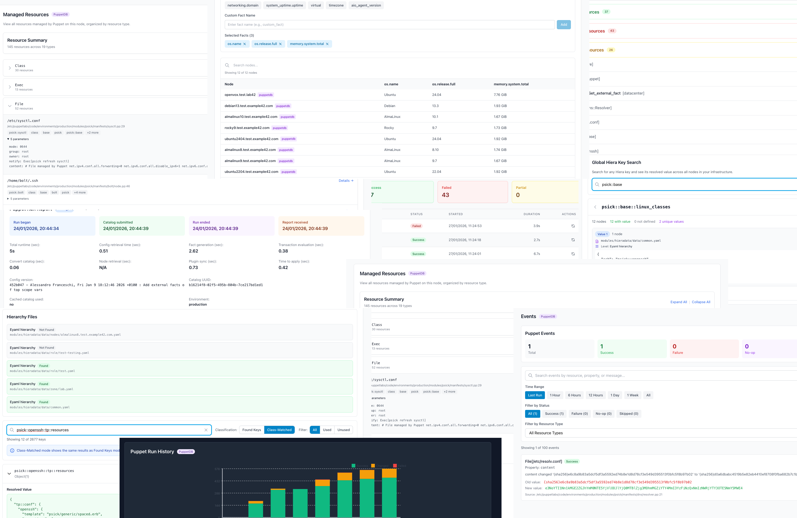

# Pabawi

<table>
<tr>
<td width="150">
  
</td>
<td>
  <h3>Classic Infrastructures Command &amp; Control Awesomeness</h3>
  <p>Pabawi is a web UI for infrastructure management, inventory, and remote execution. It integrates with Puppet, Bolt, Ansible, PuppetDB, Hiera, SSH, Proxmox, and AWS — supporting both Puppet Enterprise and Open Source Puppet / OpenVox. A single interface for executing commands, browsing inventory, viewing system facts, provisioning VMs, and tracking operations across your entire environment.</p>
</td>
</tr>
</table>

[](LICENSE)
[](https://github.com/example42/pabawi/releases)
[](https://hub.docker.com/r/example42/pabawi)
[](https://github.com/example42/pabawi/stargazers)

## Who is this for?

- **Sysadmins and DevOps teams** using Puppet, Bolt, Ansible, or SSH to manage physical servers and VMs
- **Puppet Open Source users** who want a web UI without Puppet Enterprise
- **Mixed-tool environments** — if you use both Puppet and Ansible, Pabawi brings them together in one interface
- **Homelabbers** who just want a web frontend for their servers (SSH-only works fine)

If you manage "classic infrastructure" — bare metal, VMs, not Kubernetes — Pabawi is built for you.

## Table of Contents

- [Features](#features)
- [Screenshots](#screenshots)
- [Prerequisites](#prerequisites)
- [Installation](#installation)
  - [Quick Start](#quick-start)
  - [Manual Setup](#manual-setup)
  - [Docker](#docker)
- [Configuration](#configuration)
- [Project Structure](#project-structure)
- [Troubleshooting](#troubleshooting)
- [Development and Contributing](#development-and-contributing)
- [Roadmap](#roadmap)
- [License](#license)
- [Support](#support)
- [Acknowledgments](#acknowledgments)

## Features

- **Multi-Source Inventory** — nodes from Bolt, PuppetDB, Ansible, SSH, Proxmox, AWS, with inventory groups
- **Command Execution** — ad-hoc commands on remote nodes with whitelist security
- **Task Execution** — Bolt tasks with automatic parameter discovery
- **Package Management** — install and manage packages across infrastructure
- **Proxmox Provisioning** — VM and container management alongside config management
- **AWS EC2 Provisioning** — cloud instance lifecycle management
- **Execution History** — track operations with re-execution capability
- **RBAC Authentication** — role-based access control, multiple users, audit trail
- **Node Facts** — system information from Puppet agents
- **Puppet Reports** — run reports with metrics and resource changes
- **Catalog Inspection** — compiled catalogs, resource relationships, cross-environment diff
- **Event Tracking** — resource changes and failures over time
- **Hiera Data Browser** — hierarchical configuration data and key usage analysis
- **Node Journal** — timeline of events, actions, and notes per node
- **Global Journal** — cross-node timeline with filtering by node, group, event type, source, and date range
- **Real-time Streaming** — live output for command and task execution
- **Expert Mode** — full command lines and debug output
- **Graceful Degradation** — continues operating when individual integrations are unavailable
- **Request Deduplication** — LRU-cached responses for identical API requests to reduce external calls
- **Input Sanitization** — automatic null byte removal, prototype pollution prevention, and deep nesting protection

## Screenshots



## Prerequisites

- **Node.js 20+** and **npm 9+** (or a container engine for Docker deployment)
- **Bolt CLI** — for Bolt integration ([setup](docs/integrations/bolt.md))
- **Ansible CLI** — for Ansible integration ([setup](docs/integrations/ansible.md))
- **Puppet/OpenVox agent** — for [PuppetDB](docs/integrations/puppetdb.md) and [Puppetserver](docs/integrations/puppetserver.md) integrations; provides SSL certs
- **Control repo** — for Hiera integration ([setup](docs/integrations/hiera.md))

All integrations are optional — enable only what you use.

## Installation

### Quick Start

```bash
git clone https://github.com/example42/pabawi
cd pabawi
./scripts/setup.sh
```

The interactive setup script will:

1. **Check prerequisites** — Node.js, npm, and optionally Bolt, Ansible, Puppet/OpenVox CLIs
2. **Generate `backend/.env`** — core settings and integrations with smart defaults based on detected tools and SSL certs
3. **Install dependencies** — `npm run install:all`
4. **Start the application** — development mode, full-stack build, or exit

### Manual Setup

```bash
git clone https://github.com/example42/pabawi
cd pabawi

# Install dependencies
npm run install:all

# Create your configuration
cp backend/.env.example backend/.env
# Edit backend/.env with your settings

# Start in development mode
npm run dev:backend    # backend on port 3000
npm run dev:frontend   # frontend on port 5173

# Or build and serve everything from the backend
npm run dev:fullstack  # port 3000
```

### Docker

```bash
# Create a working directory for persistent data, certs, and project files
mkdir pabawi && cd pabawi

# Create your configuration file (paths are relative to the container)
vi .env

# Run the image, mounting the current directory
docker run -d \
  --name pabawi \
  --user "$(id -u):1001" \
  -p 127.0.0.1:3000:3000 \
  -v "$(pwd)/pabawi:/pabawi" \
  --env-file ".env" \
  example42/pabawi:latest
```

The application starts at <http://localhost:3000>.

For full Docker and Kubernetes deployment instructions, see the [Docker Deployment Guide](docs/deployment/docker.md) and [Kubernetes Guide](docs/deployment/kubernetes.md).

## Configuration

All configuration is in `backend/.env`. The setup script generates this file, or use `backend/.env.example` as a template.

The web UI also includes per-integration setup wizards that generate `.env` snippets you can paste into your configuration file.

Key configuration areas:

| Area | Variables |
|---|---|
| Core | `PORT`, `HOST`, `LOG_LEVEL` |
| Auth | `JWT_SECRET`, `AUTH_ENABLED` |
| Bolt | `BOLT_*` |
| PuppetDB / Puppetserver | `PUPPETDB_*`, `PUPPETSERVER_*` |
| Hiera | `HIERA_*` |
| Ansible | `ANSIBLE_*` |
| SSH | `SSH_*` |
| Proxmox | `PROXMOX_*` |
| AWS | `AWS_*` |
| Security | `COMMAND_WHITELIST*`, `CONCURRENT_EXECUTION_LIMIT` |

Full reference: [Configuration Guide](docs/configuration.md).

## Project Structure

```text
pabawi/
├── frontend/                  # Svelte 5 + Vite SPA
│   └── src/
│       ├── components/        # UI components
│       ├── pages/             # Page components
│       └── lib/               # Utilities and rune-based state
├── backend/                   # Node.js + Express + TypeScript
│   └── src/
│       ├── integrations/      # Plugin system (Bolt, PuppetDB, SSH, ...)
│       ├── services/          # ExecutionQueue, RBAC, streaming, auth
│       ├── routes/            # Express route handlers
│       ├── middleware/        # JWT, RBAC, rate limiting, security headers
│       ├── database/          # SQLite + migrations
│       ├── errors/            # Typed error classes
│       └── validation/        # Zod request schemas
├── docs/                      # Documentation
│   ├── integrations/          # Per-integration setup guides
│   └── deployment/            # Docker and Kubernetes guides
├── e2e/                       # Playwright E2E tests
└── package.json               # Root workspace configuration
```

See [Architecture](docs/architecture.md) for a detailed description of the plugin system and data flows.

## Troubleshooting

See the [Troubleshooting Guide](docs/troubleshooting.md) for common issues with installation, configuration, and integrations.

## Development and Contributing

See the [Development Guide](docs/development.md) for setup, testing, and contribution guidelines.

## Roadmap

### Planned integrations

- **Icinga / CheckMK** — monitoring context in the same interface
- **Terraform / OpenTofu** — infrastructure provisioning alongside configuration management

### Also planned

Scheduled executions, custom dashboards, CLI tool, audit logging, Tiny Puppet integration.

### Version History

- **v1.1.0**: Global Journal with cross-node timeline,  security hardening, docs rewrite
- **v1.0.0**: Configuration refactor (`.env` as single source of truth), Proxmox and AWS provisioning, Node Journal, setup wizard `.env` snippet generators, Integration Status Dashboard
- **v0.10.0**: AWS EC2 integration, integration configuration management
- **v0.9.0**: Proxmox integration, Node Journal
- **v0.8.0**: RBAC authentication, SSH integration, inventory groups
- **v0.7.0**: Ansible integration, class-aware Hiera lookups
- **v0.6.0**: Code consolidation and fixes
- **v0.5.0**: Report filtering, Puppet run history visualization, enhanced expert mode
- **v0.4.0**: Hiera integration, enhanced plugin architecture
- **v0.3.0**: Puppetserver integration, interface enhancements
- **v0.2.0**: PuppetDB integration, re-execution, expert mode
- **v0.1.0**: Initial release with Bolt integration

## License

Apache License 2.0 — see [LICENSE](LICENSE).

## Support

**Documentation**

- [Architecture](docs/architecture.md) | [Configuration](docs/configuration.md) | [User Guide](docs/user-guide.md) | [API Reference](docs/api.md)
- [Permissions & RBAC](docs/permissions-rbac.md) | [Troubleshooting](docs/troubleshooting.md) | [Development](docs/development.md)

**Integrations**

- [Bolt](docs/integrations/bolt.md) | [Ansible](docs/integrations/ansible.md) | [SSH](docs/integrations/ssh.md)
- [PuppetDB](docs/integrations/puppetdb.md) | [Puppetserver](docs/integrations/puppetserver.md) | [Hiera](docs/integrations/hiera.md)
- [Proxmox](docs/integrations/proxmox.md) | [AWS](docs/integrations/aws.md)

**Deployment**

- [Docker](docs/deployment/docker.md) | [Kubernetes](docs/deployment/kubernetes.md)

For help: enable expert mode for diagnostics, or [open a GitHub issue](https://github.com/example42/pabawi/issues) with version info, sanitized config, reproduction steps, and error messages.

## Acknowledgments

Pabawi builds on: [Puppet/OpenVox](https://puppet.com), [Bolt](https://puppet.com/docs/bolt), [PuppetDB](https://puppet.com/docs/puppetdb), [Svelte 5](https://svelte.dev), [Node.js](https://nodejs.org), [TypeScript](https://www.typescriptlang.org), [SQLite](https://sqlite.org). Thanks to all contributors and the Puppet community.
