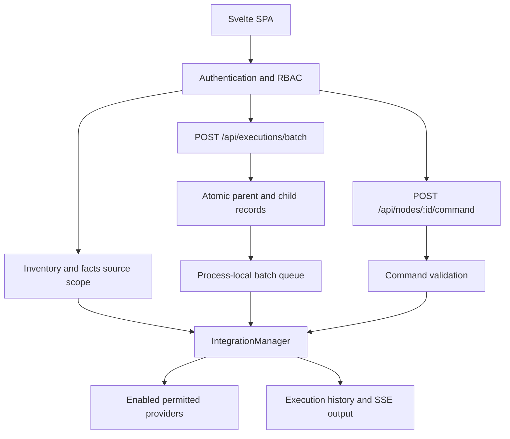

# Pabawi architecture

Pabawi is a Svelte 5 SPA served by a Node.js/Express backend. The backend
aggregates infrastructure data, dispatches provider actions and persists execution
history. The supported deployment baseline is one backend process with SQLite or
PostgreSQL. A shared database does not distribute queues, tickets or sessions.

## Plugins and composition

`backend/src/plugins/registry.ts` declares configuration resolution, constructors,
types and priorities. `server.ts` iterates it and registers enabled plugins with
`IntegrationManager`. Concrete plugins extend `BasePlugin`; some retain historical
`Service` or `Integration` class names. Provider-specific APIs and CLI semantics
stay in the integration directories.

| Integration | Constructor | Registry type | Priority |
|---|---|---|---|
| Bolt | `BoltPlugin` | both | 5 |
| Ansible | `AnsiblePlugin` | both | 5 |
| PuppetDB | `PuppetDBService` | information | 10 |
| Puppetserver | `PuppetserverService` | information | 8 |
| Hiera | `HieraPlugin` | information | 6 |
| SSH | `SSHPlugin` | both | 50 |
| Proxmox | `ProxmoxIntegration` | both | 7 |
| AWS | `AWSPlugin` | both | 7 |
| Azure | `AzurePlugin` | both | 7 |
| Checkmk | `CheckmkPlugin` | information | 8 |

`InformationSourcePlugin` provides inventory, facts and node data.
`ExecutionToolPlugin` exposes capabilities and executes actions. Provisioning
uses execution-tool capabilities and provider-specific route methods. Console
providers are registered separately through the console-provider interface.
Higher source priorities win during merging. The table records registry values;
SSH and Proxmox also accept priority settings in their provider configuration.

`BasePlugin` owns initialization state and health checks through
`performInitialization()` and `performHealthCheck()`. Failed initialization is
logged; other integrations continue. `IntegrationManager` defaults to five-minute
health checks, one-minute retries after failures and a ten-minute health cache.
Checkmk additionally caches its REST health probe for five minutes by default.

## Configuration and startup

`ConfigService` loads and validates server/integration environment settings;
SSH uses `integrations/ssh/config.ts`. Source development loads `.env` from the
backend working directory; deployed processes receive their environment from the
container or service manager. Authentication settings such as registration policy
and default roles are database-backed. See [configuration](configuration.md).

Startup creates shared services in `DIContainer`, initializes the database and
migrations, registers plugins, starts health scheduling and mounts routes.
`mountInfrastructureRoutes` is the production assembly also exercised by the
route authorization tests. Other factories mount authentication, RBAC management,
monitoring, journal, diagnostics and console routes. MCP is optional at `/mcp`.
Factory signatures vary: some receive explicit services plus a container.

## Request and execution boundaries

Inventory (`GET /api/inventory`) and facts (`GET /api/nodes/:id/facts`) resolve
source permissions before querying providers. Scoped results cannot populate or
consume the unrestricted inventory cache. Node linking correlates source identities.
Caching varies by provider and request path; Checkmk monitoring reads are live.

Aggregated inventory and node facts wait at most 15 seconds per source operation
(60 seconds for Checkmk inventory/facts). Health checks wait at most 15 seconds.
A source has at most 20 outstanding operations through these aggregation paths;
timing out a caller does not release capacity until the provider actually settles.
Other sources can still return partial results. These deadlines do not abort the
underlying provider or apply to every direct provider API route.

Batch admission commits records before dispatch and returns IDs asynchronously.
Queued cancellation prevents execution. Dispatched cancellation records intent;
plugins have no general abort contract. Startup/shutdown cancel undispatched batch
work and mark uncertain dispatched work interrupted without replay. Direct command
and multi-node Puppet routes do not share batch queue admission. The configured
batch concurrency limit is not a global execution limit.

On startup, standalone queued records become cancelled and running records become
interrupted, preserving attribution and terminal records. Recovery never replays
uncertain provider work. Console session recovery precedes HTTP admission.
SIGINT and SIGTERM stop HTTP admission, health scheduling and batch admission,
close local streams/sessions, and attempt draining before database closure. The
process exits within a 25-second shutdown budget; deadline or cleanup failure
produces exit code 1 and leaves unfinished records for startup reconciliation.
Deployment termination grace must exceed 25 seconds. A successful local shutdown
does not prove that an upstream action stopped. Direct background worker ownership
is still being consolidated under A22.

Mutation clients default to no transport retries. Batch and multi-node Puppet
admission support durable user/route-scoped `Idempotency-Key` claims. Other mutation
routes do not have that durable contract. See [API semantics](api.md).

SSE uses `POST /api/executions/:id/stream-ticket` with an access JWT, followed by
`GET /api/executions/:id/stream?ticket=...`. Tickets are single-use, expire after
30 seconds and only authenticate that execution's GET stream. A `complete` event
carries terminal status; it does not imply success. Long-lived streams revalidate
credentials. Ticket storage and output buffers are process-local.

## Console and authentication

`ConsoleSessionManager` reserves per-user capacity and owns durable session state.
`ConsoleConnectionBroker` holds single-use upstream material only in memory.
`ConsoleWebSocketProxy` claims a ticket and relays frames to the provider; session
termination closes both ends and releases provider state. Restart invalidates
process-local material. Fake-upstream lifecycle tests pass; actual Proxmox console
compatibility remains unverified. See [console access](api.md#console-vnc--terminal).

REST authentication is mandatory except the explicitly public setup and login
flows in [the API guide](api.md#authentication). Generic inventory lifecycle
requests additionally accept a machine credential mapped to `lifecycle-service`.
Personal MCP JWTs use the caller's permissions; only the MCP static credential
uses `mcp-service`. Account and RBAC revisions enforce revocation across database
connections. See [RBAC](permissions-rbac.md), [MCP](mcp.md) and
[Entra ID](integrations/entra-id.md).

Diagnostics include raw provider output and execution context. Redaction is not
a guarantee that arbitrary command output or support exports contain no secrets;
treat them as sensitive operator data.

## Code layout

| Path under `backend/src/` | Responsibility |
|---|---|
| `server.ts`, `container/`, `plugins/` | Composition and service/plugin ownership |
| `config/`, `integrations/ssh/config.ts` | Configuration parsing |
| `integrations/` | Plugins, provider services and `NodeLinkingService` |
| `routes/`, `middleware/` | HTTP contracts, authentication and authorization |
| `validation/CommandWhitelistService.ts` | Command policy |
| `services/` | Execution, authentication, RBAC, console and diagnostics services |
| `services/journal/` | Journal collection and querying |
| `database/` | DatabaseService, repositories, adapters and migrations |
| `mcp/` | Session ownership, tool authorization and output summarization |

The frontend uses Svelte 5 runes. `pages/` holds route views, `components/` shared
UI, and `lib/*.svelte.ts` module-level reactive state. `lib/api.ts` owns transport
and auth replay; `lib/executionStream.svelte.ts` owns SSE and polling fallback.
`npm run check:components` compares Svelte semantic errors against the recorded
backlog. Component lint coverage remains separate work.

## Database transaction ownership

`DatabaseAdapter.withTransaction(callback)` owns a connection for the callback's
async context. It commits on success and rolls back on failure. Nested transactions
and inherited database work after the callback ends are rejected. Await all work
before returning. Application SQL uses `?` placeholders; PostgreSQL rewrites them.

SQLite serializes transactions and ordinary queries on its adapter connection.
PostgreSQL pins a pooled client per transaction. `withExclusiveConnection(callback)`
reserves an adapter for maintenance; migrations hold it across inspection,
transactions and SQLite foreign-key restoration. This does not coordinate separate
adapters or processes. Run only one migration process per installation.

Schema changes live in `database/migrations/`, with dialect-specific files where
needed. Use `DatabaseService` rather than creating ad hoc connections. See
[upgrade and recovery](upgrading.md) and the [deployment topology](deployment/kubernetes.md).
