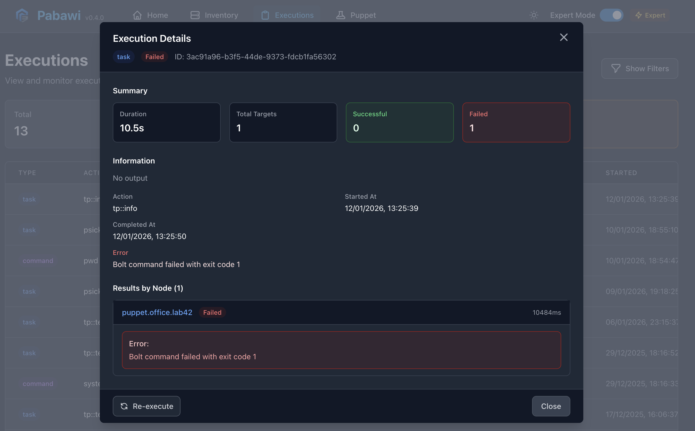
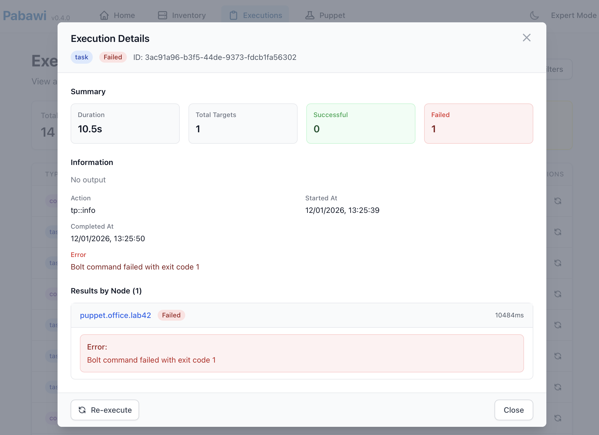

# Pabawi Screenshots

This document provides visual documentation of the Pabawi web interface, showing key features and workflows for infrastructure management with Puppet Bolt.

## Home Dashboard


**File:** `home-dashboard.png`

The main dashboard provides an overview of your infrastructure and quick access to key features. This page displays:

- Integration status indicators for PuppetDB, Puppetserver, and Hiera
- Quick navigation to inventory, executions, and other main sections
- System health and connectivity status
- Recent activity summary

## Inventory Page


**File:** `inventory-page.png`

The inventory page shows all nodes from your Bolt inventory with comprehensive filtering and search capabilities:

- **Node Cards**: Display node name, URI, transport method, and status
- **Search and Filter**: Real-time search by node name and filtering by transport type
- **View Options**: Toggle between grid and list views
- **Source Attribution**: Clear indication of data sources (Bolt, PuppetDB)
- **Performance**: Virtual scrolling for large inventories (1000+ nodes)

## Node Detail Page


**File:** `node-detail-page.png`

The node detail page is the central hub for all operations on a specific node:

- **Node Information**: Basic metadata and connection details
- **Collapsible Sections**: Organized workflow areas for different operations
- **Facts Section**: System information gathering and display
- **Operation Forms**: Command execution, task running, Puppet runs, package installation
- **Execution History**: Recent operations performed on this node

## Command Execution


**File:** `command-execution.png`

The command execution interface allows running ad-hoc shell commands on target nodes:

- **Command Input**: Text field with validation and whitelist checking
- **Security Features**: Command whitelist enforcement for production safety
- **Real-time Results**: Immediate display of stdout, stderr, and exit codes
- **Execution Details**: Duration, timestamp, and status indicators
- **Expert Mode**: Additional diagnostic information when enabled

## Task Execution


**File:** `task-execution.png`

The Bolt task execution interface provides access to predefined automation scripts:

- **Task Browser**: Organized display of available tasks by module
- **Parameter Configuration**: Dynamic forms based on task metadata
- **Parameter Types**: Support for strings, integers, booleans, arrays, and hashes
- **Validation**: Required field checking and type validation
- **Task Documentation**: Descriptions and parameter details

## Puppet Run Interface


**File:** `puppet-run-interface.png`

The Puppet run interface enables executing Puppet agent runs with full configuration control:

- **Basic Options**: Tags and environment configuration
- **Advanced Options**: Noop mode, debug mode, and additional Puppet agent flags
- **Safety Features**: Dry-run capability with noop mode
- **Configuration Override**: No-noop mode for overriding node settings
- **Execution Control**: Clear action buttons and status indicators

## Execution History



**File:** `execution-history.png`

The execution history page provides comprehensive tracking of all operations:

- **Summary Statistics**: Total, successful, failed, and running executions
- **Filtering Options**: Date range, status, target node, and search filters
- **Execution List**: Detailed view of past operations with results
- **Re-execution**: Quick repeat of previous operations with preserved parameters
- **Pagination**: Efficient handling of large execution histories

## Expert Mode Output



**File:** `expert-mode-output.png`

Expert mode provides detailed diagnostic information for troubleshooting and auditing:

- **Full Command Lines**: Complete Bolt CLI commands executed
- **Raw Output**: Unfiltered stdout and stderr from operations
- **Request Tracking**: Unique request IDs for log correlation
- **Detailed Diagnostics**: Additional context for debugging
- **Search Functionality**: Find specific information in large outputs

## Usage Guidelines

### Accessing Screenshots

All screenshots are stored in the `docs/screenshots/` directory and can be referenced in documentation using relative paths:

```markdown

```

### Screenshot Naming Convention

Screenshots follow a descriptive naming pattern:
- `home-dashboard.png` - Main application dashboard
- `inventory-page.png` - Node inventory listing
- `node-detail-page.png` - Individual node management
- `command-execution.png` - Ad-hoc command interface
- `task-execution.png` - Bolt task execution
- `puppet-run-interface.png` - Puppet agent runs
- `execution-history.png` - Operation tracking
- `expert-mode-output.png` - Detailed diagnostics

### Documentation Integration

These screenshots are referenced throughout the Pabawi documentation:

- [User Guide](user-guide.md) - Comprehensive feature walkthrough
- [README](../README.md) - Quick start and overview
- [Configuration Guide](configuration.md) - Setup instructions
- [API Documentation](api.md) - Technical reference

### Updating Screenshots

When updating screenshots:

1. Use consistent browser window size and zoom level
2. Ensure sensitive information is not visible
3. Update corresponding documentation if UI changes
4. Maintain descriptive filenames
5. Test all documentation links after updates

## Feature Highlights

### Multi-Source Integration

Screenshots demonstrate Pabawi's ability to integrate data from multiple sources:
- Bolt inventory for node management
- PuppetDB for comprehensive system information
- Puppetserver for certificate and configuration management
- Hiera for hierarchical configuration data

### Security Features

Visual elements showing security implementations:
- Command whitelist enforcement
- Noop mode for safe testing
- Expert mode for detailed auditing
- Execution tracking for accountability

### User Experience

Interface design principles visible in screenshots:
- Clean, intuitive navigation
- Responsive design for different screen sizes
- Real-time feedback and status indicators
- Consistent visual language across features
- Efficient workflows for common tasks

### Performance Optimization

Screenshots show performance features:
- Virtual scrolling for large inventories
- Real-time search and filtering
- Efficient data loading and caching
- Responsive interface updates

## Technical Details

### Screenshot Specifications

- **Format**: PNG with transparency support
- **Resolution**: High-resolution for documentation clarity
- **Compression**: Optimized for web display
- **Accessibility**: Alt text provided for all images

### Browser Compatibility

Screenshots captured using modern web browsers with:
- JavaScript enabled
- CSS Grid and Flexbox support
- WebSocket support for real-time features
- Local storage for user preferences

### Responsive Design

Interface adapts to different screen sizes:
- Desktop: Full feature set with multi-column layouts
- Tablet: Optimized touch interface with collapsible sections
- Mobile: Streamlined interface with essential features

## Support and Troubleshooting

If the interface doesn't match these screenshots:

1. **Version Differences**: Check your Pabawi version against documentation
2. **Browser Issues**: Ensure JavaScript is enabled and browser is supported
3. **Configuration**: Verify integrations are properly configured
4. **Permissions**: Check user permissions for accessing features
5. **Network**: Ensure connectivity to backend services

For additional help, see:
- [Troubleshooting Guide](troubleshooting.md)
- [Configuration Guide](configuration.md)
- [User Guide](user-guide.md)